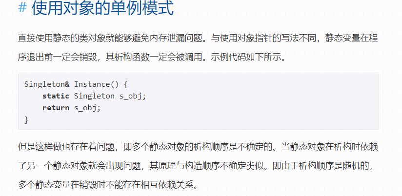

## Questions
1. [static member function can access non-static member variable](#static)
2. [constructor can assign value to static member vairble](#static)
3. [The destruction of static variable in singleton mode](#static)
3. member access operator can be overloaded ?
4. queue is thread safe ?
5. outside of class, "." can access private variable.
6. we can include header files in `extern C` ?
7. difference between `const` and `constexpr`
8. difference between left value and id-identifier.


## pool
1. Lambda captures.
3. right value reference, perfect forwarding.
4. gdb
5. copy constructor in inheritance.


## Notes:


## Basics

### Chapter1

`cout` is a predefined **object** (class), that knows how to handle different kinds of data. It's not a function.

`endl` is a special notation, also dubbed *manipulator*.

The following 2 lines behaves the same as starting a new line. However, `endl` guarantees that the output will be **flushed**, while `\n` on some system doesn't.
```cpp
cout << "\n";
cout << endl;
```


1. constructors can not be virtual.
2. `constexpr` is evaluated at compile time, and can be used on functions and constructors while `const` is evaluated at runtime.
3. 2D array

    ```cpp
    void myfunc2(int a[][10]) // length of second dimension has to be specifed
    // same as above.
    int func(int (*a)[10]) {
        a[0][0] = 100;
        return 0;
    }
    /**
     * int **array;
     * array = new int *[10];
     */
    void myfunc2(int **a)
    ```

### operator precedence
1. `++ () []`
2. `a*b, a/b, a%b`
3. `a+b, a-b`
4. `a&b`
5. `a^b`
6. `a|b`

4. `extern` to tell the compiler that the the variable or function may not be inside this file, but is certainly somewhere else.

    ```cpp
    /*
    * main.cpp
    */
    extern int i;
    // extern int test(); function is by default with extern keyword
    int test();

    int main() {
        cout <<  i << endl;
        cout << test() << endl;
        cout << "main.cpp doesn't include any header files" << endl;
        return 0;
    }

    /*
    * extern.cpp
    */
    int i = 10;
    int test() {return 20;}
    ```

5. `inline` keywords will tell the compiler to substitute the function where it's called called, therefore, the assembly of a functionA that calls inline functionB will not have to jump forwards and backwards and thus eleminated the overhead of function calls. However, expanding will cause the assembly code to be enlarged meaning when there is a loop, the expanding of code will be huge and the binary file will be larger. Therefore, compiler will not substitute the function even `inline` is specified and only will do when the cost-benefit analysis shows its worthwhile.

6. `variadic functions`, are functions which take a variable number of arguments.

    ```cpp
    #include <iostream>
    #include <cstdarg>

    using namespace std;

    int func(char fmt,...) {
        va_list args;
        va_start(args, fmt);

        if(fmt == 'd') {
            int i = va_arg(args, int);
            cout << "I'm an integer: " << i << endl;
        }
    }

    int main() {
        func('d', 428);
        return 0;
    }
    ```

7. `unnamed namespace` will ask the compiler to give the namespace a name and appy `using namespace` on that name, which makes the content will only be visible by the local file. The effect is essentially the same as `static`

8. `friend` keyword allows a class or function to be able to fully access public/private members of the current class members. we can see that Student is not a subclass of Teacher.

    ```cpp
    /*
    * teacher.h
    */
    class Student;

    class Teacher {
        friend Student;
        int age = 36;
    };

    /*
    * student.cpp
    */
    class Student {
    public:
        int getTeacherAge();
    };

    int Student::getTeacherAge() {
        Teacher teacher;
        cout << teacher.age << endl;
        return teacher.age;
    }
    ```

9. `friend` function, like a friend class can be given a special grant to access to private and protected members. A `friend` function can be
    * A member function of **another** class
    * A global function.
    * a `friend` function is a **non member function** or ordinary function of a class.
    * `friend` key word is placed before declaration not definition.
    * When `friend` function is called neither name of object nor dot operator is used.
    * `friend` function can be declared in any section of the class i.e. public/private/protected.

    ```cpp
    class Person {
        string name_;
        shared_ptr<Person> partner_;
    public:
        Person(string name) {
            name_ = name;
        }
        // this is not a function of Person, but a global function
        friend bool partnerUp(shared_ptr<Person> p1, shared_ptr<Person> p2) {
            p1->partner_ = p2;
            p2->partner_ = p1;
            return true;
        }
    };

    int main() {
        shared_ptr<Person> lucy {make_shared<Person>("lucy")};
        shared_ptr<Person> lala {make_shared<Person>("lala")};
        partnerUp(lucy, lala); // it's a global function
    }
    ```

9. [The order of Execution in initializer list](https://www.geeksforgeeks.org/order-of-execution-in-initializer-list-in-c/)

10. `default` keyword of a constructor specifies that the constructor is the same as default construtcor. As we know default constructor is unsupplemented when we specify one.

    ```cpp
    // sptr_deadlock.cpp
    class Foo {
    public:
        Foo() = default;
        // explict Foo(int a) {
        //     age = a;
        // }
        Foo(int a) {
            age = a;
        }
        Foo(char i) = delete;
        int getAge() {
            return age;
        }
    private:
        int age = 64;
    };
    ```
#### explicit
11. `explicit`

    * keyword to ask compiler to void implicit contruction. when a single `int` can construct `Foo` then the compiler allows converting an `int` to a `Foo` and passing it to the function.

    * can only be applied on contructor, and unary argument construtcor.
    * can not be inherited.
    * `string a = "hello world";` is a implicit conversion from `char *` to `string`.

    ```cpp
    void func(Foo f) {
        cout << "do nothing" << endl;
    }
    int main() {
        func(12);
        // do nothing got printed.
    }
    ```

12. `delete` keyword of a constructor tells that this form of construction is not allowed. This keyword can also be used on copy constructor to tell that this class is not allowed to be copied.

    ```cpp
    Foo(const Foo &other) = delete;
    ```

## static

13. `static` keyword
    * specifies that the **member variable/function**  will be visible/accessible by everything in the current local file and only this local file. And it also makes the variable/function **unbounded** to any class. **Therefore, `this` which points to the current object(class) is not applicable to static memeber function.**  **A static member variable can only be initialized globally.**. Because it's `static`, the variable/function can be directly accessed without declaring a variable of that class first. `static` variable/function will also have a special segment of memory separated from the memory of the class.

    ```cpp
    class Foo {
    public:
        string getName() {
            return s_name;
        }
        static string s_getName() {
            return s_name;
        }
        static string t_getName() {
            return this->s_name; // ‘this’ is unavailable for static member functions
        }
        static string e_getName() {
            return name;
        } // error: static member function can access static member variable.
    private:
        static string s_name;
        string name = "WelcomHere";
    };

    string Foo::s_name = "HelloWorld";

    int main() {
        Foo f;
        cout << Foo.s_name << endl; // error: s_name is declared as private
        cout << Foo::s_getName() << endl; // calling s_getName() without using f.
    }

    ```

    * static variable lives in the scope it is initialized.

    ```cpp
    #include <iostream>
    #include <vector>
    using namespace std;
    static int s_value = 20;
    void func() {
        static int s_value = 0;
        s_value++;
        cout << s_value << endl;
    }

    class Foo {
    public:
        static int value;
    };

    int Foo::value = 20;

    int main() {
        cout << Foo::value << endl; // 20
        cout << s_value << endl; // 20
        func(); // 1
        func(); // 2
        func(); // 3
        cout << s_value << endl; // 20
    }

    ```
14. In singleton mode, static variables are allocated when the program starts, however, when there are dependencies among static variables, the destruction order is undetermined, therefore, when the program ends, there may be destruction errors. [->Ref](https://blog.wangzhl.com/posts/static-initialization-order-problem/)

    

14. `const` memember variable can either be initialized by default value or through initializer list. (can't use constructor). Also, when having `const` member variables, **these member varaibles have to be initialized**.

    ```cpp
    class Foo {
        Foo(): valueA(40) {
            valueB = 20; // error
        }
    private:
        const int valueA = 30;
        const int valueB;
    };
    ```

15. leftvalue is a value which can be retrieved from parenthesis or by the value of a variable.

    ```cpp
    int i = 0; // i is an identifier
    // (i) is a left value.
    int * p = &i;
    cout << *p << endl; // *p is a leftvalue which is i.
    ```

### Inheritance

1. `Inheritance`
    | inheritance level | public members of derived class | protected members of derived class | private members of derived class |
    | ----------------- | ------------------------------- | ---------------------------------- | -------------------------------- |
    | :`public` Base    | remain `public`                 | remain `protected`                 | remain `private`                 |
    | :`proetcted` Base | change to `protected`           | remain `protected`                 | remain `private`                 |
    | :`private` Base   | change to `private`             | change to `private`                | remain `private`                 |
2. `friend` ship will not be inheritated. In the derived class we can use Base specifier to call Base functions/variables.
    ```cpp
    Derived::getVal() {
        return Base::value;
    }
    ```
3. Base class can't not access functions/member even polymorphism is used.
    ```cpp
    void func(Base * bp) {
        bp->derivedOnlyFunc(); // error: bp has no member named derivedOnlyFunc
    }

    int main() {
        Base * bp = new Derived();
        func(bp);
    }
    ```
4. contructor will not be inheritated by default. Or `using Base::Base` to inherit all contructors of Base class.  Base **default** constructor will and **has to**(there has to be a no-arg contructor) be called when constructing derived class. We can use initializer list in derived construtcor to call non-default constructor of Base class's.
    ```cpp
    Derived(int a, int b, int c) : Base(a, b), c_(c) {} // call non-default base constructor.

    class Derived {
        using Base::Base;
        // no constructor defined here.
    }

    int main() {
        Derived d(20, 30); // inheritated from Base class.
    }
    ```
5. as we know, derived class will inheirt all member functions of Base class's as well as overloaded fucntions. Howerver, once the drived class overwrites the function, even one version of the function, all overloaded functions of the base class will not be inheritated. Therefore, to make them still be inheritated, `using` is used (only `protected/public` functions).
    ```cpp
    class Base {
    public:
        void getVal() {}
        void getVal(int a) {}
    };

    class Derived: public Base {
    public:
        // void getVal() {}
    };

    int main() {
        Derived d;
        d.getVal();
        d.getVal(1); // works fine if Derived doesn't have getVal, error otherwise.

    }
    ```

6. When `diamond inheritance` happens, we need virtual base to solve. [virtual base](https://www.geeksforgeeks.org/virtual-base-class-in-c/). virtual base class will not have variable of `Base` a pointer instead. Also, derived class's initializer list has to include the Base class.
    ```cpp
    class D {
        D(int a, int b, int c) : A(a), B(b), C(c) {}
    }
    ```

7. Only nonstatic member functions may be virtual.

8. `virtual table` [Reference](https://www.learncpp.com/cpp-tutorial/the-virtual-table/). Don't forget that a derived class will be devided into inherited portion and self-added portion, where Base class can only access the inherited portion, meaning Base can access `*_vptr`;

```cpp
#include <iostream>
using namespace std;

class Base1 {
public:
    virtual ~Base1() {
        cout << "Base1::delete" << endl;
    };
};

class Base2 {
public:
    explicit Base2(int a) : m_a(a) {
        init();
    }
    virtual void Foo() {
        cout << "Base2::Foo" << endl;
    }
    virtual ~Base2() {
        cout << "Base2::delete" << endl;
    }
protected:
    virtual void init() {
        cout << "Base2::Init" << endl;
    }
    int m_a;
};

class Derived : public Base1, public Base2 {
public:
    Derived(int a, int b) : Base2(a), m_b(b) {}
    void Foo() {
        cout << "Derived::Foo" << endl;
    }
    void func() {
        cout << " Hello funk" << endl;
    }
    ~Derived() {
        cout << "Derived::delete" << endl;
    }
protected:
    void init() {
        cout << "Derived::init" << endl;
    }
    int m_b;
};

int main() {
    Base2 *ptr = new Derived(3, 4);
    ptr->func(); // error Base2 can only access Base2 portion of Derived which has Base1 portion(inheirted) + Base2 portion(inherited) + sef-added portion.
    cout << sizeof(*ptr) << endl;
    delete ptr; // error // unsolvled
}
```

23. destrutcor can not be pure virtual even within a pure virtual class.

24. **Virtual with default values** [Refernece](https://www.geeksforgeeks.org/default-arguments-and-virtual-function-in-cpp/)
    ```cpp
    class Base {
    public:
        virtual void Foo(int value = 1) {
            cout << "Base::" << value << endl;
        }
    };

    class Derived : public Base {
    public:
        void Foo(int value = 2) override {
            cout << "Derived::" << value << endl;
        }
    };

    int main() {
        Base * bp = new Derived();
        bp->Foo(); // Derived::1
    }
    ```

## Casting [->Ref](https://www.geeksforgeeks.org/static_cast-in-c-type-casting-operators/)

1. `static_cast`
    * force conversion that only checks at compile time, has no assurance for runtime safty.
    * can be used in conversion between Derived and Base class. Because, there's no runtime check, conversion is unsafe.

2. `dynamic_cast`
    * `RTTI`: `dynamic_cast` can be used to convert from Base to Derived and vice versa. When polymorphism occurs, we can use the validity of `dynamic cast` to check the type of the variable. When coversion is not valid, such cast type is not one of the derived class, `nullptr` is returned. `dynamic cast` relies on `virtual` meaning if the base class doesn't have a virtual keyword, there will be no virtual table, thus no `dynamic cast` (compile error).
        ```cpp
        class Base {
            virtual void func() {};
        };

        class Derived : public Base {};

        class Derived2 : public Derived {};

        int main() {
            Base * bp = new Derived2();
            Derived * dp = dynamic_cast<Derived *>(bp); // valid
            Derived2 * dp2 = dynamic_cast<Derived2 *>(bp); // valid

            Base * bp = new Derived();
            Derived * dp = dynamic_cast<Derived *>(bp); // valid
            Derived2 * dp2 = dynamic_cast<Derived2 *>(bp); // invalid

            if(dp2 == nullptr) {
                cout << "nullptr" << endl;
            } else {
                cout << "valid" << endl;
            }
        }
        ```

    * `RTTI`: `typeid` can directly tell actual type. Howerver, if not `virtual` function is declared, `typeid` will only show the base class type, as `typeid` also relies on virtual table.

3. `const_cast` removes const-ness, however, changing a variable that initially declared as `const` after using `cons_cast` to a non-const variable is still invalid.

4. `reinterpret_cast` dangerously change the type, wiouth any security checks.

## Template

1. `Type Parameter`
    ```cpp
    template<typename T>
    int compare(const T& a, const T&b) {}
    ```

2. `nontype parameter`
    ```cpp
    template<typename T, size_t N>
    void init(T (&data)[N]) { // array can only pass by reference as historical reason, array will decay to pointer.
        for (size_t i = 0; i < N; i++) {
            data[i] = 0;
        }
    }

    void func(int arr[]) { // not pass by reference.
        arr[0] = 40;
    }

    int main() {
        int a[10];
        func(a);
        cout << a[0] << endl; // 40.
    }
    ```

3. `parameter pack` (variadic template):
    ```cpp
    void print() {}

    template<typename Head, typename... Args>
    void print(const Head& t, cosnt Args&... args) {
        cout << t << " ";
        return print(args...)
    }

    int main() {
        int v = 10;
        double v2 = 2.2;
        print("values are", v, v2, "c++"); // values are 10 2.2 c++
    }
    ```

4. `function pointer` [#Ref1](https://www.learncpp.com/cpp-tutorial/function-pointers/), [#Ref2](https://www.geeksforgeeks.org/function-pointer-in-c/) **[#Ref3](https://stackoverflow.com/questions/13067227/type-of-function-in-c-or-c)**
    ```cpp
    void func(int a, int b) {
        cout << a << "+" << b << endl;
    }
    typedef void(* func_ptr)(int a, int b); // third way.

    int main() {
        using FunctionType = void(*)(int a, int b); // one way of function pointer
        FunctionType ptr = func;
        ptr(1, 2);

        void(* ptr)(int a, int b) = func; // second way
        ptr(1, 2);

        func_ptr ptr = func;
        ptr(1, 2);
    }
    ```

    ```cpp
    #include <iostream>
    using namespace std;

    template<class F>
    class Executor;

    template<typename R, typename... Args>
    class Executor<R (Args...)> {
    private:
        using FunctionType = R(*)(Args...);
        FunctionType const func_;
    public:
        Executor(FunctionType func) : func_(func) {}
        R execute(Args... args) {
            return func_(args...);
        }

    };

    // or in a more standard way.
    // template<typename R, typename... Args>
    // class Executor<R (Args...)> {
    // private:
    //     R (* func_)(Args...);
    // public:
    //     Executor(R(* func)(Args...)) : func_(func) {}
    //     R execute(Args... args) {
    //         return func_(args...);
    //     }
    // };

    void func(int a, int b) {
        cout << a << "+" << b << endl;
    }

    int main() {
        auto executor = new Executor<decltype(func)>(func); // decltype(func) = void <int a, int b>
        executor->execute(1, 2);
    }
    ```
5. [Source Code Organization for template.](https://learn.microsoft.com/en-us/cpp/cpp/source-code-organization-cpp-templates?view=msvc-170)
   * All template class should be put inside a `.h` file, and be included to all files that need it. 
   * Because, templates won't be complied if there's no instantiation, since the compiler can't compile the template class/function for every type at compile time. Therefore when only the definition is included in main.cpp(any file that includes the template), it can surely be complied with no problem, for instance `function<T>()` with `int` will be compiled to a new function `function<int>()` at compile time. But the implementation of `function<T>()` is compiled at the source file of template (template.cpp). However, when compiling `template.cpp`, the compiler doesn't know an instantiation of `int` needs to be compiled. Therefore, at linking phase, `function<int>()` will be a undefined reference. 
   * Solve:
     1. include template's implementation at all files, therefore, it will be compiled when needed every time.
     2. explicit instantiation: in the template.cpp file, add instantiation of the type, which means only the instantiated type can be used.

  

## RightValues[->Ref](http://thbecker.net/articles/rvalue_references/section_01.html)

1. Move assignment operators typically "steal" the resources held by the argument (e.g. pointers to dynamically-allocated objects, file descriptors, TCP sockets, I/O streams, running threads, etc.), rather than make copies of them, and leave the argument in some valid but otherwise indeterminate state. **Therefore, a class with Move assignment operators defined can gain the benefits of rightvalues(move semantics)**.

2. rightvalues as values used to assign to lvalues thus can not be modified (const)
    ```cpp
    void Foo(int & lv) {
        cout << lv << endl;
    }

    void Bar(int const & lv) {
        cout << lv << endl;
    }

    int main() {
        int a = int(30);
        Foo(int(30)); // error: cannot bind non-const lvalue reference of type ‘int&’ to an rvalue of type ‘int’
        Bar(int(30)); // no error, but int(30) will be assigned to a temp variable lv and it's lifetime gets extended.
    }
    ```
2. **[If it has a name, it's a lvalue, if it doesn't have a name, it's rvalue](http://thbecker.net/articles/rvalue_references/section_05.html)**
    ```cpp
    Base(Base const & rhs); // non-move semantics
    Base(Base&& rhs); // move semantics

    Derived(Derived&& rhs) : Base(rhs) {} // Wrong: rhs is lvalue. because it has a name
    Derived(Derived&& rhs) : Base(std::move(rhs)) {} // right.
    ```

34. move semantics in return value wouldn't gain better performance rather than worse, due to the special effort modern compilers use to optimize.
    [#Ref](http://thbecker.net/articles/rvalue_references/section_06.html)

35. Perfect forwarding allows a **template** function that accepts a set of arguments to forward these arguments to another function/constrctor whilst retaining the the lvalues and rvalues nature of the original ffcuntion arguments.

    ```cpp
    /**
     * example of a bad forwarding.
     */
    class Clazz {
    public:
        Clazz(int& val) : val_(val) {}
        int& val_;
    };
    // forward function, pass by value: have a temp variable val = 20;
    Clazz * factory(int val) {
        // store the reference to temp, which will be out of scope when factory is done.
        return new Clazz(val);
    }

    int main() {
        Clazz * c = factory(20);
        cout << c->val_ << endl;
        // do something.
        for (int i = 0; i < 32; i++) {
            int a = 20;
        }
        cout << c->val_ << endl; // undetermined.
    }
    ```

36. reference collapsing rules make perfect forwarding possible. [#Ref](http://thbecker.net/articles/rvalue_references/section_08.html)
    * A& & becomes A&
    * A& && becomes A&
    * A&& & becomes A&
    * A&& && becomes A&&

## Lambda
1. variables captured by copy by default are `const`,
    ```cpp
    int main() {
        int val_ = 20;
        auto lambda = [val_]() -> void {
            // val_ = 666; // error: assignment of read-only variable ‘val_’
            cout << "lambda1: " << val_ << endl;
        };
        val_ = 30;
        cout << val_ << endl;
        lambda();
        cout << val_ << endl;
    }
    ```
2. lambda captures value of the copy when lambda is declared not when called.
    ```cpp
    int main() {
        int val_ = 20;
        auto lambda = [val_]() -> void {
            cout << "lambda: " << val_ << endl;
        };
        val_ = 30;
        cout << val_ << endl; // 30
        lambda(); // lambda: 20
        cout << val_ << endl; // 30
    }
    ```

3. when capture by reference, don't forget that the changing the value after declartion of lambda will affect the capture of lambda.
    ```cpp
    int main() {
        int val_ = 20;
        auto lambda = [&val_]() -> void {
            cout << "lambda: " << val_ << endl;
        };
        val_ = 30;
        cout << val_ << endl; // 30
        lambda(); // lambda: 30
        cout << val_ << endl; // 30
    }
    ```

4. When capture is empty, lambda can be passed as function pointer.
    ```cpp
    using namespace std;
    using foo = void(int); // type alias, where void(int) is type_id
    void func(foo lambda) {
        lambda(428); // 428
    }

    int main() {
        auto lambda = [](int val) -> void {
            cout << "lambda: " << val << endl;
        };
        func(lambda);
    }
    ```

5. when capture is not empty, `std::function` can be used to create closure.
    ```cpp
    // function
    void func(std::function<void(void)> lambda) {
        lambda(); // 20
    }

    int main() {
        int val = 20;
        auto lambda = [val]() -> void {
            cout << "lambda: " << val << endl;
        };
        val = 30;
        func(lambda);
    }
    ```

6. `auto ` can be used in pass in argument closure to achieve template effect.

7. `std::initializer_list` allows us to quickly pass a set of variables in the same type. However, variables in `list` are **read-only**
    ```cpp
    void func(std::initializer_list<int> ls) {
        for(auto it = ls.begin(); it < ls.end(); it++) {
            // *it = 10; error: read-only variable is not assignable
            cout << *it  << endl;
        }
    }
    int main() {
        func({1, 2, 3, 4}); // curly brackets are used, just like when initialize vector : v = new vector<int>{1, 2, 3};
    }
    ```

8. `auto` infers type at compile time. `auto`**will ignore const when type deduction copy, but include const when type deduction by reference**
    ```cpp
    int x = 0;
    auto *p1 = &x; // p1 = int*, auto = int
    auto p2 = &x; // p2 = int*, auto = int*

    const auto n = x; // n = const int, auto = int
    auto f = n; // f = int, auto = int (auto will ignore const)
    const auto &r1 = x; // rl = const int&, auto = int
    auto &r2 = r1; // r2 = const int&, auto = const int
    ```
    ```cpp
    int main() {
        const int val = 10;
        auto &av = val;
        av = 20; // error
        cout << av << endl;
    -------
        auto av = val;
        av = 20; // no error
    }
    ```

9. `decltype(e)` specifier evaluates to
    * type of `e` when `e` is an identifier.
    * type of the return value if `e` is a call to a function.
    * right value reference if `e` is a right value reference
    * type reference if `ee` is a left value.

    ```cpp
    int a = 0;
    decltype(a) x; // int
    decltype((a)) x; // int &
    ```

## Smart Pointer

1. Common Operations

    | Expression               | functionality                                |
    | ------------------------ | -------------------------------------------- |
    | `shared_ptr<T> sp`       | construct an empty pointer which equals 0    |
    | `p`                      | `p = true` if `p` points to something        |
    | `*p`                     | retrieve the object/value that `p` points to |
    | `p.get()`                | return the pure `pointer` that `p` stores    |
    | `swap(p, q) / p.swap(q)` | swap the pure `pointer` that `p` `q` stores  |

2. Destruction of smart pointer will always happen regardless of exceptions.

    ```cpp
    int* value = new int(42);
    // something bad happened, and value will be leaked.
    delete value;

    std::shared_ptr<int> pv = std::shared_ptr<int>(42);
    // something bad happened, and pv will still be released.
    ```

2. `unique_ptr`

    | Expression                 | functionality                                                           |
    | -------------------------- | ----------------------------------------------------------------------- |
    | `make_unique(args)`        | construct an unique pointer which equals 0 with default destructor      |
    | `unique_ptr<T,D> up(agrs)` | `T` is the type of the managed object, `D` is a destructor function     |
    | `up.release()`             | release the ownership if any and return a pointer to the managed object |
    | `up.reset(args = nullptr)` | replaces the managed object with `args`                                 |
    | `swap(p, q) / p.swap(q)`   | swap the pure `pointer` that `p` `q` stores                             |

    ```cpp
    // helper class for runtime polymorphism demo below
    struct B
    {
        virtual ~B() = default;

        virtual void bar() { std::cout << "B::bar\n"; }
    };

    struct D : B
    {
        D() { std::cout << "D::D\n"; }
        ~D() { std::cout << "D::~D\n"; }

        void bar() override { std::cout << "D::bar\n"; }
    };

    // a function consuming a unique_ptr can take it by value or by rvalue reference
    std::unique_ptr<D> pass_through(std::unique_ptr<D> p)
    {
        p->bar();
        return p;
    }

    // helper function for the custom deleter demo below
    void close_file(std::FILE* fp)
    {
        std::fclose(fp);
    }
    int main()
    {
        std::cout << "1) Unique ownership semantics demo\n";
        {
            // Create a (uniquely owned) resource
            std::unique_ptr<D> p = std::make_unique<D>();

            // Transfer ownership to `pass_through`,
            // which in turn transfers ownership back through the return value
            std::unique_ptr<D> q = pass_through(std::move(p));

            // `p` is now in a moved-from 'empty' state, equal to `nullptr`
            assert(!p);
        }

        std::cout << "\n" "2) Runtime polymorphism demo\n";
        {
            // Create a derived resource and point to it via base type
            std::unique_ptr<B> p = std::make_unique<D>();

            // Dynamic dispatch works as expected
            p->bar();
        }

        std::cout << "\n" "3) Custom deleter demo\n";
        std::ofstream("demo.txt") << 'x'; // prepare the file to read
        {
            using unique_file_t = std::unique_ptr<std::FILE, decltype(&close_file)>;
            unique_file_t fp(std::fopen("demo.txt", "r"), &close_file);
            if (fp)
                std::cout << char(std::fgetc(fp.get())) << '\n';
        } // `close_file()` called here (if `fp` is not null)

        {
            std::unique_ptr<D[]> p(new D[3]);
        } // `D::~D()` is called 3 times
    }
    ```

2. `shared_ptr`

    | Expression                              | functionality                                                           |
    | --------------------------------------- | ----------------------------------------------------------------------- |
    | `make_shared(args)`                     | construct an unique pointer which equals 0 with default destructor      |
    | `shared_ptr<T> sp2(sp1)`                | `sp2` will make a copy of `sp1` and increase the counter of `sp1`/`sp2` |
    | `sp1 = sp2` (different managed objects) | decrease the counter of `sp1` by 1 and increase counter of `sp2` by 1   |
    | `sp.use_count()`                        | return the counter(number of sptr points to the managed object)         |

    ```cpp
    int main() {
        shared_ptr<int> sp1(new int(10));
        cout << "sp1 count: "<< sp1.use_count() << endl; // sp1 count: 1
        shared_ptr<int> sp2(sp1);
        cout << "sp1 count: "<< sp1.use_count() << endl; // sp1 count: 2
        cout << "sp2 count: "<< sp2.use_count() << endl; // sp2 count: 2
        shared_ptr<int> sp3(sp1);
        cout << "sp1 count: "<< sp1.use_count() << endl; // sp1 count: 3
        cout << "sp2 count: "<< sp2.use_count() << endl; // sp2 count: 3
        cout << "sp3 count: "<< sp2.use_count() << endl; // sp3 count: 3
    }
    ```

    * benefits of using `make_shared`, when calling `function #1`, the order of execution follows:

        ```cpp
        int getValue();
        void function(std::shared_ptr<int> sptr, int value);
        // using new #1
        function(std::shared_ptr<int>(new int(10)), getValue());
        // using make_shared #2
        function(std::make_shared<int>(10), getValue());
        ```

        1. allocate memory for `int(10)`;
        2. construct `shared_ptr` to manage `int(10)`;
        3. execute `getValue` and get the value;
        4. execute `function`;

    * The above order is what we expected, and will work just fine. However, the execution order of `#2` and `#3` is undetermined. <br>
    if `#3` happens first and an exception is thrown then memory leak will happen.
    * As illustrated above, `new` will have 2 allocations, however, `make_shared` will construct only once, meaning it's faster. Same thing applies to `unique_ptr`.
    * `make_shared` also has its downside, we can't specify the `deleter` as well as `initializer list`

3. `weak_ptr`
    | Expression        | functionality                                                                                               |
    | ----------------- | ----------------------------------------------------------------------------------------------------------- |
    | `weak_ptr<T>(sp)` | construct an weak pointer points to the same object as shared pointer                                       |
    | `w = p`           | `w`/`p` share the same object where `p` can only be **weak/shared** pointer                                 |
    | `w.use_count()`   | number of referecences to the **shared pointer's** managed object                                           |
    | `w.expired()`     | return `true` if `w.usecount() = 0`                                                                         |
    | `w.lock()`        | return an empty `shared_ptr` if `expired() = true` otherwise, return a shared_pointer to the managed object |

    * `weak_ptr` is designed to resolve the **Deadlock** caused by `shared_ptr`
        ```cpp
        // sptr_deadlock.cpp
        class Person {
            string name_;
            shared_ptr<Person> partner_;
        public:
            Person(string name) {
                name_ = name;
            }
            friend bool partnerUp(shared_ptr<Person> p1, shared_ptr<Person> p2) {
                p1->partner_ = p2;
                p2->partner_ = p1;
                cout << p1->name_ << " is not partnered with " << p2->name_ << endl;
                return true;
            }
        };

        int main() {
            shared_ptr<Person> lucy {make_shared<Person>("lucy")};
            shared_ptr<Person> lala {make_shared<Person>("lala")};
            partnerUp(lucy, lala);
            cout << lucy.use_count() << endl; // 2 lucy -> Person(lucy) lala->partner_ = Person(lucy) --> 2
            cout << lala.use_count() << endl; // 2 same  as above.
        }
        /**
         *==27458== LEAK SUMMARY:
         *==27458==    definitely lost: 64 bytes in 1 blocks
         *==27458==    indirectly lost: 64 bytes in 1 blocks
         *==27458==      possibly lost: 0 bytes in 0 blocks
         *==27458==    still reachable: 0 bytes in 0 blocks
         *==27458==         suppressed: 0 bytes in 0 blocks
         *==27458== ERROR SUMMARY: 1 errors from 1 contexts (suppressed: 0 from 0)
         **/
        ```
    * `weak_ptr` can get temperory control rights and can only access when the managed object exists.
        ```cpp
        void observe() {
            // do something only when the managed object is availible.
            if (auto sptr = wp.lock()) {
                cout << "hello world" << endl;
            }
        }
        ```

## TestFields

1. `runtime error` <br> pure virtual method called <br> terminate called without an active exception <br> Aborted

    ```cpp
    // virtual.cpp
    class Base {
    public:
        explicit Base(int a) {
            init(a);
        }
        void init(int a) {
            Foo(a);
        }
    private:
        virtual void Foo(int a) = 0;
    };

    class Derived : public Base {
    public:
        explicit Derived(int a) : Base(a) {

        }
    private:
        void Foo(int a) override {}
    };

    int main() {
        Base * bp = new Derived(3);
        delete bp;
    }
    ```

2.

    ```cpp
    #include <iostream>


    using namespace std;

    class Base1 {
    public:
        virtual ~Base1() = default;
    };

    class Base2 {
    public:
        explicit Base2(int a) : m_a(a) {
            init();
        }
        virtual void Foo() {
            cout << "Base2::Foo" << endl;
        }
    protected:
        virtual void init() {
            cout << "Base2::Init" << endl;
        }
        int m_a;
    };

    class Derived : public Base1, public Base2 {
    public:
        Derived(int a, int b) : Base2(a), m_b(b) {}
        void Foo() {
            cout << "Derived::Foo" << endl;
        }
        void func() {
            cout << " Hello funk" << endl;
        }
    protected:
        void init() {
            cout << "Derived::init" << endl;
        }
        int m_b;
    };

    int main() {
        Base2 *ptr = new Derived(3, 4);
        ptr->Foo();
        cout << sizeof(*ptr) << endl;
        delete ptr;
    }
    ```


    ```cpp
    #include <iostream>
    using namespace std;

    int main() {
        int a = 5;
        int b;
        b = (a++) * (a++);
        cout << b << " " << a << endl; // 30 7
    }

    ```

## [Structure Binding](https://en.cppreference.com/w/cpp/language/structured_binding)

Structured binding is a feature introduced in **C++17** that allows you to decompose a complex data structure, such as a pair, tuple, or array, into individual variables in a more concise and readable way. It provides a convenient syntax for unpacking the elements of a structure and assigning them to separate variables.

The basic syntax is 

```cpp
auto [variable1, variable2, ...] = structure;
```
