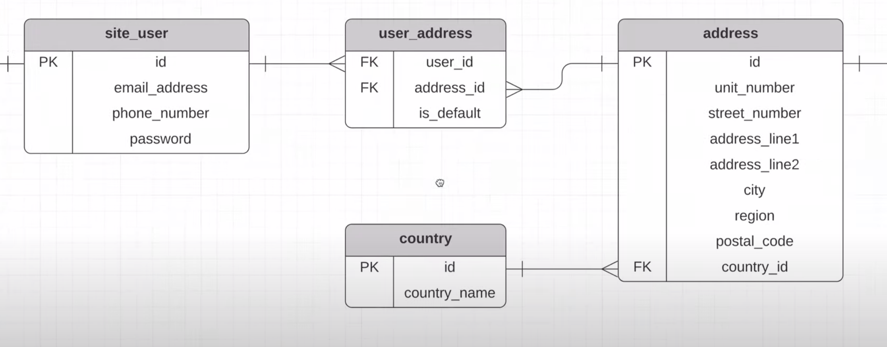

# Database Design

When dealing with **Multiple to Multiple** relationship, a common way is to add a middle layer to have 2 **One to Multiple** relationships. 

Example:

When a user can have multiple addresses and an address can be used by multiple users. We add a joining table in the middle to eliminate the `M to M` relationship.

