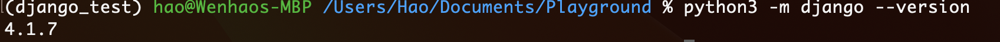

# Django

## Questions

#### [How to integrate Django with React?](../../FrontEnd/React/reactNotes.md#how-to-integrate-react-with-the-backend)
#### [How to parse request.body from POST in Django](https://stackoverflow.com/questions/29780060/trying-to-parse-request-body-from-post-in-django)
#### [How to filter a query with a list of values?](https://stackoverflow.com/questions/9304908/how-can-i-filter-a-django-query-with-a-list-of-values)
#### [What are cookies, local storage, session storage](https://www.youtube.com/watch?v=GihQAC1I39Q)

A cookie is a payload of data that will be exchanged between server and client on **EVERY** request. Therefore, all necessary tokens are stored inside the cookie.

Local storage is a cache section on the computer, meaning data inside of which will be accessed by everyone and won't be automatically deleted.

Session storage is a cache section stores inside the browser memory and only a specific tab can view it, which also will be deleted once the section is closed.


## [Django Working Model](https://developer.mozilla.org/en-US/docs/Learn/Server-side/Django/Introduction#what_does_django_code_look_likenb)


* **View**: A view is a request handler function, which receives HTTP requests and returns HTTP responses. Views access the data needed to satisfy requests via models, and delegate the formatting of the response to templates.

* **Models**: Models are Python objects that define the structure of an application's data, and provide mechanisms to manage (add, modify, delete) and query records in the database.

* **Templates**: A template is a text file defining the structure or layout of a file (such as an HTML page), with placeholders used to represent actual content. A view can dynamically create an HTML page using an HTML template, populating it with data from a model. A template can be used to define the structure of any type of file; **it doesn't have to be HTML!**


## Environment

Django relies on Python. Therefore, we can use Django on system wide where all Django projects share the same python version or a local virtual environment where different Django projects have different Python versions as they specified.

The installation procedure can be referred [here](https://developer.mozilla.org/en-US/docs/Learn/Server-side/Django/development_environment#installing_the_virtual_environment_software)

After successful installation, we'll **install Django inside the virtual environment**. The result is when we enter the vEnv, we'll have Django installed, and exit into the the normal system, we'll find it not found.



### Common Commands that run on the normal system env

1. `deactivate` — Exit out of the current Python virtual environment
2. `workon` — List available virtual environments
3. `workon name_of_environment` — Activate the specified Python virtual environment
4. `rmvirtualenv name_of_environment` — Remove the specified environment.


## StartUp and common commands

1. `mkvirtualenv name-of-the-env`: create a new virtual environment and automatically log into the created env.
2. `workon env`: Log into the env. (optional)
3. `pip3 install django~=4.0`: Install Django.
4. `django-admin startproject name-of-the-project`: Inside the env, created a new project using django. The project still exists after you logout the env. 
5. `python3 manage.py runserver`: Inside the project folder, start the server.

?> `manage.py` is serves as your project management script, which can be used to create on or more applications, work with databases, and start the development web server.
Note: A website may consist of one or more sections. For example, main site, blog, wiki, downloads area, etc. Django encourages you to develop these components as separate applications, which could then be re-used in different projects if desired.

6. `python3 manage.py makemigrations`: save changes after developing more models to represent in the databases. Refer to [MIgration Folder](#migration-folder) to better understand what migrations are.
7. `python3 manage.py migrate`: apply the changes to the databases.
8. `python3 manage.py createsuperuser`: create a super user to the admin site.
9. 


## Development Procedure

1. Register the new applications to include them in the project. [Registering Models](https://developer.mozilla.org/en-US/docs/Learn/Server-side/Django/Admin_site#registering_models)
2. Hook up the url/path mapper for each application.

## Project skeleton

To see what each file is doing after creating the project refer to [creating_the_project](https://developer.mozilla.org/en-US/docs/Learn/Server-side/Django/skeleton_website#creating_the_project)

## Basic Concepts


### Migration folder

Django uses an `Object-Relational-Mapper` (ORM) to map model definitions in the Django code to the data structure used by the underlying database. As we change our model definitions, Django tracks the changes and can create database migration scripts (in /locallibrary/catalog/migrations/) to automatically migrate the underlying data structure in the database to match the model.


### Models

Django uses an abstraction over databases, thus we'll only need to work with Models (often Python classes). Check out [Model Primer](https://developer.mozilla.org/en-US/docs/Learn/Server-side/Django/Models#model_primer) for better details how to mimic fields, restrictions and etc of databases using Python classes. 


?! In many fields, the first *unnamed* argument is `verbose_name` which is a label for the column. 


#### [ForeignKey](https://docs.djangoproject.com/en/4.1/ref/models/fields/#foreignkey)

When creating a relationship on a model that has not been defined, we can use the name of the model, rather than the object itself.

ForeignKey is a one to many relationship. Thus, when we are in a situation where the `one` model doesn't have a field to describe the `many` model and try to retrieve all associated `many` instances, we can use Django's reverse lookup.

Example: `Book` is a foreign key of `BookInstance`. Thus, `One` book may have `Many` book instances. We try to find all associated book instances.

In a view, we use `set`
```python

  <!-- code to iterate across each copy/instance of a book -->

```

For details refer to [creating the detail view template](https://developer.mozilla.org/en-US/docs/Learn/Server-side/Django/Generic_views#creating_the_detail_view_template)


#### [Choices field](https://docs.djangoproject.com/en/4.0/ref/models/fields/#choices)

For every choices field `Foo` a method `get_Foo_display()` will be automatically created by Django, which can be used to get the current value of the field.


### Views

A view is a function that processes an HTTP request, fetches the required data from the database, renders the data in an HTML page using an HTML template, and then returns the generated HTML in an HTTP response to display the page to the user. 

#### Function based View

A view is defined as a function if it is in the following form:

```python
def index(request):
    # Generate counts of some of the main object
    num_books = Book.objects.all().count()
    num_instances = BookInstance.objects.all().count()
    num_genres = Genre.objects.count()

    # Available books (status = 'a')
    num_instances_available = BookInstance.objects.filter(status__exact='a').count()

    # The 'all()' is implied by default.
    num_authors = Author.objects.count()

    # construct context object that is passed to the template
    context = {
        'num_books': num_books,
        'num_instances': num_instances,
        'num_instances_available': num_instances_available,
        'num_authors': num_authors,
        'num_genres': num_genres,
    }
    # render(request, template_name, context=None, content_type=None, status=None, using=None)¶
    return render(request, 'index.html', context=context)
```

For a function based view, the url mapping looks as simple as the following:

```python
urlpatterns = [
    path('', views.index, name='index')
]
```

#### [Class-based generic list view](https://docs.djangoproject.com/en/4.1/topics/class-based-views/generic-display/)

The benefit of writing a view based on a class rather than a function is that a class-based view can inherit from another class-based view, thus the majority of duplicated work can be saved.


> For Django class-based views we access an appropriate view function by calling the class method as_view(). This does all the work of creating an instance of the class, and making sure that the right handler methods are called for incoming HTTP requests.

For a class-based view, teh url mapping requires additional bit of work:

```python
urlpatterns = [
    path('', views.abc.as_view(), name='view')
]
```

#### Capture argument and Pass additional options to view

Angle brackets are used to capture part of the URL, setting the name of the variable that the view can use to access the captured data. A proceeding [type converter](https://docs.djangoproject.com/en/4.0/topics/http/urls/#path-converters) can be optionally used. 

> Regular expression can also be used, which is even more powerful.

```python
 path('book/<int:pk>', views.BookDetailView.as_view(), name='book-detail'),
```

For [DetailView](https://docs.djangoproject.com/en/4.1/ref/class-based-views/generic-display/#detailview), it is inherited from [SingleObjectMixin](https://docs.djangoproject.com/en/4.1/ref/class-based-views/mixins-single-object/#django.views.generic.detail.SingleObjectMixin). According to the flowchart, [get_object()](https://docs.djangoproject.com/en/4.1/ref/class-based-views/mixins-single-object/#django.views.generic.detail.SingleObjectMixin.get_object) is called, which will filter by primary key or slug filed automatically if set. Thus, we after `pk` the default name primary key is set, it's automatically filtered.


For [additional options](https://docs.djangoproject.com/en/4.0/topics/http/urls/#views-extra-options), use an unnamed object as the third argument of `path()`. This is useful when you want multiple resources to share the same view with slightly different options.


#### [How to fetch data from model](https://docs.djangoproject.com/en/4.1/topics/db/queries/#retrieving-objects)

To get all the instances of a model, we first need to `import` it 

```python
from .model import book
```

Then query:

```python
num_books = Book.objects.all().count()
#This is equivalent to the above one as all() is implied
num_books = Book.objects.count() 
```

All models are inherited from [django.db.models.Model](https://docs.djangoproject.com/en/4.1/ref/models/instances/#django.db.models.Model) (No need to dive into this link), thus has an attribute `objects`. Indeed, the attribute is called `Manager` which by default called `objects` if no custom one is provided. [Manager](https://docs.djangoproject.com/en/4.1/topics/db/managers/#django.db.models.Manager) is the most important interface that allows to query operations over databases. 

> In the above example, the return value of `all()` is a [QuerySet](https://docs.djangoproject.com/en/4.1/ref/models/querysets/#django.db.models.query.QuerySet) represents a collection of objects from your database. It's usually chained by multiple filter operations.


### Admin sites

In order to show models in the admin site which is a hub site that allows us to insert, delete and modify models easily. However, [Migrations](#migration-folder) works with `databases`. The admin site has no idea what models you have. Hence, we also need to **register** the models to the admin site. Details can refer to [Registering Models](https://developer.mozilla.org/en-US/docs/Learn/Server-side/Django/Admin_site#registering_models)

> Note that admin sites are customizable. A [reference page](https://docs.djangoproject.com/en/4.0/ref/contrib/admin/) shows all available customizations. 

#### Register

To register a model to the admin page, we use `admin.site.register(model-name)` command for the default admin page, or `admin.site.register(model-name, custom-admin-model)` for a custom admin model or [register decorator](https://docs.djangoproject.com/en/4.0/ref/contrib/admin/#the-register-decorator)

> Note that sometimes when we customize the displayed information of a model, we may encounter that Django doesn't allow us to display columns with `ManyToMany` relationship. Refer to [Configure List views](https://developer.mozilla.org/en-US/docs/Learn/Server-side/Django/Admin_site#configure_list_views) to handle this.


### Templates

Templates of Django allow us to swap `variable`, `tags` and so on to easily remove boilerplate code. 

! You can't specify arguments to functions in templates.


#### Search Location

By default, templates are searched in the `application/templates/` folder. 

Inside `settings.py`, `TEMPLATES` is where to configure the search directories of templates.


#### [Template Inheritance](https://docs.djangoproject.com/en/4.1/ref/templates/language/#template-inheritance)

Template Inheritance is the most important Feature of templates. The most essential tags associated with it are `block` and `extends`

1. We set a `base.html` that serves as the base skeleton, where `block` tag is used to play the template role. 

2. Create other derived files that start with `extends "base.html"` tag. Then all following `block` tags will be replace the `block` tags defined in the `base.html`

#### Load

Your project is likely to use static resources, including JavaScript, CSS, and images. Because the location of these files might not be known (or might change), Django allows you to specify the location in your templates relative to the `STATIC_URL` global setting. The default skeleton website sets the value of `STATIC_URL` to `/static/`, but you might choose to host these on a content delivery network or elsewhere.

Within the template you first call the load template tag specifying "static" to add the template library, as shown in the code sample below. You can then use the static template tag and specify the relative URL to the required file.


```html
<!-- Add additional CSS in static file -->

<link rel="stylesheet" href="" />

```

### URL

url tag can be used inside the quote mark. The following argument is the name of a `path()` defined in the url.py of the application.

```html
<li><a href="">Home</a></li>
```


### Session

Session is used to keep track of the states between users (**actually between browsers**). Django stores a `session id` inside the cookie that can be used to identify browser and session. The session data by default is stored in the databases. 

#### [AutoSave](https://developer.mozilla.org/en-US/docs/Learn/Server-side/Django/Sessions#saving_session_data)

Django will save changes to the session data to the database automatically. However, it will not recognize the changes if updates happen to the data of session data (`nested data`). 

```python
# This is detected as an update to the session, so session data is saved.
request.session['my_car'] = 'mini'

# Session object not directly modified, only data within the session. Session changes not saved!
request.session['my_car']['wheels'] = 'alloy'

# Set session as modified to force data updates/cookie to be saved.
request.session.modified = True
```

Thus, we have to explicitly specify an update.


### [Users](https://docs.djangoproject.com/en/4.0/topics/auth/customizing/#using-a-custom-user-model-when-starting-a-project)


### Permissions

Permissions are associated with **models** and define the operations that can be performed on a [model](#models) instance by a user. By default, Django allow add, change, and delete permissions to all users. 

Permissions are defined on a model `class Meta` section.


### Forms

Django Form is a generic way that allows to quickly validate the inputs, similar tool is [Django REST framework serializer](https://www.django-rest-framework.org/api-guide/serializers/). **If we implement the frontend ourselves, the following procedure can be neglected as we only care about the data population of form.**

The procedure of a handling forms by Django is illustrated below:


So, Django returns an empty form on the **first** request and a filled form with response on the **second** request. Normally, the **first** request happens when the page loads, and the **second** request happens after the submission. 

To deal with different requests by the same handler function, we use `POST` and `GET` methods to distinguish as the first request is, by convention,  a `GET` request and the second request is a `POST` request which contains some user-entered data.


#### Access data

When accessing user-entered data, one way is to use `request.POST['field_name]`, which is not recommended, as te data is raw and may contain malicious inputs. Another way is to use `form.clean_data['field_name]` which is validated and cleaned. 

When using Axios in React, the data sent through request is raw instead of form data. According to [Django](https://stackoverflow.com/questions/16213324/django-tastypie-request-post-is-empty), only form data will be accessible through `request.POST` while raw data is accessed through `request.body`. Thus, we need to [parse raw data into python json format before using it](https://stackoverflow.com/questions/29780060/trying-to-parse-request-body-from-post-in-django). 

> REST framework provides the functionality of Form and parsing raw to json, however it requires more learning effort. The easiest way is by using `Python.json`


#### [CSRF Token](https://portswigger.net/web-security/csrf)

Add the `` to every Django template you create that uses POST to submit data. This will reduce the chance of forms being hijacked by malicious users.

```python
  <form action="" method="post">
    
    <table>
    {{ form.as_table }}
    </table>
    <input type="submit" value="Submit">
  </form>
```

> When using Axios in React to send form data, check [how to fix the CSRF Token error](../../FrontEnd/React/reactNotes.md/#how-to-solve-csrf-token-missing-error-when-using-axios)


## Authentication and Authorization with React

First thing first, the Authentication and authorization system that Django by default uses is more than enough. But it can only be used if we use Django as a webpage provider meaning we have to use its template system. It's clearly not the case if we use React as our frontend. Thus, third-party (meaning it doesn't come along with Django) authentication and authorization system has be to used.

### [JWT (JSON Web Token)](https://www.youtube.com/watch?v=7Q17ubqLfaM)

JWT is an authorization system, that unlike traditional `SessionID` system. It stores all the information inside the token including the User information.

Traditional SessionID system returns a session ID to the client when it makes its first request. All following requests will be sent along with that sessionID. Inside the server memory, the sessionID is bound to a specific user. Thus, the server will have to do a lookup to find that user and make sure it exists.

JWT also sends a token along with the first request (the login request normally), which contains all the user information encoded by a `secret key` that only the server knows. A portion of  token also contains all the information encoded by the secret key. Thus, when the server receives the token on the following requests, all it has to do is recalculate the information portion with its secret key and makes sure it's the same as the encoded portion of the token. As long as the code is matched, the server can be sure that the token is not tampered with and the user can be trusted. 

The above link provides very detail explanation on this, also at what scenario JWT is useful.

>`AccessToken` is what is referred above. However, RefreshToken is also a term that is often heard. A great explanation can be found [here](https://www.youtube.com/watch?v=41vmzPdbfXM)

### How to use JWT with React

The Django Rest Framework provides [detail documents](https://www.django-rest-framework.org/api-guide/authentication/) on how to setup the authentication system. 

Also this [article](https://www.digitalocean.com/community/tutorials/how-to-add-login-authentication-to-react-applications) provides step by step implementation, which is a great reference to start with. 

As for the React Part, this [youtube mix](https://www.youtube.com/watch?v=brcHK3P6ChQ&list=RDCMUCY38RvRIxYODO4penyxUwTg&start_radio=1&rv=brcHK3P6ChQ&t=48) provides step by step implementation of the whole authentication system using React.


### How to implement Registration API using DRF?

User is stored as a model in Django. Thus, we can treat it as a normal model with DRF by writing a serializer. 

For the React part, a simple form that submits user password and necessary info with a `POST` request is enough.

The detail implementation of the registration API can be referred to this two pages. 

1. [How to Create Register and Login API using Django Rest Framework and Token Authentication](https://www.codersarts.com/post/how-to-create-register-and-login-api-using-django-rest-framework-and-token-authentication)

2. [Django REST Framework Tutorial – Register Login Logout API](https://studygyaan.com/django/django-rest-framework-tutorial-register-login-logout)

3. [](https://iheanyi.com/journal/user-registration-authentication-with-django-django-rest-framework-react-and-redux/)

4. [Digital Ocean](https://www.digitalocean.com/community/tutorials/how-to-add-login-authentication-to-react-applications)

More reference can be found here:

1. [.](https://medium.com/@ronakchitlangya1997/jwt-authentication-with-react-js-and-django-c034aae1e60d)

2. [.](https://blog.devgenius.io/django-rest-framework-react-authentication-workflow-2022-part-2-d299b7fef875)

3. [.](https://www.reddit.com/r/django/comments/vp93md/comment/iei6lqu/)

4. [.](https://www.reddit.com/r/django/comments/l6tmfx/django_react_best_authentication_method/)

4. [.](https://www.digitalocean.com/community/tutorials/how-to-add-login-authentication-to-react-applications)


For password validation, Django provides default validators in the `settings.py`. We can also write our own validators. An official reference can be found at [Writing your own validator¶](https://docs.djangoproject.com/en/4.1/topics/auth/passwords/#writing-your-own-validator). We can then add the path to `settings.py` following the syntax. 

> A step by step demonstration can be found at [Default and Custom password validators in Django](https://www.letscodemore.com/blog/how-to-add-custom-password-validators-in-django/)


### How to implement block anonymous users from calling APIs using DRF?

In a normal Django function based view, a `login_required` decorator can be used to block any unauthenticated users. In a class based view, URLConf decorator, derived from a `Mixin` or `method_decorator` on `dispatch` method all all possible. A detail reference can be found in this [page](https://stackoverflow.com/questions/6069070/how-to-use-permission-required-decorators-on-django-class-based-views)

As for Django Rest Framework, [Permission classes](https://www.django-rest-framework.org/api-guide/permissions/) can be used. 


#### How to export all dependencies (libraries) that current project is rely on

```bash
pip3 freeze > requirements.txt  # Python3
```

[Reference to](https://stackoverflow.com/questions/31684375/automatically-create-requirements-txt)


#### How to implement Email Verification?

1. For email verification, the most important thing is `token` generation. A token is a block of **hashed** data which indicates the data is not changed. 

A big misunderstanding is that `hashes` like `SHA1` are **not** encryptions. Hashes only cares about the data is not changed, and it's irreversible, while encryption also cares about reversion.

2. By default, Django provides `default_token_generator` which is an alias of `PasswordResetTokenGenerator`. After read the source code, it's not hard to understand that Django uses `hashlib` and [hmac](https://www.liaoxuefeng.com/wiki/1016959663602400/1183198304823296) standard library to help generate the token. Therefore, we can implement a subclass that is derived from `PasswordResetTokenGenerator` and override its `_make_hash_value` function (which indicates all value to be checked). A step by step tutorial can be found [here](https://www.youtube.com/watch?v=Rbkc-0rqSw8&t=1873s)

> One problem of the above method is that `token` is only used as an indicator that shows if the data is modified. Meaning we have to include a `userid` in plaintext (even use [base64 encode](https://www.youtube.com/watch?v=8qkxeZmKmOY) it's still plaintext in a random look).

1. An alternative way is to use `encryption` to generate the token, which encodes everything including the user information. The server then decodes from the token to retrieve user info for further actions. A reference can be found [1](https://blog.csdn.net/qq_51014805/article/details/119987513) [2](https://blog.csdn.net/weixin_43903639/article/details/122898902)
