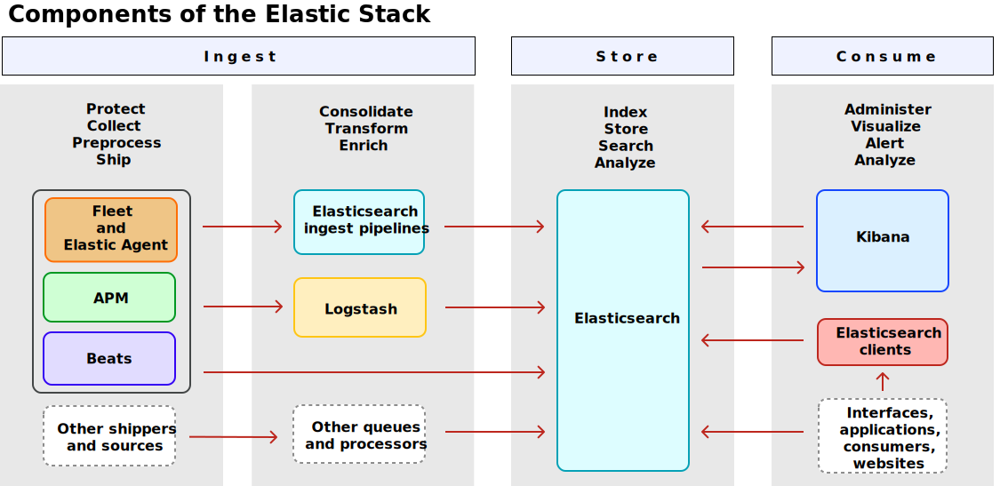

## Main concepts


#### Level 1: Core Architecture & Basic Concepts

1. Cluster, Node, and Shards
   * **Cluster**: A single collection of one or more Elasticsearch nodes. The top-level container.

   * **Node**: A single server instance that is part of a cluster. Stores data and participates in indexing and search.

   * **Shard**: A single Lucene index. Sharding is how Elasticsearch distributes data.

     * Primary Shard: The main copy of your data where all writes go first.
     * Replica Shard: A copy of a primary shard for high availability and improved read performance.

Key Insight: An Elasticsearch Index is physically divided into one or more shards, which are distributed across nodes.

2. Index, Document, and Field

   * **Index**: A collection of documents that have similar characteristics (like a "table" in an RDBMS, but the analogy is loose).

   * **Document**: A JSON object that is the basic unit of information in Elasticsearch. Stored in an index and represented by a unique ID.

   * **Field**: A key-value pair within a document (like a "column").

    Example:

    ```json
    // Index: `products`
    // Document:
    {
    "_id": "1",
    "name": "Wireless Mouse", // Field
    "price": 29.99,          // Field
    "category": "electronics" // Field
    }
    ```

3. Inverted Index

This is the secret sauce that makes full-text search so fast.

It's a data structure that maps terms (words) to the documents that contain them.

Think of it like the index at the back of a book. You look up a keyword and it tells you all the pages where it appears.

#### Level 2: Data Modeling & Operations

1. Mapping
The "schema definition" for your index. It defines:

The data type of each field (text, keyword, date, long, nested, etc.).

How the field should be indexed and analyzed.

Crucial Distinction:

* **text**: For full-text search (e.g., product descriptions). It's analyzed (broken down into tokens).

* **keyword**: For exact matches, aggregations, and sorting (e.g., status codes, tags, categories).

5. Analysis & Analyzers
Analysis is the process of converting text into tokens or terms for the inverted index.

An Analyzer is a package that does this. It consists of:

Character Filters: Clean up the text (e.g., strip HTML).

Tokenizer: Splits text into tokens (e.g., on whitespace).

Token Filters: Modify tokens (e.g., lowercase them, remove stopwords like "and", "the").

Example: "The Quick Brown-Fox!" becomes ["quick", "brown", "fox"].

6. CRUD & Search APIs
Index API: Add or update a document.

Get API: Retrieve a document by its ID.

Delete API: Delete a document.

Search API: The most important API. Complex queries can be built using:

Query Context: "How well does this document match this clause?" (Relevance scoring).

Filter Context: "Does this document match this clause?" (Yes/No, faster, cached).

Level 3: Advanced Data & Cluster Management
7. Data Streams (You just asked about this!)
The modern way to handle time-series data (logs, metrics). It's a managed, append-only sequence of indices.

8. Index Lifecycle Management (ILM)
Automates how you manage your indices over time. You define policies that move indices through "hot," "warm," "cold," and "delete" phases based on age, size, etc.

Essential for managing costs and performance for time-series data.

9. Cluster Health & Management
Health Status: green (all good), yellow (all primaries are available, but replicas are not), red (some primary shards are missing).

Cat API: A simple, concise API for monitoring cluster state (e.g., GET _cat/indices?v).

Tasks API: For managing long-running tasks like reindexing.

Level 4: Performance, Security & Reliability
10. Refresh, Flush, and Translog
Refresh: Makes newly indexed documents available for search. By default happens every 1 second. This is what makes ES "near real-time."

Transaction Log (Translog): A write-ahead log that ensures data durability. All operations are logged here before being committed to the Lucene segments.

Flush: The process of clearing the translog and committing data to disk in a new Lucene segment.

11. Dynamic Mapping vs. Explicit Mapping
Dynamic Mapping: Let ES guess the field type when you index a new document. Great for prototyping, dangerous for production.

Explicit Mapping: You define the mapping before indexing data. This is a best practice for production to avoid type mismatches and poor performance.

12. Security & RBAC
Role-Based Access Control (RBAC): Defining roles (e.g., read-only-user, ingest-manager) with specific privileges (which indices they can read/write) and assigning them to users.

Kibana Spaces: For organizing Kibana objects (dashboards, visualizations) for different teams or use cases.


## Elastic Stack — overview



This note summarizes the core components, data flow, and quick operational guidance for the Elastic Stack (Elasticsearch, Logstash, Kibana) and related tools (Beats, Elastic Agent, Fleet).

Goals of this document:
- Give a concise description of each component and how they interact.
- Provide a short quickstart and common operational tips.
- Link to official docs and useful next steps.

### What the Elastic Stack provides

- Indexing, searching, and analytics engine: Elasticsearch (distributed, RESTful).
- Data collection and ingestion: Beats (lightweight shippers), Elastic Agent (unified agent), Logstash (transform/ingest pipelines).
- Visualization and management: Kibana.
- Centralized agent management: Fleet (manages Elastic Agent policies and integrations).

> Fleet enables you to centrally manage Elastic Agents and their policies.

### Key components

- Elasticsearch — distributed document store and full-text search engine. Use it for storing logs, metrics, traces, and application data.
- Kibana — web UI for search, visualizations, dashboards, and managing Fleet and Ingest Pipelines.
- Logstash — optional processing pipeline for advanced transformations, enrichment, and routing.
- Beats — a family of lightweight shippers (Filebeat, Metricbeat, Packetbeat, Winlogbeat, Auditbeat) that send data directly to Elasticsearch or to Logstash.
- Elastic Agent — a single, unified agent that can replace multiple Beats and collect logs/metrics/security data via integrations.
- Fleet — Kibana-managed service for centrally controlling Elastic Agents and their policies.

### Typical data flow

1. Data source: application logs, system logs, metrics, network packets, APM traces.
2. Collector: Beats or Elastic Agent gather the data on hosts/containers.
3. Ingest: Data can be sent directly to Elasticsearch or routed through Logstash for advanced processing.
4. Ingest pipelines (Elasticsearch) can parse, drop, or enrich documents before indexing.
5. Storage & search: Elasticsearch indexes the documents and serves queries.
6. Visualization & management: Kibana lets you explore data, build dashboards, and manage Fleet/policies.

### Common operational tips

- Index lifecycle: Use index lifecycle management (ILM) to rotate, warm, and delete indices to control storage costs.
- Templates & mappings: Define index templates and explicit mappings for fields you care about (timestamps, numeric, keyword) to avoid mapping explosions.
- Ingest pipelines: Prefer ingest pipelines over client-side parsing when you want central parsing logic and lower client CPU usage.
- Security: Enable TLS between components and configure authentication (built-in security) for production.
- Monitoring: Use the Stack Monitoring (formerly X-Pack monitoring) to track cluster health, JVM, and indexing/search metrics.

### Troubleshooting checklist

- Cluster health: `/_cluster/health` and Kibana Monitoring.
- Slow queries: Review slow logs and use the Profile API to investigate expensive queries.
- Shard allocation: Check `/_cat/shards` and allocation explanations when nodes are down.
- Disk watermarks: Elasticsearch will block writes if nodes exceed high disk watermark; consider ILM or more storage.


### ElasticSearch

#### [Search approaches](https://www.elastic.co/docs/solutions/search/search-approaches)


### Index and search basics

[**Index**](https://www.elastic.co/docs/manage-data/data-store/index-basics)

    So, in Elasticsearch terms, an **Index** is a **logical namespace that points to a collection of documents** that are usually related.

Index components

  * **Document**: A document is a set of fields, which are key-value pairs that contain your data.
  * **Metadata**:
  * [**Mapping**](https://www.elastic.co/docs/manage-data/data-store/mapping): Each index has a **mapping** or schema for how the fields in your documents are **indexed**. A mapping defines the data type for each field, how the field should be **indexed**, and how it should be stored.
  
    > Mapping typically means creating indexes of the fields. If use emplicit mapping, we can prevent [Mapping Explosion](https://www.elastic.co/docs/manage-data/data-store/mapping#mapping-limit-settings) by only creating mapping on specic fileds.


### Mapping

[**Reference:**](https://www.elastic.co/docs/reference/elasticsearch/mapping-reference/)

[Filed Types](https://www.elastic.co/docs/reference/elasticsearch/mapping-reference/field-data-types)

1. 

### [Searches](https://zilliz.com/blog/semantic-search-vs-lexical-search-vs-full-text-search)


**Lexical Search (keyword) search**
    
    Keyword match

**Full-text Search**
    variant match, `run` matches `ran`, `running` as well.

**Semantic Search**

    Create a vector database

#### [ES Search Practice](https://www.elastic.co/docs/solutions/search/get-started/quickstarts)

When you create vectors (or vectorize your data), you convert complex and nuanced documents into multidimensional numerical representations. You can choose from many different vector embedding models. Some are extremely hardware efficient and can be run with less computational power. Others have a greater understanding of the context, can answer questions, and lead a threaded conversation. 

**The way that you store vectors has a significant impact on the performance and accuracy of search results.** They must be stored in specialized data structures designed to ensure efficient similarity search and speedy vector distance calculations. This guide uses the semantic text field type, which provides sensible defaults and automation.

### [How full-text search works](https://www.elastic.co/docs/solutions/search/full-text/how-full-text-works)


### Semantic Search & Vector Search

These vector representations come in two forms: `dense vectors` that capture **overall meaning**, and `sparse vectors` that focus on **key terms and their relationships**.

Semantic Search vs Vector Search

* Semantic search provides **managed** workflows that use **vector search** under the hood:
* Vector search gives direct access to 
  1. Manual configuration of dense or sparse vectors
  2. Flexibility to bring your own embeddings
  3. Direct implementation of vector similarity matching

### Hybrid Search

Hybrid search combines traditional full-text search with AI-powered search for more powerful search experiences that serve a wider range of user needs.

Baisc Idea of Hybrid Search illustrated by [Milvus](https://zilliz.com/blog/semantic-search-vs-lexical-search-vs-full-text-search)


[Practice](https://www.elastic.co/docs/solutions/search/hybrid-semantic-text)


### DataStream


### Templates


Think of an Elasticsearch Template as a blueprint or a set of instructions that is automatically applied when a new index is created. Its primary purpose is to ensure consistency and enforce standards across your indices.

Without templates, you would have to manually define settings, mappings, and aliases every time you create a new index, which is error-prone and inefficient.


There are **two** types of template:

* An `index template` is the main configuration object applied when creating an index or data stream. It matches index names using index_patterns and resolves conflicts using a priority value. An index template can optionally define settings, mappings, and aliases directly, and refer to a list of component templates that provide reusable configuration blocks. It can also indicate whether it should create a data stream or a regular index.

* A `component template` is a reusable building block that defines settings, mappings, and aliases. Component templates are not applied directly; they must be referenced by index templates.


