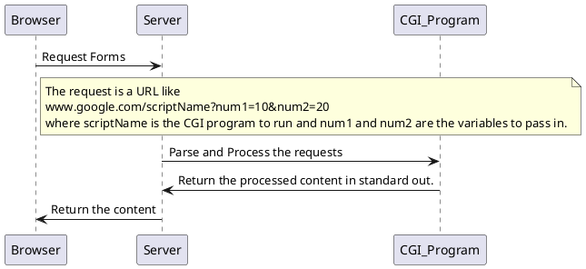

## Questions:
1. [What is CGI?](#what-is-cgi)
2. [What exactly is Apache?](#what-is-apache)
3. [What's node.js server and how's it different from Apache](#is-nodejs-a-server)

#### What is CGI (Common Gateway Interface) [->Ref](https://zhuanlan.zhihu.com/p/246268005) :id=what-is-cgi

CGI is a standard method used to generate dynamic content on web pages. CGI stands for Common Gateway Interface and provides an interface between the HTTP server and **programs generating web content**. (We're talking about dynamic content only here, like API returns, static content like HTML is directly returned by the server)

These programs are better known as CGI scripts. They are written in a scripting language. The Network Component provides such a scripting language. The HTTP server processes the script source file line by line, and the results that is printed in the standard output is sent to the web client (browser) as a part of the web page.

ps: CGI programs are like c programms, CGI script are like php and python. For better understanding, please combine this section with [Difference between node.js and Apache](#is-nodejs-a-server-what39s-the-difference-between-it-and-apache).

A comprehensive video of what CGI is can be found at [The Magic of cgi-bin](https://www.youtube.com/watch?v=NwRVJX0Ieno).



> CGI is only a **protocol** that is well defined beforehand. CGI scripts/program are application logics we're dealing with, only that they need to return the result by printing to the standard out. 

**The question I ever came up with is: If CGI scripts/program are just application logics, and I am not following any protocols at all except returning results to the standard out, where CGI plays a role?**

**The answer is that the server supports it.**. Therefore, when a request comes in, the server will follow the CGI protocol to start up a new process to run the CGI scripts/program, and a pipe between to read/write input/out streams. All we need to do is specify the location of all the cgi scripts/program inside the server `conf` file. Also, later when talking about [Nginx](#nginx) and [gunicorn](#gunicorn) you'll find that since Nginx doesn't support CGI (in this case WSGI), therefore, we need an extra layer of gunicorn to do the job. This case, Nginx is simply a request forwarder.

> Do note that, for a CGI program, we have to compile it in order to use.


To better demonstrate, here's the code written myself in the `webDev` project.

```html
<!-- index.html -->
    <body>
        <form action="usr.php" method="post">
            <div class="imgcontainer">
                
            </div>
            <div class="login_container">
                <label for="usrname"><b>用户名</b></label>
                <input type="text" name="usrname" placeholder="Enter UserName" required>
                 <button type="submit" class="login_button">Login</button>
            </div>
        </form>
    </body>
```

```php
// usr.php
<?php
include 'valid_usrs.php';

session_start();

function redirect($page) {
    header("Location: " . $page);
    exit;
}

if(!isset($_SESSION['UserName'])) {
    if (isset($_POST['usrname'])) {
        if ($_POST['usrname'] == "Buyer") {
            redirect("buyer.php");
        }
        if(!in_array($_POST['usrname'], $valid_names)) {
            redirect("index.html");

        } else {
            $_SESSION['UserName'] = $_POST['usrname'];
        }
    }
}
?>
// Everything Above is the CGI Script/Program, and everything below is the content CGI Script/Program returns
<DOCTYPE html>
<html>
    <head>
        <meta charset="utf-8">
        <meta name="viewport" content="width=device-width, initial-scale=1">
        <title></title>
        <script src="./js/jquery-3.6.0.js"></script>
        <script src="./js/usr.js"></script>
        <link rel="stylesheet" href="./css/fontawesome/all.css">
        <link rel="stylesheet" href="./css/usr.css">

    </head>
    ....
```

#### What exactly is Apache? [->Ref](https://www.nginx.com/blog/nginx-vs-apache-our-view/) :id=what-is-apache

Apache is a **Web Server Software**, which means, it's only a program running on a `server`, where server here refers the actual hardware. It's the same program I ever wrote in CS241.
The basic logic it runs is that it create a process/thread for each connection, and invoke the CGI according to the request or html file if the request is static.

#### Is node.js a server? What's the difference between it and Apache? [>Ref](https://stackoverflow.com/questions/38821947/how-does-a-node-js-server-compare-with-nginx-or-apache-servers) :id=is-nodejs-a-server

1. node.js is the runtime environment to run javaScript on a server. Therefore, with node.js, javaScript now can create, open, read, write, delete, and close files on the server. Therefore make it much it much like backend language as C or java. Because now node.js is capable of doing these sysem programming, you can also write a server using it, using `listen`. 

2. You can definitely write a node.js server, listening to a port and process the request. Now, your'll write code that will play **both the role of a server and CGI**. However, that's normally not the case in production. [当然你在你的服务器上直勾勾挂个 Node.js 监听 80 端口对外也不是不可以。但是通常真正线上（个人玩具除外）的做法是，Node.js 监听本地的某个端口，然后前面挂个 Nginx 监听 80 端口反向代理到 Node.js 上](https://www.zhihu.com/question/57688289). 

The `Ref` also notified that:

?>Then some developers started simply using HTTP as their app->server protocol. In effect, the app is also an HTTP server. The advantage of this is that you don't need to implement any new, possibly buggy, possibly not tested protocol and you can debug your app directly using a web browser (or also commonly, curl). And you don't need a modified web server to support your app, just any web server that can do reverse proxying or redirects.

---

## Nginx

Nginx is a **web server**<sup>1</sup> that can also be used as a [**reverse proxy**<sup>2</sup>](https://www.cloudflare.com/learning/cdn/glossary/reverse-proxy/), **load balancer**<sup>3</sup>, mail proxy and HTTP cache. 

* Nginx is case sensitive.

### [Nginx SetUp](https://www.plesk.com/blog/various/nginx-configuration-guide/)

Nginx can hold many virtual servers meaning, many websites can be hold on the same machine as they are hosted on different ones. 

* `/etc/nginx/sites-available/example.com` is a config file of Nginx. It includes server blocks that specifies the configurations of the virtual servers. 
> It's valid to define multiple virtual servers to host different websites in the single config file. But it's less coupled to have each one in a separate config file.

* `/etc/nginx/sites-enabled/*` contains symbolic links of config files to the ones in `/etc/nginx/sites-available/*`. Only config files included in `sites-enabled` folder can be accessed. 

* Both `sites-enable/sites-available` and `conf.d` are good practice to config vhost of Nginx for a site. The former is only available for Ubuntu/Debian distro, and easier to disable configs for sites not in use, as you have to remove the config files out of the `conf.d` folder to disable it.

* `listen` specifies the port to listen and [default_server](https://linuxhint.com/what-is-default-server-in-nginx/) specifier indicates this server is served when HTTP Host header remains unmatched with any other server blocks.

### [Nginx on LAN](https://stackoverflow.com/questions/45241243/accessing-nginx-virtual-host-in-local-network)

Each device has a host file as it's own DNS service. Only domain name not found in the host file will be sent to external DNS servers to be resolved. 

Therefore, add host entry in `IP DomainName` pair in `/etc/hosts` file on Mac can resolve local server name in a snap. 

> It's a common practice to have a host software managing local hosts for you. [switchHost](https://swh.app)


## Notes

### Build FTP server [->Ref](https://help.aliyun.com/document_detail/60152.html)


## Deployment 

### Workflow

It is fairly common to have at least a `release branch` and a `master branch` for a development. The master branch contains the latest code in development, while the release branch contains the stable code that is ready to be deployed to production.

Also, since a `release branch` is targeted for production, some of the configuration files and others may be different from the `master branch`. Therefore, when merging code from `master branch` to `release branch` should be extremely careful.

The common procedure is as follows:

1. First, ensure that the release branch is checked out and up-to-date with the remote repository.
2. Create a new branch from the release branch to use for the merge. This will allow you to resolve any conflicts and test the changes before merging them into the release branch.

```bash
git checkout release
git pull
git checkout -b merge-master-to-release
```

3. Merge the changes from the master branch into the new merge branch.

```bash
git merge master
```

4. resolve conflicts and fully test if everything works as expected before merging into the real `release branch`

!> Some of the information should not be store inside a repository, like secret keys. Those should be stored only on the server hardware.


#### Deploy a Django Application

Links that are useful along th way:


1. [Python Django Tutorial: Deploying Your Application (Option #1) - Deploy to a Linux Server](https://www.youtube.com/watch?v=Sa_kQheCnds)

2. [Deploying Django to production-MDN](https://developer.mozilla.org/en-US/docs/Learn/Server-side/Django/Deployment)

3. [How to deploy Django](https://docs.djangoproject.com/en/4.2/howto/deployment/)

4. [Deploy Django app with Nginx, Gunicorn, PostgreSQL & Supervisor](https://medium.com/hackernoon/deploy-django-app-with-nginx-gunicorn-postgresql-supervisor-9c6d556a25ac)

5. [How To Set Up Django with Postgres, Nginx, and Gunicorn on Ubuntu 22.04](https://www.digitalocean.com/community/tutorials/how-to-set-up-django-with-postgres-nginx-and-gunicorn-on-ubuntu-22-04#creating-systemd-socket-and-service-files-for-gunicorn)

6. [How to Deploy Django on Nginx with uWSGI](https://www.youtube.com/watch?v=ZpR1W-NWnp4&t=91s)

##### Foreword

Before getting into the exact details, here is a basic skeleton of the whole application is going to be work in a production server.

In development, We use `python manage.py runserver` which is a command to activate a server to serve the file on the local machine. This is a development server, meaning it's designed to be used for testing. A more detail reference can be found [here](https://www.quora.com/Why-dont-we-use-Django-server-to-host-a-Django-website-in-production). Therefore, in production, it's a must to have a dedicated web server software to server the web app.

Now, we have a web server running. 

As mentioned in this notes, [CGI](#what-is-cgi-common-gateway-interface--ref-idwhat-is-cgi) is an interface for a web server software to communicate with external resources. For python, `WSGI`, which stands for Web Server Gateway Interface is a standard interface between web servers and web applications or frameworks **specifically for the Python programming language**. Because of the existence of `WSGI`, the workflow for a request is now: 

1. A user sends a request to the web server

2. The web server receives the request and transform and package the request using `WSGI` specified standard into Python understandable format, and calls the API to let Python Framework to handle the transformed request.
>  A response handler is often provided as an input of the API, so that Python framework can easily set the response through that handler. 

3. The python framework then handles the work by calling relevant Python scripts and set the response through the handler.

The benefit of this is that Python Frameworks now don't have to handle the requests anymore, all it does it do it's job, the web server software will handle the distribution using `workers`. **And `WSGI` gives a standard so that any WSGI web server can be used with any WSGI python frameworks**

Also because, some wsgi server like [Gunicorn which is lightweight can doesn't serve static files](https://www.youtube.com/watch?v=YnrgBeIRtvo), we add a reverse proxy between client and the web server, like [Nginx](#nginx) Apache who serve static files directly and forward dynamic requests to Gunicorn. 


A detail demonstration and explanation of the above can be referred to this video [Why do Django and Flask need WSGI?](https://www.youtube.com/watch?v=66xlIunxWYQ)

> Nginx itself is not capable of directly serving Python web applications, so a WSGI application server like Gunicorn or uWSGI is used to handle the Python code and serve the application. The WSGI application server listens for incoming requests from Nginx, handles the request using the Python application code, and sends the response back to Nginx for delivery to the client.

> The most common configuration is to use Nginx as a reverse proxy in front of the WSGI application server. Nginx can be configured to forward incoming requests to the WSGI server, which then handles the Python code and sends the response back to Nginx. Nginx can then handle features like load balancing, SSL termination, and serving static files, while the WSGI server handles the Python application code.


##### Manage production and development settings separately

It's a often a good practice to have 2 setting files one for development, and one for production. By doing so, we don't have to modify the same file in release branch and master branch which can help reduce the conflicts.

According to the [official doc](https://docs.djangoproject.com/en/4.2/howto/deployment/wsgi/#configuring-the-settings-module) which indicates WSGI server loads the settings based on `DJANGO_SETTINGS_MODULE` environment variable. Only when the env variable is set django will `wsgi.py` sets it to `mysite.settings` by calling `os.environ.setdefault(mysite.settings)`. Since, `setdefault` won't change the evn value if it already exists. Thus, we can set `DJANGO_SETTINGS_MODULE` manually to the `test_settings.py` on the local machine and `production_settings.py` on the production server. It's also a good practice to have a common settings file to remove duplicate code. More detail can be referred to [How to manage development and production settings?](https://stackoverflow.com/questions/10664244/django-how-to-manage-development-and-production-settings)

> To add env variables on Macos:
```bash
vim ~/.zshenv
# add 
export DJANGO_SETTINGS_MODULE="MYAPP.dev_settings"
```

> [To add env variables only for virtualenv](https://stackoverflow.com/questions/9554087/setting-an-environment-variable-in-virtualenv), [set env variables for virtualenv](#set-environment-variables)

##### Prepare settings for Production Part1

In order to let the application work properly on the server, we need to install the same dependencies we have on our local machine onto the server.

Execute the following command on the local machine to quickly generate all the dependencies current application is rely on.
```bash
pip3 freeze > requirements.txt
```

A full reference can be found at the [official checklist page](https://docs.djangoproject.com/en/4.2/howto/deployment/checklist/), which will be using later.


##### SetUp server

1. ssh onto the server as root first

* One way is to use password, this is a simple way but requires to set the password first and type the password for every login
  > also potential brutal attack can be suffered.
* Use authentication key. 
  1. Generate ssh key on the local machine and add the generated public key to the server either through CLI or host provider websites. [SSH Authentication](https://youtu.be/Sa_kQheCnds?t=1354)
  2. Generate key from the server, this is usually done through the host provider websites who will give you a `name.pem` file. [Connect over SSH using a .pem file](https://stackoverflow.com/questions/34045375/connect-over-ssh-using-a-pem-file)
    1. Move the `pem` file into a secure location usually `~/.ssh` is a good place. 
    2. Change the permissions of the PEM file to 400. This ensures that only you have read access to the file. You can do this using the following command:
        ```bash
        chmod 400 /path/to/pem/file.pem
        ```
    3. `ssh -i /path/to/pem/file.pem user@server_ip_address` where `i` option stands for identity and is used to specify the identity (or private key) file that should be used for authentication when connecting to a remote server over SSH.


2. `apt-get update && apt-get upgrade` to update the env

3. `hostnamectl set-hostname aliyun-server` if wishes to change the hostname.

4. Add New user. 
> operating the server as root is extremely dangerous. Thus creating our own user is beyond necessary.
```bash
adduser hao
# continue the prompt
...

# add existing user to `sudo` group 
adduser hao sudo

# the following command does the same, where usermod is to used to modify user accounts. -a for `appending`, G for group. sudo for sudo group.
usermod -aG sudo username
```

5. If you wish to login your user account passwordless, repeat the 1.2.1 method and following the video.
A simplified instruction is: 
```bash
ssh-keygen -b 4096
```
Run this command on a local machine and past the `id_rsa.pub` file into server's `~/.ssh/authorized_keys`, relative to the new user. (login as the new user, not the root, otherwise you can only login to root using that key).  The folder may not be created at the moment, create it as you need to (the path has to be named exactly as shown above.). 

You may use SCP to send the `id_rsa.pub` file.

```bash
# on local machine
scp id_rsa.pub hao@139.196.146.111:~/.ssh/authorized_keys
# On server
sudo chmod 700 ~/.ssh/
```

if password authentication is disabled do the followings
```bash
sudo vim /etc/ssh/sshd_config
# edit PasswordAuthentication
PasswordAuthentication yes
# restart
sudo service sshd restart
```

6. If the server provider doesn't provider firewall by default, use `ufw` for ubuntu. A detail instruction can be found [install & configure ufw](https://youtu.be/Sa_kQheCnds?t=1633)


##### Install necessary packages.

1. pip
```bash
sudo apt-get install python3-pip
```

2. install specific python version
    You can install a new version of Python, like Python 3.9.6, on Ubuntu by following these steps:

    1. Update your system's package list:

    ```bash
    sudo apt update
    ```

    2. Install the build dependencies:

    ```bash
    sudo apt install build-essential zlib1g-dev libncurses5-dev libgdbm-dev libnss3-dev libssl-dev libreadline-dev libffi-dev wget
    ```
    > If you use sqlite3 don't forget to add `libsqlite3-dev` if your use `sqlite` as database. [Reference](https://stackoverflow.com/questions/1210664/no-module-named-sqlite3)

    3. Download the Python 3.9.6 source code:

    ```bash
    wget https://www.python.org/ftp/python/3.9.6/Python-3.9.6.tgz
    ```

    4. Extract the downloaded file:

    ```bash
    tar -xf Python-3.9.6.tgz
    ```

    5. Move into the extracted directory:

    ```bash
    cd Python-3.9.6
    ```

    6. Configure the build: enables several additional optimizations that can improve the performance of the resulting Python binary.

    ```bash
    ./configure --enable-optimizations
    ```
    > don't forget to add `--enable-loadable-sqlite-extensions` if you use `slqlite` as database. [Reference](https://stackoverflow.com/questions/1210664/no-module-named-sqlite3)

    7. Build and install Python:

    ```bash
    make -j$(nproc) # make with multi-core to compile python from source
    sudo make altinstall # install python with altinstall option which doesn't replace the origin python.
    ```

    The `altinstall` option installs the new version alongside the system's default Python version, so you can use both versions on the same system.

    8. Verify that Python 3.9.6 is installed:

    ```bash
    python3.9 --version
    ```

    This command should output `Python 3.9.6`.

3. git
```bash
sudo apt install git
```

4. npm
```bash
sudo apt install npm
```

5. [upgrade npm](../FrontEnd/CLI/cliNotes.md#upgrade-npm-to-a-specific-version) and re-login to the server

6. set up virtual env as you wish
```bash
sudo pip3 install virtualenv
# you can also use python built-in venv instead, which can't specify python version
```

##### Move code onto the server hardware

The easiest way to deploy code onto the server if you already use a version control repository is to use `git`. Ask chatGpT for other solutions.

```bash
git clone ....
```

> If you decide to use ssh to clone the repository, add generate ssh key on the server machine and add it to the github repository.

##### Create virtual Env inside the project

create a virtual env named `venv` which will create a folder the same name inside the project

```bash
virtualenv -p /usr/local/bin/python3.9 venv 
```

activate the env

```bash
source venv/bin/activate
```

##### Prepare settings for Production Part2

1. install all Django dependencies created by [Part1](#prepare-settings-for-production-part1)

```bash
pip3 install -r requirements.txt
```

2. install all React dependencies

```bash
npm install # inside react folder
```

##### Test1

At this moment, everything should be working with only tiny configurations to run the application in **development mode** on the server.

Start React APP by specifying the address to 0.0.0.0 to allow all traffics, and `DANGEROUSLY_DISABLE_HOST_CHECK=true` to disable hosts check (Make sure firewall 
allows the port number) by [creating a `.env` file inside react folder](https://stackoverflow.com/questions/44064460/invalid-host-header-when-running-create-react-app-on-localhost-subdomain)

```bash
# .env
HOST=0.0.0.0
DANGEROUSLY_DISABLE_HOST_CHECK=true
```

> **DELETE** this file after testing!!!


```bash
# specify the host address in the env for this process.
npm start

python manage.py runserver 
```
> If you have `no module named _sqlite` error check [Install necessary packages: install python](#install-necessary-packages)


##### Prepare settings for Production Part3

* For React build all files for production by running the following command, which will output all the necessary files and static files. `npm run build`


* Integrate React into Django, a detail video instruction can be found [How To Integrate React Into Your Django Project](https://www.youtube.com/watch?v=FhkqMHxchZ8&t=42s)


1.  Add the build path to Template directory in `prod_settings.py` 

```python
TEMPLATES = [
    {
        'BACKEND': 'django.template....',
        'DIRS': [ ..., os.path.join(BASE_DIR, "frontend/build") ],
        'APP_DIRS': True,
        'OPTIONS': ...
    },
]
```

> Note: the following step is optional, as later, we'll use `python manage.py collectstatic` later which will move all static files to a single location. Thus, this is step is redundant. 

2. *OPTIONAL* Add build path to directory of static files in  `prod_settings.py`

```python
STATICFILES_DIRS = [
    ...
    os.path.join(BASE_DIR, "frontend/build/static")
]
```


3. Create a Django view that renders the React app.

```python
from django.views.generic import TemplateView

class ReactIndex(TemplateView):
    template_name = "index.html"
```

4. Add a Django URL route that maps to the view created in step 3

```py
urlpatterns = [
    path('', ReactIndex.as_view(), name="react-index"),
]
```

##### Prepare settings for Production Part4

Now, we're almost finish up everything. We need to configure Django itself for production.

* Add domain name or server address to `ALLOWED_HOSTs` in `prod_settings.py` which is a security measure that specifies a list of valid hostnames that can be used to access the Django server

```bash
ALLOWED_HOSTS = ['whyprojects.tech', "139.196.146.111"] # you only need to specify either of domain name of or IP
```

> If you follow [Set environment variables](#set-environment-variables) and  [Manage production and development settings separately](#manage-production-and-development-settings-separately) to set `prod_settings.py` as the setting file to use on the server. Now you'd be able to serve the web app using Django only using **development** server without using React `npm run`. Run `python manage.py runserver 0.0.0.0:8000"

* Run through the [Django checklist](https://docs.djangoproject.com/en/4.2/howto/deployment/checklist/) now.

  * [Serving static files in production](https://developer.mozilla.org/en-US/docs/Learn/Server-side/Django/Deployment#update_the_app_for_railway)(earch for the title) or [video instruction](https://youtu.be/Sa_kQheCnds?t=2289)

```bash
python manage.py collectstatic
```

  * Generate a 50 long secret key and follow [Set env variables](#set-environment-variables) to store it. [WHY](https://docs.djangoproject.com/en/4.2/howto/deployment/checklist/#secret-key)
     
```bash
# quickly generate secrete key
python -c 'from django.core.management.utils import get_random_secret_key; print(get_random_secret_key())'
# in prod_settings.
SECRET_KEY = os.environ["SECRET_KEY"]
```
    
  * Also hide necessary passwords.
  * Follow the checklist and `python manage.py check --deploy` to check if other things need to be set based on your use case. Like `CSRF_COOKIE_SECURE`
  
  * **Finally** set DEBUG to false in `prod_settings.py`
    
   


##### Set environment variables

Example: set `prod_settings.py` as the setting file instead of `settings.py`

```bash
# for a single user
echo 'export DJANGO_SETTINGS_MODULE="MYAPP.prod_settings"' >> ~/.bashrc
source ~/.bashrc

# globally for all user
echo "export DJANGO_SETTINGS_MODULE="MYAPP.prod_settings"" >> /etc/environment
source /etc/environment

# for virtual env only (Personally more recommended)
vim /path/to/venv/bin/activate
# append
export DJANGO_SETTINGS_MODULE="MYAPP.prod_settings"
# deactivate and reactivate
```

> Do check [Problem with env variables defined inside /venv/bin/activate in the automated workflow ](#problem-with-env-variables-defined-inside-venvbinactivate-in-the-actual-workflow)


##### [Gunicorn](https://docs.gunicorn.org/en/latest/install.html)

For `wsgi` server, I choose `Gunicorn` over `uwisgi` and `Apache + mod_wsgi`. The reason is that `Gunicorn` is so much more lightweight and easier to configure. More importantly, so far, I can't really tell the difference for my own use case.

A Django official instruction can be found at [How to use Django with Gunicorn¶](https://docs.djangoproject.com/en/4.2/howto/deployment/wsgi/gunicorn/)

Since, Django already provided a minimum `wigi` file to start with. It's so much easy to use Gunicorn. A video reference can be found at [Django | Server Setup (WSGI, Gunicorn, Nginx)](https://www.youtube.com/watch?v=YnrgBeIRtvo)


1. Install
```bash
pip3 install gunicorn
```

2. Create a Gunicorn configuration file named `gunicorn.conf.py` (whatever you like) in your project directory. The file should contain the following:
```bash
import multiprocessing

wsgi_app='EngMemo.wsgi'
workers=multiprocessing.cpu_count() * 2 + 1
bind='0.0.0.0:8000'
accesslog='/var/log/gunicorn/access.log'
errorlog='/var/log/gunicorn/error.log'
```
> Here, also you can specify `command=/root/.virtualenvs/virtual-env-name/bin/gunicorn --workers 3 --bind unix:/home/django/app-django/app/app.sock app.wsgi:application` like this. which will be called when gunicorn is run. Hence `wsigi_app` and other settings can be omitted.

3. Test

Run the following, and check your browser on port:8000 with server IP. You should see the web app being served without `css` or `js` as Gunicorn is only used to handle dynamic requests. and we need to [set up Nginx](#) to direct static files to the clients

```bash
# by default gunicorn searches for file named gunicorn.conf.py in the same directory it is run.
gunicorn
```


#### Nginx

Install
```bash
sudo apt install nginx
```

Read through [Nginx Notes](#nginx) to learn the basic of Nginx.

follow [Configure Nginx](https://www.digitalocean.com/community/tutorials/how-to-set-up-django-with-postgres-nginx-and-gunicorn-on-ubuntu-22-04#configure-nginx-to-proxy-pass-to-gunicorn)
or [Configuring Nginx](https://medium.com/hackernoon/deploy-django-app-with-nginx-gunicorn-postgresql-supervisor-9c6d556a25ac) to configure Nginx.

Below is My own follow up:

* Install
```bash
sudo vim /etc/nginx/sites-available/engmemo
```

* Configure
```bash
server {

listen 80;

listen [::]:80;

server_name whyprojects.tech 139.196.146.111;

location /static/ {
    root /home/hao/Eng-Memo;
    # or
    alias /home/hao/Eng-Memo/static/;
}

location / {
    include proxy_params;
    proxy_pass http://139.196.146.111:8000; # port of gunicorn
}

}
```

> The `location` directive is used to specify a context in which a given configuration will be applied. In this case, it specifies that the following directives should apply when the URL path starts with `/static/`. The `root` directive specifies the **root directory that Nginx should use to locate the static files**. In this case, Nginx will look for the requested static files under `/home/hao/Eng-Memo`. If a file is found at the requested path `/home/hao/Eng-Memo/static/....`, Nginx will serve it to the client.

> `proxy_pass` is a directive in Nginx that is used to forward requests to a backend server.

* Enable the site and test
```bash
sudo ln -s /etc/nginx/sites-available/engmemo /etc/nginx/sites-enabled
sudo nginx -t
```

> Inside `/var/log/nginx` folder, you can see the logs of nginx which could be helpful if you encounter any problems.

start nginx at boot

```bash
sudo systemctl enable nginx.service
```
 

Now you should have a minimum setup for everything to work.


##### More Robust setup for Gunicorn to work better with Nginx and System

If you wish to follow a more advanced setup follow [Work Gunicorn with Nginx](https://docs.gunicorn.org/en/latest/deploy.html) and [Creating systemd Socket and Service Files for Gunicorn](https://www.digitalocean.com/community/tutorials/how-to-set-up-django-with-postgres-nginx-and-gunicorn-on-ubuntu-22-04#creating-systemd-socket-and-service-files-for-gunicorn)

Both `Supervisor` and `systemd` are process management tools commonly used in Linux environments. 

`Supervisor` is much simpler, but it's a normal process and hence often used inside Docker env. 

`systemd` however, is much more complex, but it is know the default init process (pid=1) on meany linux systems. Hence, personally I think learning this one could benefit more for other scenarios.

> For `Supervisor` [Deploy Django app with Nginx, Gunicorn, PostgreSQL & Supervisor](https://medium.com/hackernoon/deploy-django-app-with-nginx-gunicorn-postgresql-supervisor-9c6d556a25ac) and [Monitor Gunicorn with Supervisor](https://docs.gunicorn.org/en/latest/deploy.html) are good starting points.


> For `Systemd` [Systemd Notes](../CLI/linuxNotes.md#systemd) is good starting point.


1. The Gunicorn socket will be created at boot and will listen for connections. 

create a socket conf file inside `/lib/systemd/system/` which will be enabled later or `/etc/systemd/system` directly.

> check [Where to put unit files inside systemd notes](../CLI/linuxNotes.md#where-to-put-unit-files) to decide where you'd like to put the unit files.


```bash
sudo vim /etc/systemd/system/gunicorn.socket
```
> the suffix of a conf file is the kind of the unit. In this case `socket` which is for IPC.

```bash
[Unit]
Description=gunicorn socket

[Socket]
# listen to this socket for connections. When a connection occurs, 
# asks systemd to automatically start the service unit which will define later to handle the connection
ListenStream=/run/gunicorn.sock

[Install]
# Start this socket unit when `sockets.target` is started
WantedBy=sockets.target
```
Check [[Unit] Section Directives](https://www.digitalocean.com/community/tutorials/understanding-systemd-units-and-unit-files#unit-section-directives) for the meaning directives.


!> Socket units are very common in systemd configurations because many services implement socket-based activation to provide better parallelization and flexibility. **Each socket unit must have a matching service unit** that will be activated when the socket receives activity.


2. When connection occur, start the Gunicorn process

Create a service unit.

```bash
sudo vim /etc/systemd/system/gunicorn.service
```

```bash
[Unit]
Description=gunicorn daemon
Requires=gunicorn.socket
After=network.target

[Service]
User=hao
# give group ownership to the www-data group so that Nginx can communicate easily with Gunicorn. 
Group=www-data
# also grant permission to /var/log/gunicorn/*. Make sure user is in adm group.
SupplementaryGroups=gunicorn_log
# the directory where the Gunicorn will be run from
WorkingDirectory=/home/hao/Eng-Memo
# options are already defined inside gunicorn.conf.py
ExecStart=/home/hao/Eng-Memo/venv/bin/gunicorn


[Install]
# The multi-user.target is typically the default target for most Linux distributions, and it provides a range of services and facilities that are intended for use by multiple users, such as network services, login prompts, and graphical user interfaces.
WantedBy=multi-user.target
```
Check [[Unit] Section Directives](https://www.digitalocean.com/community/tutorials/understanding-systemd-units-and-unit-files#unit-section-directives) for the meaning directives.

> `Group` specifies the group ownership of the process that will be started by the unit. It can be group not belong to the user. `Group` accepts a single value. If you wish to add more use `SupplementaryGroups`. [man](https://man7.org/linux/man-pages/man5/systemd.exec.5.html)


Edit `gunicorn.conf.py` to listen to, instead of `0.0.0.0:8000` but the socket we created.

```bash
bind='unix:/run/gunicorn.sock'
```

Also edit `/etc/nginx/sites-available/engmemo` to change the redirection to the socket we created.

```bash
location / {
    include proxy_params;
    proxy_pass http://unix:/run/gunicorn.sock;
}
```

##### Problem with Env variables defined inside `venv/bin/activate` in the automated workflow.

Finally, in [Set env variables](#set-environment-variables) section, we add env variables inside `venv/bin/activate`, where variables will be defined after `source venv/bin/activate` is called. However, inside `gunicorn.service` file, we have `ExecStart=/home/hao/Eng-Memo/venv/bin/gunicorn`
which calls in gunicorn bin directly, without activating the venv. 

> This is totally valid, and a discussion of this works can be found at my own post [How to run Gunicorn inside virtualenv?](https://stackoverflow.com/questions/76145014/how-to-run-gunicorn-inside-virtualenv/76145331#76145331).

This will result in the env variables we declared not defined in the actual workflow. To solve this, we will move all the variables declarations to `gunicorn.conf.py` which will be always run.

```bash

raw_env=[
    'DJANGO_SETTINGS_MODULE=EngMemo.prod_settings',
    'SECRET_KEY=xxx',
    'EMAIL_HOST_PASSWORD=xxx'
    ]
```

#### Install SSL on Nginx

There are mainly 2 ways of doing this.

##### Configure this manually.

Follow up the [How to Set Up SSL with NGINX](https://www.youtube.com/watch?v=X3Pr5VATOyA).

1. download the pem/key from a provider and upload to the server.

```bash
scp -r /path/to/files user@ip:/path/to/store 
# personally create a dir named ssl inside /etc/nginx/ssl to store ssl certs
```

2. Edit Nginx Config file

```bash
server {

listen 80;

listen [::]:80;

server_name whyprojects.tech 139.196.146.111;
# redirect all http to https
return 301 https://$server_name$request_uri;

}

server {

    listen 443 ssl;
    server_name whyprojects.tech 139.196.146.111;
    ssl_certificate /etc/nginx/ssl/9706077_whyprojects/9706077_whyprojects.tech.pem;
    ssl_certificate_key /etc/nginx/ssl/9706077_whyprojects/9706077_whyprojects.tech.key;

    location /static/ {
        root /home/hao/Eng-Memo;
    }

    location / {
        include proxy_params;
        proxy_pass http://unix:/run/gunicorn.sock;
    }
}
```


##### Use Let's Encrypt and Certbot

Let's Encrypt is nonprofitable CA that issues free certificates, while CertBot is an automated tool allows to require, load certificates to many servers. The process of renew and etc can all be automated. A detail instruction of this can be found at [How To Secure Nginx with Let's Encrypt on Ubuntu 22.04](https://www.digitalocean.com/community/tutorials/how-to-secure-nginx-with-let-s-encrypt-on-ubuntu-22-04#step-1-installing-certbot)