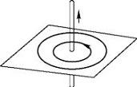
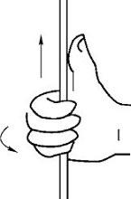

# Jargons

* The output is digital (It has 2 states, either high or low)
* 

# Laws

## Ohm's Law

# Impedance 

https://www.youtube.com/watch?v=UrCFv2qCELI

# Components

## Resistor

## Capacitor

#### What is capacitance?

Capacitance is the capacity to store charges. It is a measure of how much charge can be stored on the capacitor for a given voltage.

> The capacitance of a capacitor is determined by various factors, including the physical characteristics of the capacitor such as its size, shape, and the materials used in its construction. It is also influenced by the distance between the capacitor's plates, the dielectric material between the plates, and the surface area of the plates.

The formula for between Charges (Q), Capacitance (C) and Voltage (V) is

$$
Q = C \cdot V
$$

Total Capacitance of Capacitors in Parallel:

$$
C_{total} = C_1 + C_2 + C_3 + ... + C_n
$$

Total Capacitance of Capacitors in Series:

$$
\frac{1}{C_{total}} = \frac{1}{C_1} + \frac{1}{C_2} + \frac{1}{C_3} + ... + \frac{1}{C_n}
$$

> Because capacitors are places in series and we know when stabilized, there's no current flow. Meaning there's no charge differences. Hence, the number of charges in capacitors is the same.

$$
Q_{total} = Q_1 = Q_2   \\

V_{total} = V_1 + V_2 \\

V_{total} = \frac{Q}{C_1} + \frac{Q}{C_2} \\ 

V_{total} = Q \cdot (\frac{1}{C_1} + \frac{1}{C_2}) \\ 

\frac{V_{total}}{Q} = \frac{1}{C_1} + \frac{1}{C_2} \\ 

\frac{1}{C_total} = \frac{1}{C_1} + \frac{1}{C_2}

$$

#### [Capacitor blocks DC](https://youtu.be/UrCFv2qCELI?t=556)

## [Inductor](https://www.youtube.com/watch?v=uW-M8eBHq9U&t=7s)

Inductor uses coils to take advantages of [Electromagnetism](#electromagnetism). When a current changes from 0 to maximum, the coil incurs **induced current** that is opposite to the current to resist.

This can be interpret as the followings. In the [Electromagnetism](#electromagnetism), we introduced the direction of induced current when a magnet approaches to the center of the coil. when a magnet approaches to the center, the magnetic flux increases which is the same result of increasing the current. Therefore, the direction of the induced current is opposite to the current flow.

#### Inductance

The equation of EMF according to [Electromagnetism](#electromagnetism) is 

$$
\varepsilon = -N \frac{d\Phi}{dt}
$$

where $\varepsilon$ is *electro-motive force*, $N$ is the *number of turns* in the coil, and $\Phi$ is the *magnetic flux*.

And we also know, EMF is incurred by changes in magnetic flux, and magnetic flux is incurred by current changes. Therefore, the above equation can be slitted into 2 stages.

$$
\varepsilon = -N \frac{d\Phi}{dt} = -N \frac{d\Phi}{di}\frac{di}{dt}
$$

where $i$ is the current.

Now, $-N \frac{d\Phi}{di}$ is actually a new variable that is called **inductance**

$$
L = -N \frac{d\Phi}{di}
$$

**Inductance shows property of any electronics that for 1 amps of changes in current, the number of voltage change.**

Inductance is determined by the same factor of [magnetic flux](#magnetic-flux) and coil diameter.

1. Coil turns
2. amps of current
3. core permeability
4. coil diameter.

> Therefore, a stronger L, cause a stronger voltage change (EMF) when current changes. With stronger EMF, we get a stronger magnetic flux.

#### Why inductor is used?

# Electromagnetism

When a wire has current flowing, a magnetic ring is created around the wire.

> The direction of the ring can be determined using **RIGHT** hand's principle, where thumb is pointing the current direction and the 4 fingers are pointing to the direction of the magnetic ring.

We have such a ring for each point on the wire. However, they're in parallel and independent. 

If we convert the wire into a coil, the rings are next to each other and can be combined into a larger magnetic filed.

### Magnetic Flux

Magnetic flux is a measurement of the total magnetic field which passes through a given area. 

For a closed circuit, the following changes can affect the magnetic flux.

1. increasing current.
2. increasing the number of turns in a coil.
3. inserting a magnet into **center** of the coil.

### [Faraday's Law and Lenz's Law](https://www.khanacademy.org/science/physics/magnetic-forces-and-magnetic-fields/magnetic-flux-faradays-law/a/what-is-faradays-law)

When the magnetic fields ([magnetic flux](#magnetic-flux)) changes, this will induce **Electromotive Force** (EMF), which can be regarded as voltage as they even share the same unit. With EMF, **Induced current** is created, just like voltage creates current.

> It's the **changes** of magnetic flux cause the EMF, not magnetic flux cause EMF.

> **Also inducted current same as normal current will also create a new magnetic field**

The magnitude of the EMF is described by **Faraday's law.**

$$
\varepsilon = -N \frac{d\Phi}{dt}
$$

where $\varepsilon$ is *electro-motive force*, $N$ is the *number of turns* in the coil, and $\Phi$ is the *magnetic flux*.

The direction of the induced current is described by **Lenz's Law**. More specifically, it states the any magnetic field produced by an induced current will be in the **opposite** direction to the **change** in the original field.

[For example](http$$s://zh.wikipedia.org/zh-hk/楞次定律), when a magnet approaches a coil, according to [magnetic flux](#magnetic-flux), we know adding a magnet near the center of a coil will increase the magnetic flux. Therefore, a positive **change** of magnetic flux occurs as the magnet approaches to the coil, thus induced current is created.

According to Lenz's law, in order to **prevent** the changes, a force of pushing the magnet away is created by the induced current. So the direction of the force is to the *left*. This is same as have a magnet with N on the left, and S on the right. Applying [right-hand rule of coil](
https://zhuanlan.zhihu.com/p/85791685?utm_id=0), where thumb is pointing to the N, and the fingers are pointing to the current, we know the direction of the induced current is counter-clockwise.

More of the basics can be found at [Ref1](https://zhuanlan.zhihu.com/p/85791685?utm_id=0),

---

# Circuits

## RC Circuits

[Analysis 1](https://www.youtube.com/watch?v=OIpHPsnLlNU)

## [LC Oscillating Circuit](https://www.youtube.com/watch?v=qg4P_G-86wc)

In a LC circuit, the charged Capacitor will discharge and convert the electric energy into magnetic energy of the inductor. So at `T/4`, capacitor is fully discharged, and the magnetic field starts to collapse into electric energy that keeps the current flow (This will actually charge up the capacitor in a different direction). Therefore, the current keeps moving but slows all the way down to 0, while the voltage of capacitor is charged down.

