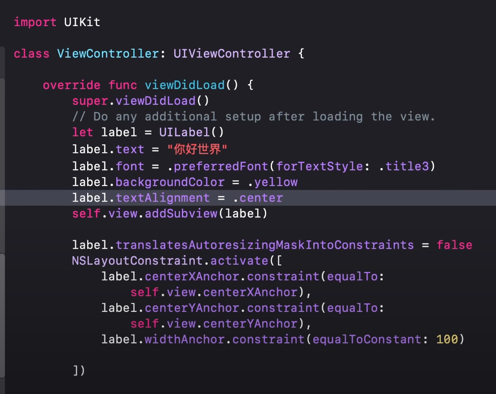

## Xcode

### [Workspace](https://developer.apple.com/documentation/xcode/managing-multiple-projects-and-their-dependencies#Manage-multiple-related-projects-using-a-workspace)

A workspace is a container for several related projects. Use a workspace to organize multiple projects that have explicit or implicit dependencies.

### Property List

Bundle is the executable, and there must be an information property list file describing the bundle. 

Before Xcode 13, there will be a `Info.plist` file created in the root directory, that allows developer to customize the properties.

After Xcode13, properties are edited in the `Project -> Target -> Info`. A new `Info.plist` file will be automatically generated when you try to change the properties.

> [Where is Info.plist in Xcode 13? (missing, not inside project navigator)](https://stackoverflow.com/questions/67896404/where-is-info-plist-in-xcode-13-missing-not-inside-project-navigator)

## IOS

There are several approaches to build IOS UI.

1. UIKit
2. SwiftUI

### UIKit

UIKit has be around for more than a decade that support nearly all IOS versions **since IOS 2**.

Along with it, **storyboard**, a low-code approach to build UI, was also introduced.

The basic development model of using UIKit is Model View Controller (MVC), where

* storyboard is used to build the view.
* UIkit is used to control the view changes dynamically.
* Swift / Objective-C is used to build the model.

> UIkit framework supports both Swift and Objective-C. (can be written using both)

**However, low-code approach to build UI is never a industry standard approach and most developers try to steer clear of it.** and prefer a programmatic way of writing UI.

Therefore, the model becomes MC, where UIkit is used to write the UI programmatically, which can be imagined as using JS to write HTML elements.

The major advantage of UIKit is that its mature, and it supports Objective-C and Swift, so developers can choose which ever language they want to build the UI.

**The major drawback of UIkit is that its imperative. The code of writing a simple UI is enormous.** even using Swift, the amount of work is even worse using Objective-C.

UIView of UIkit is a class, which is a reference type, meaning creating and deleting a view is costly.

**It's guaranteed that UIkit is dying.**

### Swift UI

SwiftUI was introduced in 2019, and it's a young framework for UI, therefore immature. There are major changes in the early years, but now its stable, and it's the future. 

**SwiftUI is a programmatic way of writing UI and its declarative. It's basically JSX.**

The amount of code to build the same UI using swift UI is much less and the code structure is much clearer.

More and more syntactic sugars are implemented to reduced the number of code needed to write UI each year.

