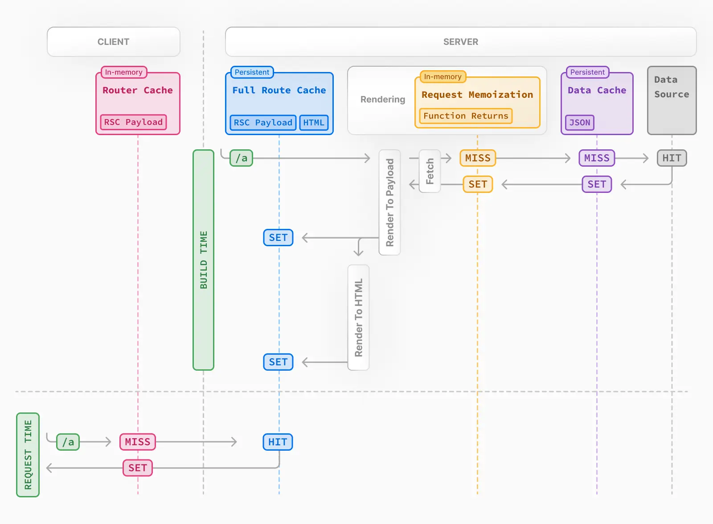

# Next JS

The best Article to learn CSR/SSR/ServerComponent is [Making Sense of React Server Components](https://www.joshwcomeau.com/react/server-components/)

Read below with the reference to the above article.

Next.JS is a framework built upon React that is so popular and gives us the freedom to choose CSR, SSR, SSG, ISR with EXTREMELY simple configurations, and even use in a mixture.

Before jumping into this topic. We can to understand the problem that NextJS solves so that we can learn the benefits of using it.

In a vanilla react app, the whole frontend is **client-side-rendered**. Upon a request, the server sends
1.  a minimum HTML file 
2.  a bunch of js file that is bundled together during build time.

The bare minimum HTML file has nothing in it and requires the JS to render the and fill the HTML contents. This means there will be a flicker of blank page when the web page is firstly loaded, and for client machines that are less powerful or with JS disabled, the web page is entirely **unusable**.

More importantly, SEO is bad as the the HTML page fetched by Google is empty.

To solve this, we have [**Server-Side-Rendering**](https://nextjs.org/docs/app/building-your-application/routing/loading-ui-and-streaming#what-is-streaming) comes to play. Instead of letting the client to execute the JS to render the HTML. SSR executes the JS code on the server to pre-render the HTML and send back to the client.

> Note, not entirely the JS will be run on server, since certain functions can only be run on the client, like `window`. Therefore, the client will **catch up** the process the server has done.

The benefits of SSR is clear. Even with JS disabled, the client now receives a well-rounded web page at the beginning.

> **REMEMBER! For SSR, all it does it running the code that originally should be run on client, now on server, it doesn't matter if the react component is server component or client component (We'll talk in a brief second). Both works on SSR.**

**SSR is what NextJS originally offers.**

Check [How NextJS Really Works](https://www.youtube.com/watch?v=d2yNsZd5PMs), in a nut shell, it only pre-renders the page when requested. Also, due to this effect, you can see even with React Client Component, notice in the demo video [React Server Components Change Everything](https://youtu.be/rGPpQdbDbwo?t=168), the client component is rendered once during the first request.

As React evolves with Next JS, now React supports Server Component that aims to improve the performance even further. Before, all components are client components, we have to use `useEffect - fetch` pattern to retrieve data, and we have to create associated APIs for the fetching to work. It would be nice if we can directly call a server function inside a component if that component is already believed to be rendered on the server.

Therefore, RSC is designed to be only capable of running on the server. It's not the same concept of SSR, only that both are rendering on the server. RSC aims for component level while SSR aims for pre-rendering.

> RSC is a feature of [React19](https://react.dev/learn/start-a-new-react-project#bleeding-edge-react-frameworks), but it can't be used independently without using `NextJS.AppRouter`


## Router

Before starting, read in combine with [Everything I Know About UI Routing](https://gist.github.com/ryanflorence/f812198561c58aec1326ac800e6ea519) to help with understanding some of the glossaries.

NextJS provides default routing functionalities. Therefore, we don't have to use third-party libraries like [React Router](https://reactrouter.com/en/main) (the most popular react routing library) to maintain routing and navigation.

More importantly, the routing plays an important role in making the server component as well as SSR to work.

There're 2 routers that NextJS provides, one is [Pages Router](#pages-router) will is the last generation router, and will not be the future. Another one is [App Router](#app-router) which is just introduced in 2023 and **is the way to go**.


Before diving in, several key differences between Page router and App routers are illustrated:

1. Page Router uses SSR, and components are client components by default (and there's no way you can configure it to make it server component)
2. App Router uses server components by default.

### [Pages Router](https://nextjs.org/docs/pages/building-your-application/routing/pages-and-layouts)

Pages router is 

1. File-Based Routing: Each page corresponds to a single JavaScript file in the pages directory. This structure is simple, intuitive and maps to the traditional URL per page mindset.

    > Since Pages Router is file based, each page is independent to one another. We can have a different folder called `components` (or whatever) to store the shared react components.

2. Layouts: the exact same concept of a wrapper that wraps children component to give them a shared look, like Navigation Bar and footer in all pages. Next.JS gives a way to [customize app](https://nextjs.org/docs/pages/building-your-application/routing/pages-and-layouts#single-shared-layout-with-custom-app) so that we only have to wrap the app component to provide the layout through the entire application.

    > However, layout is one of the major drawbacks of Pages router. Even though NextJS also provides a way of [customizing certain page](https://nextjs.org/docs/pages/building-your-application/routing/pages-and-layouts#per-page-layouts) with different layout while using the uniform app layout. **We're still having a hard time to implement nested layout**.

    > Suppose all the sub-urls of `dashboard` share a different layout than the app layout, there's no easy way of doing so but manually add the layout to the EACH file of the sub-urls. A comprehension walkthrough of creating such nested layout using Pages Router can be found at [A guide to Next.js layouts and nested layouts](https://blog.logrocket.com/guide-next-js-layouts-nested-layouts/).

3. Don't confuse: even though Pages Router is file based, doesn't mean it acts like a traditional URL routing. Instead the [Link]() navigation function allows to do client-side route transitions between pages, **similar** to a single-page application. This is done by prefetching.
    > Any <Link /> in the viewport (initially or through scroll) will be prefetched by default (including the corresponding data) for pages using Static Generation. The corresponding data for server-rendered routes is fetched only when the <Link /> is clicked. 
4. Also, for shared components, like the uniform app layout, that doesn't change during path changes, their states wil be preserved, and will not be re-rendered. 
    >From [official](https://nextjs.org/docs/pages/building-your-application/routing/pages-and-layouts): When navigating between pages, we want to persist page state (input values, scroll position, etc.) for a Single-Page Application (SPA) experience.
    > This layout pattern enables state persistence because the React component tree is maintained between page transitions. With the component tree, React can understand which elements have changed to preserve state. 
    > [Navigate Between Pages](https://nextjs.org/learn-pages-router/basics/navigate-between-pages/client-side) gives a comprehensive demo


### [App Router](https://nextjs.org/docs/app/building-your-application/routing)

App router on the other hand is component-based routing. Where each file is not a page, but a component. By utilizing nesting, problem of nested layout can be easily solved with no repeated code.

More importantly, since it uses Server component by default, performance-wise its better.


### Comparison between app/pages router

A detailed text version of comparison between Pages/App Routers can be found at [Exploring the Evolution: Next.js 13 App Router vs. Page Router](https://www.linkedin.com/pulse/exploring-evolution-nextjs-13-app-router-vs-page-louis-nwadike).

A video version can be found at [Pages Router vs App Router in Next.js - Key Differences](https://www.youtube.com/watch?v=GJPEgai_dKw)

> Both resources gives enough insights on the differences not discussed above.


## [Client Component](https://nextjs.org/docs/app/building-your-application/rendering/client-components)

As mentioned in the introduction, client components are rendered on the client **originally.** However, with Server Side rendering (SSR) enabled by default, upon **loading**, the server will pre-render the component once (not including functions can't be run like window / hooks). Re-rendering caused by later updates (soft navigation), only happens on client.

use [dynamic import](https://nextjs.org/docs/app/building-your-application/optimizing/lazy-loading#skipping-ssr) to disable SSR for specified client components.


## [Server Component](https://nextjs.org/docs/app/building-your-application/rendering/server-components)

App Router by default uses Server Component and allows the component to be `async` so that we can call async functions to fetch data on the server within the component. (You don't have to mark all server components as `async` if not needed to use `await`)

When [Interleaving Server and Client Components](https://nextjs.org/docs/app/building-your-application/rendering/composition-patterns#interleaving-server-and-client-components), client components can't `import` server components.

> It's not saying client components can't be the parent of a server component it's **importing** that matters

This is because upon a re-rendering (not loading, cuz during loading both server components and client components are rendered on the server if SSR is enabled for client components), Server Components are rendered on the server first, then client components are rendered only the client. The importing component is responsible for rendering the imported component, therefore, if client renders the server component again, a new request will be made.

> [By default All Server components are Static if not using any Dynamic APIs.](https://nextjs.org/docs/app/building-your-application/data-fetching/fetching#fetching-data-on-the-server-with-the-fetch-api)

**Also, server component once requested, can't be re-rendered.**. Therefore, all server components who is **imported** by a client component will implicitly be marked as client-component automatically, but remains server component if imported by another server component.

However, here's a  [workaround](https://www.joshwcomeau.com/react/server-components/#workarounds-7) to solve the issue like global states are placed in the root making the whole app client components.

```jsx
'use client'
 
import { useState } from 'react'
 
export default function ClientComponent({
  children,
}: {
  children: React.ReactNode
}) {
  const [count, setCount] = useState(0)
 
  return (
    <>
      <button onClick={() => setCount(count + 1)}>{count}</button>
      {children}
    </>
  )
}
```

```jsx
// This pattern works:
// You can pass a Server Component as a child or prop of a
// Client Component.
import ClientComponent from './client-component'
import ServerComponent from './server-component'
 
// Pages in Next.js are Server Components by default
export default function Page() {
  return (
    <ClientComponent>
      <ServerComponent />
    </ClientComponent>
  )
}
```

The reason the above workaround works is that, the importing component Page is a server component, and is responsible rendering `ClientComponent` and `ServerComponent`. The only responsibility of `ClientComponent` is leave places for `ServerComponent` to reside in. Furthermore, it's rendered (on the server) before rendering `ClientComponent` (on the client). Therefore, even `ServerComponent` is a child of `ClientComponent`, everything works.

when sharing data between server components, don't use context/props, directly fetch another time. [sharing data between server components](https://nextjs.org/docs/app/building-your-application/rendering/composition-patterns#sharing-data-between-components)

## rendering

Priority of consideration: SSG > SSR >= CSR

1. Static (pre-rendering at build time)
  > [You may see the terms Automatic Static Optimization, Static Site Generation, or Static Rendering being used interchangeably to refer to the process of rendering and caching routes of your application at build time.](https://nextjs.org/docs/app/building-your-application/caching#full-route-cache)
2. Client Side Rendering
3. Server Side Rendering

> For static to be able to be updated with data or Dynamic Routes (i18n) [Incremental Static Regeneration](#incremental-static-regeneration) is used. 

!> **Static rendering is route level not component level**, hence for ISR, [Partial Rendering](#partial-rendering), however, enables static rendering / dynamic rendering to be mixed together in component level

> [By default All Server components are Static if not using any Dynamic APIs.](https://nextjs.org/docs/app/building-your-application/data-fetching/fetching#fetching-data-on-the-server-with-the-fetch-api)

Several ways can be used to make a server component dynamically rendered (SSR), including 
`export const dynamic = 'force-dynamic'`  and [Dynamic APIs](https://nextjs.org/docs/app/building-your-application/rendering/server-components#dynamic-rendering)

Behind the scenes, the work is split into two parts: the client module graph and the server module graph. The server module graph contains all the components that are rendered on the server, and the client module graph contains all components that are rendered on the client.


## Key features (glossary) of Next

> Partial rendering and partial **pre-**rendering are different!, one is related to routing (only changed components got re-rendered), one is related to rendering static/dynamic mixture. ([PPR(https://nextjs.org/docs/app/building-your-application/rendering/partial-prerendering#incremental-adoption-version-15-canary-versions)] is in experimental for Next15)

* Routing 
  1. code splitting
  2. prefetching
  3. partial rendering
      

* Rendering
  1. [**streaming**](https://nextjs.org/docs/app/getting-started/data-fetching-and-streaming#streaming)
     > `loading.js` or `Suspense`
  2. Incremental Static Regeneration
     > `generateStaticParams` 
  4. [partial pre-rendering](https://nextjs.org/docs/app/building-your-application/rendering/partial-prerendering#incremental-adoption-version-15-canary-versions)
     > `Suspense`
  6. lazy loading

* Data fetching & caching
  1. Request Memoization
  2. caching

1. [Parallel Routing](#parallel-routing) & Intercepting Route

prefetching / partial rendering / code splitting are features

1. out of thr box that requires no additional setup. 
2. related to improve routing performance

## [Prefetching](https://nextjs.org/docs/app/building-your-application/routing/linking-and-navigating#2-prefetching)

Prefetching happens when a `<Link />` component enters the user's viewport (initially or through scroll). Next.js prefetches and loads the linked route (denoted by the href) and its data in the background to improve the performance of client-side navigations. (From [Link](https://nextjs.org/docs/app/api-reference/components/link#prefetch))

[router.prefetch()](router.prefetch()) can also be used to programmatically call prefetch.

The `<Link>`'s default prefetching behavior (i.e. when the prefetch prop is left unspecified or set to null) is different depending on your usage of `loading.js.` Only the shared layout, down the rendered "tree" of components until the first `loading.js` file, is prefetched and cached for 30s.

The reason `loading.js` plays such an important role in determine the behavior is due to the fact that it enables [streaming](#steaming). The existence of `loading.js` indicates down the tree is split into smaller chunks, and can be streamed to the client later.

## [Partial Rendering](https://nextjs.org/docs/app/building-your-application/rendering/partial-prerendering)

When a URL updates, shared components (e.g. layout) will not be refreshed, and states of those will be reserved as well.

> This is done by caching using [Client-side Router Cache](https://nextjs.org/docs/app/building-your-application/caching#client-side-router-cache) under the hood.

Also, Next.JS will try the best to render a page to be **static**. If there're dynamic components, by wrapping `Suspense` the fallback component will be wrapped in to built the page still in static rendering.

> Without `Suspense` the whole route will be dynamically rendered, and original rendering is page (route) level.


## [Code splitting](https://nextjs.org/docs/app/building-your-application/deploying/production-checklist#automatic-optimizations)

**Server Component only.**

For Server Components, the application code are automatically code-split by **route segments**. This means only the code needed for the current route is loaded on navigation.

!> Important to note, this is route segment level code splitting. To reduce the bundle size for each route. So that we don't have a giant SPA bundle.

!> This is only for Server components, for Client components, [lazy loading](#lazy-loading) is used instead.


> It's very confusing to say that server component allows to automatically code-split by route. Cuz, inside [lazy loading](#lazy-loading) / [streaming](#steaming), they also involve with code splitting so that bundles can be split into smaller chunks or loaded dynamically. The gist of code splitting here is to emphasize code splitting when routing.

## [Steaming](https://nextjs.org/docs/app/building-your-application/routing/loading-ui-and-streaming)

**Server Component only.**

On the server, Next.js uses React's APIs to orchestrate rendering. The rendering work is split into chunks: by individual **route segments** and **Suspense Boundaries**. [From How are Server Components rendered?](https://nextjs.org/docs/app/building-your-application/rendering/server-components#how-are-server-components-rendered)

Streaming allows you to break down the page's HTML into smaller chunks and progressively send those chunks from the server to the client.

> [code splitting](#code-splitting) in the previous section emphasize each route has a bundle, now streaming emphasize splitting the current page's bundle, and progressively serves chunks.

To enable Streaming, either stream the whole page using `loading.js` or `Suspense` for components.

[How to use streaming](https://nextjs.org/docs/app/getting-started/data-fetching-and-streaming#streaming)

The same behavior for client components that renders a fallback page first is using [lazy loading](#lazy-loading)

## Lazy loading

## [Incremental Static Regeneration](https://nextjs.org/docs/app/building-your-application/data-fetching/incremental-static-regeneration)

For static content that is prerendered at build time, the content can be pre-filled with 1 request to fetch the data through function [generateStaticParams](https://nextjs.org/docs/app/building-your-application/caching#generatestaticparams), [generateStaticParams](https://nextjs.org/docs/app/building-your-application/routing/dynamic-routes#generating-static-params)

For uncached routes, upon new request, Next.js will generate and cache this page on-demand.

> Caching for static rendered routes is also referred as [Full Route Cache](#mechanisms)

Revalidation can be triggered either

1. [On Time](https://nextjs.org/docs/app/building-your-application/data-fetching/incremental-static-regeneration#time-based-revalidation)
2. [On Demand](https://nextjs.org/docs/app/building-your-application/data-fetching/incremental-static-regeneration#on-demand-revalidation-with-revalidatepath)

> On demand means upon requesting, the cache will be revalidated, this is done by calling `revalidatePath`/`revalidateTag` in Server Actions

> For tag, during fetching, data can be stored with a tag, so that later we can call `revalidateTag`.
Example code can be found [here](https://nextjs.org/docs/app/building-your-application/data-fetching/incremental-static-regeneration#on-demand-revalidation-with-revalidatetag)

refer to [caching](#caching) to see how cache is stored.


## caching

**The response from `fetch` that server components used is not cached by default,** but are [memoized](https://nextjs.org/docs/app/building-your-application/caching#request-memoization). 

> Memoization is in memory cache, therefore after the rendering, the memory will be reset. See [How Request Memoization works](#mechanisms)

So when sharing data between server components, don't use context/props, directly fetch another time. [sharing data between server components](https://nextjs.org/docs/app/building-your-application/rendering/composition-patterns#sharing-data-between-components)

1. caching using [`unstable_cache` from NextJS](https://nextjs.org/docs/app/building-your-application/data-fetching/fetching#caching-data-with-an-orm-or-database)
2. fetch with cache option
3. [`cache` from React](https://nextjs.org/docs/app/building-your-application/data-fetching/fetching#reusing-data-across-multiple-functions)

```tsx
import { cache } from 'react'
import { db, posts, eq } from '@/lib/db' // Example with Drizzle ORM
import { notFound } from 'next/navigation'
 
export const getPost = cache(async (id) => {
  const post = await db.query.posts.findFirst({
    where: eq(posts.id, parseInt(id)),
  })
 
  if (!post) notFound()
  return post
})


const getPosts = unstable_cache(
  async () => {
    return await db.select().from(posts)
  },
  ['posts'],
  { revalidate: 3600, tags: ['posts'] }
)
```

When fetching, [there're 2 patterns](https://nextjs.org/docs/app/building-your-application/data-fetching/fetching#patterns)

1. Sequential Fetching
2. Parallel Fetching

We should try to use Parallel fetching as much as possible. 

> By default, layout and page segments are rendered in parallel. This means requests will be initiated in parallel. fetching between page segments and components are not.

To try use parallel fetching inside components of a page 2 technics can be used

1. Parallel fetching inside the same component using [Promise.all](https://nextjs.org/docs/app/building-your-application/data-fetching/fetching#parallel-data-fetching)

> `await/async` will block requests below it.

2. [Preloading](https://nextjs.org/docs/app/building-your-application/data-fetching/fetching#preloading-data) from parent component, using `cache`

```tsx
import Component, { preload } from "./Component";

export default async function Page() {
  preload("123");
  await new Promise((resolve) => {
    setTimeout(() => {
      resolve(null);
    }, 5000);
  });

  return (
    <div className="bg-white h-screen text-black">
      Hello
      <Component />
    </div>
  );
}


// Component

import { cache } from "react";

export const preload = (id: string) => {
  // void evaluates the given expression and returns undefined
  // https://developer.mozilla.org/docs/Web/JavaScript/Reference/Operators/void
  void getItem(id);
};

const getItem = cache(async (id: string): Promise<string> => {
  await new Promise((resolve) => {
    setTimeout(() => {
      resolve(null);
    }, 2000);
  });
  console.log(`called`);

  return `Item with id: ${id}`;
});

export default async function Component() {
  const item = await getItem("123");
  return <div>{item}</div>;
}
```

> `cache` has to be used so that later request within child component will not be called again, but using the result from cache. Otherwise, `getItem` will be called twice.

### Mechanisms



There're 4 kinds of caches available that will be used as much as possible.

1. [Request Memoization](https://nextjs.org/docs/app/building-your-application/caching#request-memoization)

> For **server components**, we can directly call fetch in multiple places in the same component tree. The same requests will be de-duplicated.
>
> Request Memoization is in memory cache, Once the route has been rendered and the rendering pass is complete, memory is "reset" and all request memoization entries are cleared. See [How Request Memoization Works](https://nextjs.org/docs/app/building-your-application/caching#request-memoization)

2. [Data Cache](https://nextjs.org/docs/app/building-your-application/caching#data-cache)

> This is they way to activate caching for `fetch` result.

> In the browser, the cache option of fetch indicates how a request will interact with the browser's HTTP cache, in Next.js, the cache option indicates how a server-side request will interact with the server's Data Cache.

3. [Full Route Cache](https://nextjs.org/docs/app/building-your-application/caching#full-route-cache)

> For static rendered route only, works at build time or [ISR](#incremental-static-regeneration)

> [Full Route cache will be visited after if Client-Side cache is missing.](https://nextjs.org/docs/app/building-your-application/caching#2-nextjs-caching-on-the-server-full-route-cache)

The revalidation of Full Route Cache is based on the revalidation of Data cache that is associated with the route.

4. Client-side Caching


## Route Handler & Server actions

[Both are used as api calls](https://stackoverflow.com/questions/77748391/nextjs-14-server-actions-vs-route-handlers). Route handler is preferably to be used to fetch data; Server Actions are preferably to be used to mutate data.

### Server Actions

Server Actions integrate with the Next.js caching and revalidation architecture. When an action is invoked, Next.js can return both the updated UI and new data in a single server roundtrip. ([reference](https://nextjs.org/docs/app/building-your-application/data-fetching/server-actions-and-mutations#behavior))


## [Parallel Routing](https://nextjs.org/docs/app/building-your-application/routing/parallel-routes)

Parallel Routing renders multiple pages simultaneously. This same feature can be achieved by using components of course.


```tsx
export default function Layout({children}: {children: React.ReactNode}) {
  return (
    <>
      {children}
      <Suspense fallback={...}>
        <TeamComponent />
      </Suspense>
    </>
  )
}
```

> With `Suspense` the exact same effect can be replicated without using parallel routing. For the reason why Suspense is needed check [Stream](#stream)

The reason Parallel Routing is useful is when we wish to display multiple pages with the **same URL route**. Typically, different pages will result in different URLs, unless we're only swapping components. But App Router introduces layouts, so using component to have the same will become a bit of unmanageable when the components get larger.

Therefore, parallel can use the same page/layout/loading etc features while keeping them share the same URL. More importantly, hard visiting route `/parallel/settings` will try to render `settings` route in all parallel routes.

For soft navigation (that uses `Link`), when navigating to `parallel/settings`, the client knows the activating parallel page, therefore, only that particular parallel route will be processed. 

For hard navigation (refresh/direct visiting), there is not parent parallel page, this requires all parallel routes to have a sub route `settings` otherwise 404 will be thrown. Hence, `default.tsx` has to be used.

The main feature of Parallel Routing is particular useful when used in combination with `Intercepting Route` to create a re-visitable modal. Check out the video for better understanding [Learn Next.js Intercepting Routes In 11 Minutes](https://www.youtube.com/watch?v=zDZBKEvU8b0)

