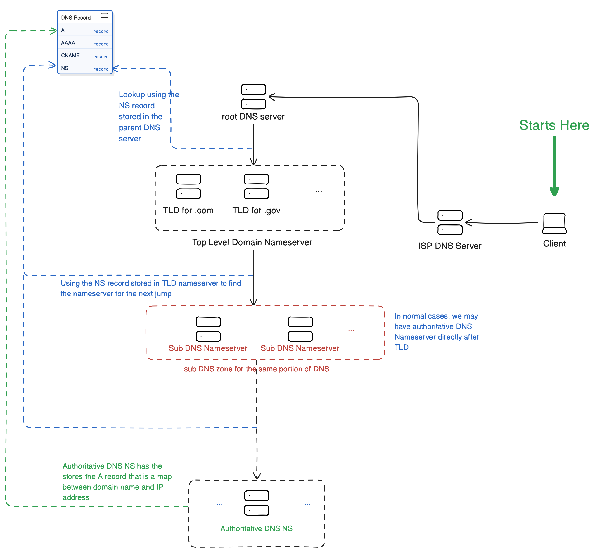
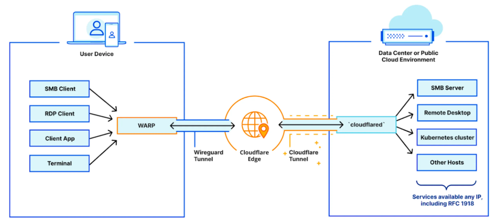

# Network

## DNS



When buying a domain from the provider, the domain provider **typically have their own DNS name server**. 

After hosting the website, or service, the server provider (not the domain provider) will provide an IP address of the server, which we can provide to the domain provider. So that the IP address can be linked to the domain using `A` DNS record stored in the domain provider's name server.

However, a some reasonable cases, we may wish not to use the name sever of the domain provider, what we can do is add a `NS` record in the domain provider that points to the authoritative name server that we wish to use and store the A record there.

## Multicast

Multicast is used to allow multiple devices to receive the same content without needing the source server to send packets to each receiver. The distribution is handled by the network devices (A.K.A routers).

`IGMP` is the protocol used between the router and switches that receives the packets. This protocol is used to maintain if a device is subscribed/unsubscribed to a multicast group. 

`PIM` is the protocol between routers so that the router in the final segment can find a path to the source server. 

> In multicast, all receiver subscribe to a **shared multicast IP** address. That multicast IP address in IGMP will be converted into multicast MAC address in the router of final segment, since switches are in Layer 2.


Extremely useful references:

1. [What is Multicast Networking and How Does It Work?](https://www.auvik.com/franklyit/blog/multicast-networking/#:~:text=Multicast%20networking%20is%20based%20on,broadcast%20because%20it%27s%20more%20selective.)

2. [Multicast Explained in 5 Minutes | CCIE Journey for Week 6-12-2020](https://www.youtube.com/watch?v=W5oMvrMRM3Q)


## [What is the purpopse of br-lan in openwrt?](https://forum.openwrt.org/t/what-is-the-purpopse-of-br-lan-in-openwrt/122316)

A bridge interface is like a virtual Ethernet switch. It lets you connect more than one thing to the "port" (interface) in the kernel that holds an IP address. The usual usage is to connect both Ethernet and wifi to the lan network. On a dual band router there may be two APs connected, one for each band. On a wired only router the br-lan is still set up for the possibility to add something later. There is a really insignificant performance drop going through a bridge with only two ports (the kernel and the eth port) compared to a direct connection, it doesn't hurt to leave it in.

wifi interfaces connected to a bridge are specified in the wireless configuration they won't appear in the network configuration.

# Set Up OpenWrt in docker

## SetUp Docker

The simplest way to install `Docker` is to use [convenience script](https://docs.docker.com/engine/install/debian/#install-using-the-convenience-script)

1. First update necessary packages and upgrade by running

```bash
sudo apt-get update
sudo apt-get upgrade
```

2. Then follow the link above and run

```bash
curl -fsSL https://get.docker.com -o get-docker.sh
sudo sh ./get-docker.sh
```

> When I first run the above installation script, I encountered a problem of having `dpkg` return non-zero error. I solved this by uninstalling the docker and restarting the machine.

## Install OpenWrt

After successfully install docker, we need to download the docker image for openwrt, by running

```bash
docker pull sulinggg/openwrt:rpi4
```

where `sulinggg/openwrt` is the image name and `rpi4` is the tag which is a more specific version of the image.

## Config Env

OpenWrt requires a `LAN` port and `WAN` port. Thus, we'll use `macvlan` to mimic exclusive network interfaces for `LAN` and `WAN`

#### For WAN

```bash
docker network create -d macvlan --subnet=192.168.1.0/24 --gateway=192.168.1 -o parent=eth0 openwrt_WAN
```

- `docker network create` is used to create a network interface that containers can use.

- `-d` stands for **driver** which is the network type, in this case `macvlan`

- `--subnet` and `--gateway` specifies the network.

> Here, the traffic comes from modem with IP `192.168.1.1` in case, thus I use `192.168.1.0/24` as the subnet.
> !> However, it seems unnecessary to set `--subnet` and `--gateway`, you'll see some strange stuff happen later when setting `LAN`

- `-o` stands for extra options for the network interface

- `parent` is the actual physical network interface this virtual macvlan interface attaches to. Thus, all traffic will go through this actual network interface.

#### For LAN

```bash
docker network create -d macvlan --subnet=123.123.123.0/24 --gateway=123.123.123.1 -o parent=eth0 openwrt_LAN
```

> `--subnet` and `--gateway` are completely random stuff, you can define whatever you want.

## Start OpenWrt

To deploy OpenWrt in a container, run

```
docker run --name openwrt --privileged -d --network openwrt_LAN sulinggg/openwrt:rpi4 /sbin/init
```

- `--name` is the name of the container, in this case it's `openwrt`

- `--privileged` means the the container is running with permission to access some of the system operations, in this case, `openwrt` can have access to the information of CPU and memory and etc.

!> As I discovered, running in `--privileged` mode, the crash of container can break down the entire system, which is extremely annoying.

- `-d` stands for `detached` meaning to run the container in background.

> It's common to run with extra `-it` options.

- `--network` specify the network this container connects to. In this case it's the `LAN` we created.

- `/sbin/init` is the initial command when starting the container, in this case is to boot the OS.

Now, the container is only connected to 1 single network interface. We add WAN port by running

```bash
docker network connect openwrt_WAN openwrt
```

## Config OpenWrt

We can log into openwrt by running

```bash
docker exec -it openwrt bash
```

- `docker exec` is to run certain commands in the container.

- `-it` stands for `interactive` and run in an exclusive terminal.

> I don't know why it won't work without these two options.

- `bash` is the command to run, which is the shell of openwrt.

To config network settings openwrt, we can run

```bash
vim /etc/config/networks
```

and apply the changes by running

```bash
/etc/init.d/network restart
```

## Confusion

Below is an example of the network configs.

```
config interface 'lan'
    option type 'bridge'
    option ifname 'eth0'
    option proto 'static'
    option ipaddr '172.16.60.1'
    option netmask '255.255.255.0'
    option ip6assign '64'

config interface 'wan'
        option ifname 'eth1'
        option proto 'dhcp'
        option ip6assign '64'
```

!>The problem here is that we can set IP address of the `LAN` port outside the range we specified when creating [openwrt_LAN](#for-lan). If we run `docker network inspect openwrt_LAN` we can see the **Assigned IP address** by docker within the range. We can set IP addresses different from the assigned one. All devices can connect to openwrt through the IP address we specify here, instead of the one declared in `openwrt_LAN`.

> I started a [question](https://stackoverflow.com/questions/75053373/how-docker-network-works-when-setting-container-ip-address-different-from-the-do) to trace this question

## Extra details

1. When we connect `openwrt` to two networks `openwrt_LAN` and `openwrt_WAN`, we actually add two network interfaces to `openwrt`. If you run `ip addr` inside `openwrt` you'll see 2 extra network interfaces. We can see these two interfaces have the same MAC address as the assigned ones if we run `docker network inspect openwrt_[LAN | WAN]`.

2. Running `ip addr` inside `openwrt` you'll see `br-lan` network interface in addition to `LAN` and `WAN`. `br-lan` is a bridge interface, that forward all traffic to `LAN` you'll see it share the same MAC address with `LAN` and run `ip link master br-lan` will show it enclaves `LAN`. More details can be referred to [What is the purpopse of br-lan in openwrt?](#what-is-the-purpopse-of-br-lan-in-openwrt)

3. We can see `eth0` has IP address like `192.168.1.2`, and `eth1` has IP address like `169.254.120.102` after running `ip addr` in the host device. The reason for this is that `eth0` is connected to the router/modem, and thus has a valid Ip address from the DHCP service of the router/model. `169.254.0.0/16` is a IP address assigned by the host device itself when it can't find a valid address from any service.

> Note, these are all actual physical network interfaces with actual IP address.

4. In the above, `eth0`, the actual physical network interface will have a valid IP address like `192.168.1.2`. Since we have another MAC address mounted on the same port using macvlan in `openwrt` and set `WAN` in `openwrt` to have `dhcp` enabled, the router/modem will also assign another IP address to the port of `openwrt` as its WAN ip address.

## Finish Up

After enabling DHCP in `openwrt`, we now nearly finishes up everything.

Now, the only problem is that we can't connect to the host device from outside world, unless we direct connect to it. Also, host device is not in the `openwrt` network. The reason for this that host can't connect to macvlan network by default for security reason. To solve this, we'll add an network interface using macvlan on the same physical network interface as `openwrt` on the host device. [修复容器与宿主机通讯](https://www.treesir.pub/post/n1-docker/#容器与宿主机的通讯修复) for details.

We'll run

```
ip link add inLink link eth1 type macvlan mode bridge
```

- `inLink` is the name of the new interface.

- `link` is the device (network interface) we have our operation on. In this case it's eth0, it should be the LAN port.

After running the above command, we don't need to specify any IP address if we enable DHCP in `openwrt`. As they use macvlan in bridge mode. Host device is directly connected to `openwrt` LAN port. Thus, host is automatically assigned with IP.

To better understand how macvlan works. Refer to [macvlan for beginners](https://developers.redhat.com/blog/2018/10/22/introduction-to-linux-interfaces-for-virtual-networking#macvlan) and [docker network]()

## Reference

1. [Docker 上运行 Lean 大源码编译的 OpenWRT](https://openwrt.club/93.html)

2. [Docker networking](https://www.youtube.com/watch?v=bKFMS5C4CG0)

> This video shows the fundamental concepts all docker network types with beginner-friendly illustration.

3. [Docker bridge 模式 容器如何访问外部世界？](https://blog.csdn.net/qq_34556414/article/details/108718522)
   - [what is Masquerade?](#masquerade)
   -

# Masquerade

Masquerade is essentially an IP address NAT translation. It enables to translate packets originally from multiple addresses to looks like originally from a single IP address specified. Thus, it enables to hide multiple IP addresses and only expose the one you specific as public. Refer to [Masquerade (hide) NAT from IBM](https://www.ibm.com/docs/en/i/7.2?topic=translation-masquerade-hide-nat) for more details

# iptable


## NAT Traversal

One way of connecting devices / services in a private network is use **Port Forwarding** that is enabled in the parent routers. However, this requires the parent router to have a public IP.

When we don't have a public IP address in the root router, we can still use a server that sits between the client and the service in the private network to bridge the connection. This is called NAT Traversal.

### Cloudflare

There're many NAT traversal services out there, but the Zero Trust of Cloudflare is a service to security framework that provides secure remote access to applications and services.

> Zero Trust is a security model that says to trust nobody from inside/outside of the network, wheres, **Zero Trust Network Access(ZTNA)** is such an implementation of the model by Cloudflare.

ZTNA allows us to connect to the internal network in 2 approaches

1. Through domain name to expose a service, like HTTP


> This requires a domain name

1. Though private network, this exposes the whole private network just like a vpn.



> This requires the client to connect to the cloudflare network using **Warp**

#### Setup

For both approaches, **a cloudflare daemon** is required, to expose the private network/service to the Cloudflare network through **Tunnel**

For a service: 

follow the documentation [Create a tunnel (dashboard)](https://developers.cloudflare.com/cloudflare-one/connections/connect-networks/get-started/create-remote-tunnel/) for reference to create a tunnel and setup `cloudflared` on the server device.

For serving the private network

following the documentation [Connect to private network](https://developers.cloudflare.com/cloudflare-one/connections/connect-networks/private-net/cloudflared/)

> Warp needs to be installed on the end user's device and [logged in](https://developers.cloudflare.com/cloudflare-one/connections/connect-devices/warp/deployment/manual-deployment/)

Also, the [Split Tunnel needs to be configured](https://developers.cloudflare.com/cloudflare-one/connections/connect-networks/private-net/cloudflared/#3-route-private-network-ips-through-warp).

It's also recommended to configure Access Policy to make sure the network is restricted to authenticated users only.

By the end of this setup, the exposed private network like `192.168.*` can be directly visited with **Warp** open, even though the connecting device is not connecting to the private network.


### Bonus

In order to ask WSL to enable ssh on windows boot, 