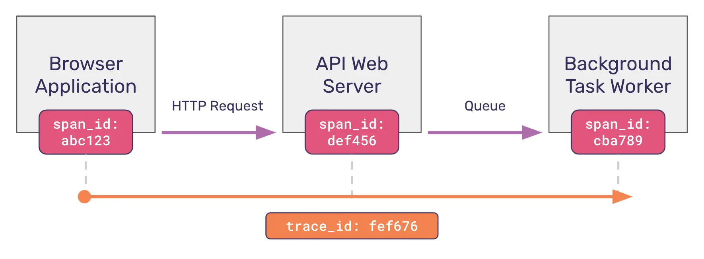

# OpenTelemetry


some intro videos to Otel: 
1. [OpenTelemetry in Node.js - Traces, Metrics and Logs](https://www.youtube.com/watch?v=NbVVZlSsvvM)
2. [What is OpenTelemetry? - Explanation and Demo](https://www.youtube.com/watch?v=LzLULxhyIpU&t=1021s)

## Basic Concepts

### Telemetry / signal

Telemetry refers to data emitted from a system and its behavior. The data can come in the form of **traces**, **metrics**, and **logs**.

## [Problems that OpenTelemetry tries to solve](http://jirablog.sentry.io/distributed-tracing-101-for-full-stack-developers/)

When debugging, we typically reply on logs and call stacks. This approach is straight forward when we have a monolithic system. 

1. we login to the server
2. Look through the logs / call stacks
3. Identify the problem

What if we a micro system with 3 services running on 3 servers

1. we log into the first server
2. we log into the second server
3. we log into the third server

You know the rest if we have hundreds of services.

We need **aggregation**! It's better to have single source to find logs. So we need Grafana, datadog, who can aggregate logs / metrics. NOT opentelemetry.

We just need to send logs to a central serivce whenever we create a log.

However, logs don't have **correlations.** There may be hundres of **same** logs created by a service in a second by different users. How can we know which log in service A is linked to which log in service B that are created by the same user?

**Traces!**

With a `trace id` unique across the whole request that involves many services, and `span id` representing each service, and inject these data inside metrics / logs, they are all correlated. and we can identify the logs / metrics by a specific request.

In order for each request knows which trace it blongs to, we need trace context that stores

1. `trace_id`
2. `parent_id`




Check out [Distributed Tracing 101 for Full Stack Developers](https://blog.sentry.io/distributed-tracing-101-for-full-stack-developers/)

We can manually insert `trace_id` and log with those, but this is extremely cumbersome, and there is no standard way. Hence, we need a tool and standarized way to do this. 

So we have **OpenTelemetry**.

It provides a starndarized way to mannually add  trace / metrics / logs, and a zero-code way using libriaries, to inject. **The code to add trace / metric / logs is also call** [intrumentation](#instrumentation)

The action to share trace context is also known as [Context propagation](https://opentelemetry.io/docs/concepts/context-propagation/)

Check out [Distributed Tracing 101 for Full Stack Developers](https://blog.sentry.io/distributed-tracing-101-for-full-stack-developers/) for a quick intro.


## Instrumentation

**Simple Analogy: Instrumentation = Adding Sensors**

Imagine your application is a car. Instrumentation is like installing sensors in the car to monitor:

1. **Speed (metrics)**

2. **Engine health (traces)**

3. **Fuel efficiency (logs).**

Without these sensors, you can’t collect data. With them, you get visibility into how the car operates.

**OTel’s role: Standardizes how these "sensors" (instrumentation) are added and how data is formatted.**

If you’re instrumenting an app, you need to use the OpenTelemetry SDK for your language.


Instrumentation is can be summarised as adding logs / traces / metrics. You can done it [mannully](#manual-intrumentation) or using exsitig [libraries](#libraries).


### [Manual Intrumentation](https://opentelemetry.io/docs/languages/js/instrumentation/#manual-instrumentation-setup)

1. For mannual instrumentation, you need to initialize sdks.
2. [create tracers / meters / loggers.](https://opentelemetry.io/docs/languages/js/instrumentation/#initialize-tracing)
3. Through your application code, Manually add tracing, meterics.

```ts
import { trace, Span } from '@opentelemetry/api';

/* ... */
const tracer = trace.getTracer('dice-lib');

function rollOnce(i: number, min: number, max: number) {
  return tracer.startActiveSpan(`rollOnce:${i}`, (span: Span) => {
    const result = Math.floor(Math.random() * (max - min + 1) + min);
    span.end();
    return result;
  });
}

export function rollTheDice(rolls: number, min: number, max: number) {
  // Create a span. A span must be closed.
  return tracer.startActiveSpan('rollTheDice', (parentSpan: Span) => {
    const result: number[] = [];
    for (let i = 0; i < rolls; i++) {
      result.push(rollOnce(i, min, max));
    }
    // Be sure to end the span!
    parentSpan.end();
    return result;
  });
}
```

### [Libraries]()

1. After installing the instrumentation libraries you need, **register** them with the OpenTelemetry SDK for Node.js.

```ts
/*instrumentation.ts*/
...
import { getNodeAutoInstrumentations } from '@opentelemetry/auto-instrumentations-node';

const sdk = new NodeSDK({
  ...
  // This registers all instrumentation packages
  instrumentations: [getNodeAutoInstrumentations()]
});

sdk.start()
```

Libraries like `express` typically has exsting instrumentation lib and were written with intrumentations. So that after registartion, the traces / logs will automatically be handled. You can still add new traces and logs maunnuly inside the application.


### Distributed traces

Distributed Traces rely on Context Propagation. 

For the vast majority of use cases, libraries that natively support OpenTelemetry or instrumentation libraries will automatically propagate trace context across services for you. It is only in rare cases that you will need to propagate context manually.


For manual propagation refer to [Manual context propagation](https://opentelemetry.io/docs/languages/js/propagation/#manual-context-propagation) with information [Context](https://opentelemetry.io/docs/languages/js/context/), and [Propagator](https://opentelemetry.io/docs/concepts/context-propagation/#propagation)


## [Architecture](https://opentelemetry.io/docs/specs/otel/overview/#api)


## [Steps](https://opentelemetry.io/docs/concepts/instrumentation/code-based/) 

Otel handles the traces / metrics. And youself handles the logs. 

1. Configure the OpenTelemetry API / SDK

> This involves creating a tracer and/or meter provider.

2. Create Telemetry Data

> Logs / Traces / Metrics

3. Export Data

    * You can either exporting data from your process to an analysis backend or through a proxy named collector.

## [Components](https://opentelemetry.io/docs/concepts/components/)

### [API / SDK](https://opentelemetry.io/docs/specs/otel/overview/#api)

> API is the interface, and SDK is the implementation of API. We should use SDK, and not worry about the API. API is the interface defined necessary for cross-cutting concerns. 

### Collector

**IT'S A PROXY**

The OpenTelemetry Collector is a vendor-agnostic **proxy** that can receive, process, and export telemetry data. 

Often we need a docker running for collector and exporter, so that all of the telemetry data from different services are sent to the collector. 

WHY do we need this collector? why don't we just send telemetry data directly to the observability backend? like grafana?. **Answer is we can!, but it's better to have a proxy, to clean the data before storing.**

check [Do you need an OpenTelemetry Collector?](https://grafana.com/blog/2023/11/21/do-you-need-an-opentelemetry-collector/)

### Exporter

The end of a collector docker that send data to the observability backend.


### [Pino](https://betterstack.com/community/guides/logging/how-to-install-setup-and-use-pino-to-log-node-js-applications/)

A good choice for logging.

[How to set it up with NextJS.](https://blog.arcjet.com/structured-logging-in-json-for-next-js/)


[Debugging Pino Logger Issues in a Next.js Turbo Monorepo on Vercel: A Journey Through Backend Engineering](https://medium.com/@sibteali786/debugging-pino-logger-issues-in-a-next-js-4e0c3368ef14)


[A complete guide to instrumenting Next.JS with OpenTelemetry and Pino Logger](https://harith-sankalpa.medium.com/a-complete-guide-to-instrumenting-next-js-with-opentelemetry-and-pino-logger-54cf5734a40c)