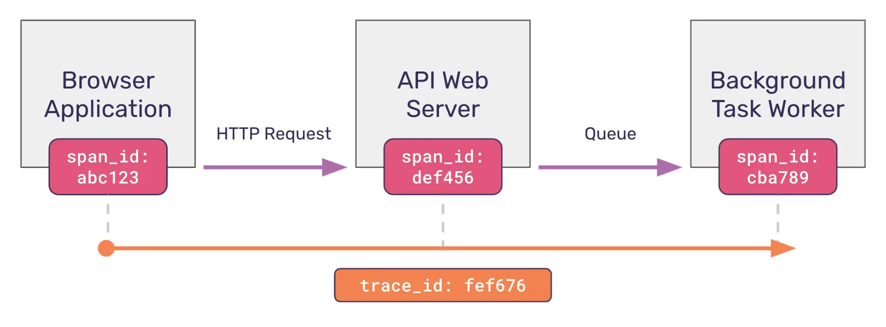

# OpenTelemetry


some intro videos to Otel: 
1. [OpenTelemetry in Node.js - Traces, Metrics and Logs](https://www.youtube.com/watch?v=NbVVZlSsvvM)
2. [What is OpenTelemetry? - Explanation and Demo](https://www.youtube.com/watch?v=LzLULxhyIpU&t=1021s)

## Basic Concepts

### Telemetry / signal

Telemetry refers to data emitted from a system and its behavior. The data can come in the form of **traces**, **metrics**, and **logs**.

## [Problems that OpenTelemetry tries to solve](http://jirablog.sentry.io/distributed-tracing-101-for-full-stack-developers/)

When debugging, we typically reply on logs and call stacks. This approach is straight forward when we have a monolithic system. 

1. we login to the server
2. Look through the logs / call stacks
3. Identify the problem

What if we a micro system with 3 services running on 3 servers

1. we log into the first server
2. we log into the second server
3. we log into the third server

You know the rest if we have hundreds of services.

We need **aggregation**! It's better to have single source to find logs. So we need Grafana, datadog, who can aggregate logs / metrics. NOT opentelemetry.

We just need to send logs to a central serivce whenever we create a log.

However, logs don't have **correlations.** There may be hundres of **same** logs created by a service in a second by different users. How can we know which log in service A is linked to which log in service B that are created by the same user?

**Traces!**

With a `trace id` unique across the whole request that involves many services, and `span id` representing each service, and inject these data inside metrics / logs, they are all correlated. and we can identify the logs / metrics by a specific request.

In order for each request knows which trace it blongs to, we need trace context that stores

1. `trace_id`
2. `parent_id`




Check out [Distributed Tracing 101 for Full Stack Developers](https://blog.sentry.io/distributed-tracing-101-for-full-stack-developers/)

We can manually insert `trace_id` and log with those, but this is extremely cumbersome, and there is no standard way. Hence, we need a tool and standarized way to do this. 

So we have **OpenTelemetry**.

It provides a starndarized way to mannually add  trace / metrics / logs, and a zero-code way using libriaries, to inject. **The code to add trace / metric / logs is also call** [intrumentation](#instrumentation)

The action to share trace context is also known as [Context propagation](https://opentelemetry.io/docs/concepts/context-propagation/)

Check out [Distributed Tracing 101 for Full Stack Developers](https://blog.sentry.io/distributed-tracing-101-for-full-stack-developers/) for a quick intro.


## Instrumentation

**Simple Analogy: Instrumentation = Adding Sensors**

Imagine your application is a car. Instrumentation is like installing sensors in the car to monitor:

1. **Speed (metrics)**

2. **Engine health (traces)**

3. **Fuel efficiency (logs).**

Without these sensors, you can’t collect data. With them, you get visibility into how the car operates.

**OTel’s role: Standardizes how these "sensors" (instrumentation) are added and how data is formatted.**

If you’re instrumenting an app, you need to use the OpenTelemetry SDK for your language.


Instrumentation is can be summarised as adding logs / traces / metrics. You can done it [mannully](#manual-intrumentation) or using exsitig [libraries](#libraries).


### [Manual Intrumentation](https://opentelemetry.io/docs/languages/js/instrumentation/#manual-instrumentation-setup)

1. For mannual instrumentation, you need to initialize sdks.
2. [create tracers / meters / loggers.](https://opentelemetry.io/docs/languages/js/instrumentation/#initialize-tracing)
3. Through your application code, Manually add tracing, meterics.

```ts
import { trace, Span } from '@opentelemetry/api';

/* ... */
const tracer = trace.getTracer('dice-lib');

function rollOnce(i: number, min: number, max: number) {
  return tracer.startActiveSpan(`rollOnce:${i}`, (span: Span) => {
    const result = Math.floor(Math.random() * (max - min + 1) + min);
    span.end();
    return result;
  });
}

export function rollTheDice(rolls: number, min: number, max: number) {
  // Create a span. A span must be closed.
  return tracer.startActiveSpan('rollTheDice', (parentSpan: Span) => {
    const result: number[] = [];
    for (let i = 0; i < rolls; i++) {
      result.push(rollOnce(i, min, max));
    }
    // Be sure to end the span!
    parentSpan.end();
    return result;
  });
}
```

### [Libraries]()

1. After installing the instrumentation libraries you need, **register** them with the OpenTelemetry SDK for Node.js.

```ts
/*instrumentation.ts*/
...
import { getNodeAutoInstrumentations } from '@opentelemetry/auto-instrumentations-node';

const sdk = new NodeSDK({
  ...
  // This registers all instrumentation packages
  instrumentations: [getNodeAutoInstrumentations()]
});

sdk.start()
```

Libraries like `express` typically has exsting instrumentation lib and were written with intrumentations. So that after registartion, the traces / logs will automatically be handled. You can still add new traces and logs maunnuly inside the application.


### Distributed traces

Distributed Traces rely on Context Propagation. 

For the vast majority of use cases, libraries that natively support OpenTelemetry or instrumentation libraries will automatically propagate trace context across services for you. It is only in rare cases that you will need to propagate context manually.


For manual propagation refer to [Manual context propagation](https://opentelemetry.io/docs/languages/js/propagation/#manual-context-propagation) with information [Context](https://opentelemetry.io/docs/languages/js/context/), and [Propagator](https://opentelemetry.io/docs/concepts/context-propagation/#propagation)


## [Architecture](https://opentelemetry.io/docs/specs/otel/overview/#api)


## [Steps](https://opentelemetry.io/docs/concepts/instrumentation/code-based/) 

Otel handles the traces / metrics. And youself handles the logs. 

1. Configure the OpenTelemetry API / SDK

> This involves creating a tracer and/or meter provider.

2. Create Telemetry Data

> Logs / Traces / Metrics

3. Export Data

    * You can either exporting data from your process to an analysis backend or through a proxy named collector.

## [Components](https://opentelemetry.io/docs/concepts/components/)

### [API / SDK](https://opentelemetry.io/docs/specs/otel/overview/#api)

> API is the interface, and SDK is the implementation of API. We should use SDK, and not worry about the API. API is the interface defined necessary for cross-cutting concerns. 

### Collector

**IT'S A PROXY**

The OpenTelemetry Collector is a vendor-agnostic **proxy** that can receive, process, and export telemetry data. 

Often we need a docker running for collector and exporter, so that all of the telemetry data from different services are sent to the collector. 

WHY do we need this collector? why don't we just send telemetry data directly to the observability backend? like grafana?. **Answer is we can!, but it's better to have a proxy, to clean the data before storing.**

check [Do you need an OpenTelemetry Collector?](https://grafana.com/blog/2023/11/21/do-you-need-an-opentelemetry-collector/)

### Exporter

The end of a collector docker that send data to the observability backend.


### [Pino](https://betterstack.com/community/guides/logging/how-to-install-setup-and-use-pino-to-log-node-js-applications/)

A good choice for logging.

[How to set it up with NextJS.](https://blog.arcjet.com/structured-logging-in-json-for-next-js/)


[Debugging Pino Logger Issues in a Next.js Turbo Monorepo on Vercel: A Journey Through Backend Engineering](https://medium.com/@sibteali786/debugging-pino-logger-issues-in-a-next-js-4e0c3368ef14)


[A complete guide to instrumenting Next.JS with OpenTelemetry and Pino Logger](https://harith-sankalpa.medium.com/a-complete-guide-to-instrumenting-next-js-with-opentelemetry-and-pino-logger-54cf5734a40c)


下面是一份整理好的文档版，可直接放进项目文档或知识库。

---

# Pino 日志接入 Grafana Stack 的三种方案对比

## 1. 背景

当前项目使用 **Next.js + Pino** 进行应用日志记录，并计划使用 **Grafana Stack** 做日志与链路追踪观测。

Grafana Stack 中常见组件包括：

```text
Grafana：可视化与查询界面
Loki：日志存储与查询
Tempo：Trace 存储与查询
Alloy：采集、处理、转发 logs / traces / metrics 的 agent
OpenTelemetry：应用侧生成和传输 telemetry 数据的标准
```

在日志接入 Loki 这件事上，主要有三种方案：

```text
方案一：Pino → stdout → Alloy → Loki
方案二：Pino → OpenTelemetry Transport → OTel Exporter/Collector → Loki
方案三：Pino → Loki Transport → Loki
```

三种方案最终都可以把日志送到 Loki，并在 Grafana 中查询，但它们的职责划分、复杂度和生产适用性不同。

---

# 2. 方案一：Pino + stdout + Alloy + Loki

## 2.1 架构链路

```text
Next.js App
  ↓
Pino 输出 JSON 日志到 stdout
  ↓
Alloy 采集容器 stdout / Docker logs / Kubernetes logs
  ↓
Loki
  ↓
Grafana
```

## 2.2 应用代码示例

```ts
logger.info({ route: "/api/transcribe" }, "request completed");
```

Pino 输出一行 JSON 日志：

```json
{
  "level": 30,
  "route": "/api/transcribe",
  "msg": "request completed"
}
```

应用本身不直接知道 Loki，也不负责把日志发到 Loki。它只负责把结构化日志写到 stdout。

## 2.3 职责划分

```text
应用负责：写结构化日志
Alloy 负责：采集、处理、加标签、转发日志
Loki 负责：存储日志
Grafana 负责：查询和展示日志
```

## 2.4 优点

这是最推荐的生产方案。

优点包括：

```text
1. 应用逻辑简单，只负责输出日志。
2. 符合 Docker / Kubernetes 的标准日志模型。
3. 即使 Loki 或 Alloy 出问题，仍然可以通过 docker logs / kubectl logs 查看原始日志。
4. 多服务场景下统一采集，不需要每个服务单独配置 Loki 发送逻辑。
5. 日志采集、过滤、脱敏、加标签、路由都可以集中在 Alloy 中处理。
6. 更适合私有化部署和长期维护。
```

例如多个服务可以统一接入同一个 Alloy：

```text
nextjs-app
asr-service
worker-service
user-service
    ↓
  Alloy
    ↓
  Loki
```

## 2.5 缺点

```text
1. 需要额外部署 Alloy。
2. 初期比“应用直接发 Loki”多一个组件。
3. 需要理解 Alloy 的配置。
```

但从生产角度看，这个复杂度通常是值得的。

## 2.6 适合场景

```text
Docker / Kubernetes 部署
多个服务
生产环境
私有化部署
希望应用和观测系统解耦
希望日志采集由基础设施统一管理
```

---

# 3. 方案二：Pino + Transport + OpenTelemetry Exporter + Loki

## 3.1 架构链路

```text
Next.js App
  ↓
Pino Transport
  ↓
转换成 OpenTelemetry LogRecord
  ↓
OTLP Exporter
  ↓
OpenTelemetry Collector / Alloy
  ↓
Loki
  ↓
Grafana
```

这个方案是 OpenTelemetry 原生风格。

日志不再只是 stdout 中的一行 JSON，而是会被转换成 OpenTelemetry 的日志模型，也就是 `LogRecord`。

## 3.2 普通日志与 OTel LogRecord 的区别

应用代码仍然可能是：

```ts
logger.info({ route: "/api/transcribe" }, "request completed");
```

但它会被转换成类似这样的 OpenTelemetry LogRecord：

```text
LogRecord:
  body: "request completed"
  severity: INFO
  attributes:
    route: "/api/transcribe"
  resource:
    service.name: "nextjs-app"
    deployment.environment: "production"
  trace_id: "..."
  span_id: "..."
```

然后通过 OTLP 协议发送到 Collector，再由 Collector 转发到 Loki。

## 3.3 职责划分

```text
应用负责：写日志、转换为 OpenTelemetry LogRecord、通过 OTLP 发送
Collector / Alloy 负责：接收、处理、转发
Loki 负责：存储日志
Grafana 负责：查询和展示日志
```

## 3.4 优点

```text
1. Logs / Traces / Metrics 都可以走 OpenTelemetry 统一协议。
2. 更符合 OpenTelemetry 原生架构。
3. 更容易支持多后端转发，例如 Loki + Datadog + Honeycomb。
4. 应用层 telemetry 更标准化。
5. 后续如果更换观测后端，理论上更灵活。
```

整体链路可以统一成：

```text
App
  ↓
OpenTelemetry
  ↓
Collector / Alloy
  ↓
Loki / Tempo / Grafana Cloud / Datadog
```

## 3.5 缺点

```text
1. 应用复杂度更高。
2. 应用需要关心 OTLP exporter、collector endpoint、发送失败、缓冲、重试等问题。
3. Node.js / Next.js 生态里，OpenTelemetry Logs 没有 stdout 日志模式那么直观和成熟。
4. 如果只通过 OTLP 发日志，不输出 stdout，那么 docker logs / kubectl logs 可能看不到完整业务日志。
5. 排障难度高于 stdout 方案。
```

如果 OTLP 链路出问题，日志可能丢失，除非同时保留 stdout 输出。

## 3.6 适合场景

```text
希望 logs / traces / metrics 全部统一走 OpenTelemetry
有成熟的 OpenTelemetry Collector 管理能力
需要多后端转发
不依赖 Docker / Kubernetes stdout 日志采集
对供应商无关性要求很高
```

对于当前阶段的 Next.js 项目来说，这个方案偏重，除非明确需要统一 OTLP 管理所有 telemetry。

---

# 4. 方案三：Pino + Transport + Loki

## 4.1 架构链路

```text
Next.js App
  ↓
Pino Loki Transport
  ↓
Loki
  ↓
Grafana
```

这个方案最直接：应用自己通过 Pino transport 把日志发送到 Loki。

## 4.2 应用代码示例

业务代码仍然是：

```ts
logger.info({ route: "/api/transcribe" }, "request completed");
```

但 Pino transport 会把日志通过 HTTP 推送到 Loki。

## 4.3 职责划分

```text
应用负责：写日志、配置 Loki、发送日志到 Loki
Loki 负责：存储日志
Grafana 负责：查询和展示日志
```

也就是说，日志投递逻辑进入了应用本身。

## 4.4 优点

```text
1. 链路最短。
2. 不需要 Alloy 或 Promtail。
3. 小项目中接入速度快。
4. 本地 Demo 或快速验证 Loki 时很方便。
```

架构很简单：

```text
App → Loki → Grafana
```

## 4.5 缺点

```text
1. 应用和 Loki 强耦合。
2. 每个应用都需要配置 Loki endpoint、认证、labels 等。
3. Loki 不可用时，应用侧 transport 可能报错、丢日志、堆积内存或影响性能。
4. 多服务场景下，每个服务都要重复配置。
5. 以后从本地 Loki 切换到 Grafana Cloud Loki 或客户私有 Loki 时，需要修改每个应用配置。
6. 如果只通过 transport 发 Loki，不输出 stdout，则 docker logs / kubectl logs 的排障能力会变弱。
```

这个方案适合简单，但不太适合长期生产化和多服务架构。

## 4.6 适合场景

```text
小项目
Demo
单体应用
快速验证 Loki
不想部署 Alloy
对长期维护和多服务扩展要求不高
```

---

# 5. 三种方案总表对比

| 对比项              | 方案一：Pino → stdout → Alloy → Loki | 方案二：Pino → OTel Transport → Collector → Loki | 方案三：Pino → Loki Transport → Loki |
| ------------------- | ------------------------------------ | ------------------------------------------------ | ------------------------------------ |
| 日志输出形式        | JSON stdout                          | OpenTelemetry LogRecord                          | 直接发 Loki                          |
| 谁负责发送日志      | Alloy                                | 应用 + Collector                                 | 应用                                 |
| 应用是否知道 Loki   | 不知道                               | 不直接知道 Loki，但知道 OTel endpoint            | 知道                                 |
| 应用复杂度          | 低                                   | 高                                               | 中                                   |
| 基础设施复杂度      | 中                                   | 中/高                                            | 低                                   |
| 是否适合多服务      | 很适合                               | 适合，但复杂                                     | 不太适合                             |
| 是否适合 Docker/K8s | 很适合                               | 可以                                             | 一般                                 |
| 是否方便本地排障    | 很方便，可用 docker logs             | 取决于是否也输出 stdout                          | 取决于是否也输出 stdout              |
| 是否容易切换后端    | 容易，改 Alloy 配置                  | 容易，改 Collector 配置                          | 较麻烦，每个应用改配置               |
| 生产推荐度          | 高                                   | 中                                               | 中/低                                |
| 私有化部署适配      | 很好                                 | 可以                                             | 一般                                 |
| 学习/接入成本       | 中                                   | 高                                               | 低                                   |

---

# 6. 和 Trace 的关系

无论使用哪种日志方案，Trace 都可以独立使用 OpenTelemetry：

```text
Next.js OpenTelemetry
  ↓
Collector / Alloy
  ↓
Tempo
  ↓
Grafana
```

日志和 Trace 的关联不是靠“日志必须走 OpenTelemetry”，而是靠日志中包含同一个 `trace_id`。

例如日志中包含：

```json
{
  "msg": "request failed",
  "trace_id": "abc123",
  "span_id": "def456"
}
```

Tempo 中也存储了同一个 `trace_id` 的完整链路：

```text
trace_id = abc123

span 1: Next.js received request
span 2: Next.js called ASR service
span 3: ASR service queried database
```

Grafana 就可以做到：

```text
Loki 日志
  ↓ 点击 trace_id
Tempo Trace
```

因此，推荐的组合是：

```text
日志：Pino → stdout → Alloy → Loki
Trace：OpenTelemetry → Alloy / Collector → Tempo
```

只要日志中带有 `trace_id`，就可以实现日志与 Trace 关联。

---

# 7. 推荐方案

结合当前情况：

```text
Next.js 项目
Pino logger 已经设置
优先关注日志
未来可能有多个服务
可能需要私有化部署
计划使用 Grafana Stack
```

推荐选择：

```text
Pino → stdout → Alloy → Loki
```

Trace 走：

```text
OpenTelemetry → Alloy / Collector → Tempo
```

整体架构为：

```text
Next.js App
  ├─ Pino JSON logs → stdout → Alloy → Loki → Grafana
  └─ OpenTelemetry traces → Alloy / Collector → Tempo → Grafana
```

这个方案的核心优点是：

```text
应用只负责生成高质量结构化日志
基础设施负责采集和转发
日志和 Trace 通过 trace_id 关联
未来多个服务可以复用同一套观测栈
私有化部署也更清晰
```

---

# 8. 最终结论

## 方案一

```text
Pino → stdout → Alloy → Loki
```

最工程化、最生产友好。推荐作为当前默认方案。

## 方案二

```text
Pino → OpenTelemetry Transport → Collector → Loki
```

最 OpenTelemetry 原生，但复杂度较高。适合有明确 OTel 全栈标准化需求的团队。

## 方案三

```text
Pino → Loki Transport → Loki
```

最直接，适合 Demo、小项目或快速验证，不太适合长期多服务生产架构。

## 当前建议

```text
优先采用方案一。
```

也就是：

```text
Logs:
Pino JSON stdout → Alloy → Loki

Traces:
OpenTelemetry → Alloy / Collector → Tempo

Visualization:
Grafana
```

一句话总结：

```text
日志投递应该尽量交给基础设施，而不是让应用直接绑定 Loki。
```


## OpenTelemetry Collector, Grafana Alloy, and OTLP: Relationship Summary

## 1. The core confusion

OpenTelemetry is not one single tool.

It is an ecosystem that defines:

- telemetry concepts: traces, metrics, logs
- data models
- semantic conventions
- protocols, especially OTLP
- SDKs for applications
- an official Collector implementation

Grafana Alloy is a separate Grafana Labs tool, but it is compatible with the OpenTelemetry Collector model.

So the relationship is:

```txt
OpenTelemetry
├─ Defines the standard model and protocol
├─ Provides official SDKs
├─ Provides the official OpenTelemetry Collector
└─ Provides official Collector components

Grafana Alloy
└─ Implements a Collector-compatible pipeline and supports many OpenTelemetry Collector components
```

---

## 2. What is OTLP?

OTLP means **OpenTelemetry Protocol**.

It is only a protocol, not a storage system or dashboard.

It defines how telemetry data is sent over the network.

Common OTLP transports:

```txt
OTLP over HTTP
OTLP over gRPC
```

Example:

```txt
Next.js app
  ↓ sends traces via OTLP
Alloy or OpenTelemetry Collector
```

Better wording:

```txt
The app sends traces via OTLP to Alloy.
```

Not:

```txt
The app sends traces to OTLP.
```

OTLP is the language/protocol. Alloy or the OpenTelemetry Collector is the receiver that understands that language.

---

## 3. What is the OpenTelemetry SDK?

The SDK runs inside your application.

For a Next.js / Node.js app, the SDK is responsible for:

- creating traces and spans
- collecting telemetry from auto-instrumentation
- attaching context such as trace ID and span ID
- exporting telemetry to another system

Example:

```txt
Next.js app
  ↓
OpenTelemetry JS SDK
  ↓
OTLP exporter
  ↓
Alloy / OpenTelemetry Collector / Tempo
```

Typical Node.js packages:

```bash
@opentelemetry/api
@opentelemetry/sdk-node
@opentelemetry/auto-instrumentations-node
@opentelemetry/exporter-trace-otlp-http
```

The SDK is the in-app part.

The Collector or Alloy is the outside-app pipeline/gateway part.

---

## 4. What is the official OpenTelemetry Collector?

The OpenTelemetry Collector is the official vendor-neutral telemetry gateway from the OpenTelemetry project.

It can:

- receive telemetry
- process telemetry
- export telemetry to another backend

Its pipeline model is:

```txt
Receiver → Processor → Exporter
```

Example Collector config:

```yaml
receivers:
  otlp:
    protocols:
      grpc:
      http:

processors:
  batch:

exporters:
  otlp:
    endpoint: tempo:4317
    tls:
      insecure: true

service:
  pipelines:
    traces:
      receivers: [otlp]
      processors: [batch]
      exporters: [otlp]
```

This means:

```txt
Receive traces via OTLP
Batch them
Export them via OTLP to Tempo
```

---

## 5. What are receivers, processors, exporters, and extensions?

These are component roles inside a Collector-compatible tool.

They are not usually separate tools you install one by one.

### Receiver

A receiver is how telemetry enters the pipeline.

Examples:

```txt
otlp receiver       accepts OTLP data
jaeger receiver     accepts Jaeger trace data
zipkin receiver     accepts Zipkin trace data
prometheus receiver scrapes Prometheus metrics
filelog receiver    reads logs from files
```

### Processor

A processor modifies, filters, batches, or enriches telemetry.

Examples:

```txt
batch processor
memory_limiter processor
attributes processor
resource processor
```

### Exporter

An exporter sends telemetry out to another system.

Examples:

```txt
otlp exporter
prometheus exporter
debug exporter
loki exporter
jaeger exporter
zipkin exporter
```

### Extension

An extension provides helper behavior that is usually not part of the main telemetry data path.

Examples:

```txt
health check
authentication helpers
profiling helpers
internal diagnostics
```

For most basic trace setups, you mainly care about:

```txt
receiver + processor + exporter
```

---

## 6. Does every receiver use OTLP?

No.

OTLP is only one protocol.

Different receivers accept different protocols or data sources.

Example:

```txt
App
  ↓ Jaeger protocol
OpenTelemetry Collector Jaeger Receiver
  ↓ internal OpenTelemetry data model
Batch Processor
  ↓ OTLP
Tempo
```

In this example:

```txt
Input protocol: Jaeger
Output protocol: OTLP
```

The Collector acts as a translator/gateway.

Another example:

```txt
App
  ↓ OTLP
Collector OTLP Receiver
  ↓ internal OpenTelemetry data model
Exporter
  ↓ Jaeger
Jaeger backend
```

In this example:

```txt
Input protocol: OTLP
Output protocol: Jaeger
```

So:

```txt
Receiver = what the Collector can accept
Exporter = what the Collector can send
```

---

## 7. What is Grafana Alloy?

Grafana Alloy is Grafana Labs' telemetry collector/gateway.

It can collect, process, and forward:

- logs
- traces
- metrics
- profiles

For OpenTelemetry, Alloy includes many OpenTelemetry Collector-compatible components using the `otelcol.*` namespace.

Example Alloy config:

```hcl
otelcol.receiver.otlp "default" {
  grpc {
    endpoint = "0.0.0.0:4317"
  }

  http {
    endpoint = "0.0.0.0:4318"
  }

  output {
    traces = [otelcol.processor.batch.default.input]
  }
}

otelcol.processor.batch "default" {
  output {
    traces = [otelcol.exporter.otlp.tempo.input]
  }
}

otelcol.exporter.otlp "tempo" {
  client {
    endpoint = "tempo:4317"

    tls {
      insecure = true
    }
  }
}
```

This means:

```txt
Alloy receives OTLP traces
Alloy batches them
Alloy exports them via OTLP to Tempo
```

---

## 8. Alloy vs OpenTelemetry Collector

They are similar in role but not identical.

### OpenTelemetry Collector

```txt
Official implementation from the OpenTelemetry project
Vendor-neutral
Uses YAML config
Has receivers/processors/exporters/extensions
Common in many observability stacks
```

### Grafana Alloy

```txt
Grafana Labs implementation
Collector-compatible
Uses Alloy/HCL-style config
Integrates well with Grafana, Loki, Tempo, Prometheus, and Mimir
Can run OpenTelemetry Collector-style components through otelcol.*
Good fit for Grafana-based observability stacks
```

Simple comparison:

```txt
OpenTelemetry Collector = official vendor-neutral collector

Grafana Alloy = Grafana's collector/gateway that supports OpenTelemetry Collector-style pipelines
```

---

## 9. Why use Alloy if OpenTelemetry already has a Collector?

Because Alloy fits naturally into a Grafana stack.

If your stack is:

```txt
Pino logs → Docker logs → Alloy → Loki → Grafana
```

Then adding traces through Alloy keeps one central telemetry gateway:

```txt
Next.js App
├─ Logs   → stdout → Alloy → Loki  → Grafana
└─ Traces → OTLP   → Alloy → Tempo → Grafana
```

This avoids running two collectors:

```txt
One for logs
One for traces
```

Instead, Alloy can become the central place for telemetry routing.

---

## 10. Recommended mental model

Use this model:

```txt
OpenTelemetry = standard + SDKs + official Collector

OTLP = protocol used to send telemetry

OpenTelemetry SDK = runs inside the app and creates/exports telemetry

OpenTelemetry Collector = official external telemetry gateway

Grafana Alloy = Grafana's Collector-compatible telemetry gateway

Tempo = trace storage backend

Loki = log storage backend

Grafana = visualization UI
```

For your current setup:

```txt
Logs:
Next.js / Pino
  ↓ stdout
Docker logs
  ↓
Alloy
  ↓
Loki
  ↓
Grafana

Traces:
Next.js / OpenTelemetry SDK
  ↓ OTLP
Alloy OTLP receiver
  ↓
Alloy batch processor
  ↓
Alloy OTLP exporter
  ↓
Tempo
  ↓
Grafana
```

---

## 11. Final practical conclusion

You do not need both OpenTelemetry Collector and Alloy for your current setup.

Because you already use Alloy for logs, the recommended path is:

```txt
Use OpenTelemetry SDK inside the app
Send traces via OTLP to Alloy
Use Alloy as the collector/gateway
Send traces from Alloy to Tempo
View traces in Grafana
```

So the key relationship is:

```txt
OpenTelemetry provides the standard and official implementation.

Alloy is not the official OpenTelemetry Collector,
but Alloy can perform the Collector role and supports OpenTelemetry Collector-compatible components.

In a Grafana stack, Alloy commonly replaces the need to run the official OpenTelemetry Collector separately.
```
