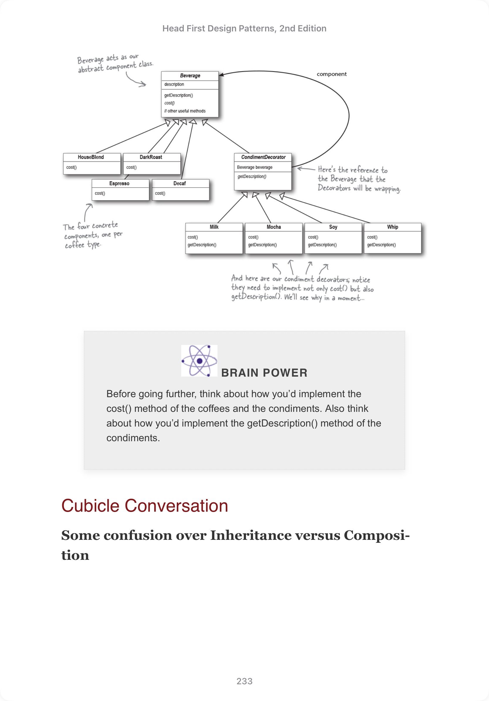

# Principles

## Identify the aspects of your application that vary and separate them from what stays the same.

## Program to an interface, not an implementation.

By coding to an interface, you know you can insulate yourself from many of the changes that might happen to a system down the road. Why? If your code is written to an interface, then it will work with any new classes implementing that interface through polymorphism.

## HAS-A is better than IS-A -> [Favor composition over inheritance.](https://www.youtube.com/watch?v=nnwD5Lwwqdo)


We can use **composition** to build the class, which makes it more flexible, instead of inheriting their behavior.

By saying favor composition over inheritance, we mean prefer using composition to add new **functionalities** instead of using inheritance.

We can still use inheritance to achieve the **type matching**. 



In the above Decorator Pattern, we still use inheritance to create more types of Decorators with the same syntax (type matching), however, new behaviors of a coffee is not introduced by inheritance, rather using composition of different decorators.

## Depend upon abstractions. Do not depend upon concrete classes.

At first, this principle sounds a lot like “Program to an interface, not an implementation,” right? It is similar; however, the Dependency Inversion Principle makes an even stronger statement about abstraction. It suggests that our high-level components should not depend on our low-level components; rather, they should both depend on abstractions.

Suppose we have classes like PizzaStore (A higher level component) and pizza (A lower level component) where PizzaStore cooks different kinds of pizza, if we don't use abstraction and create each kind of pizza an individual class, the PizzaStore is dependent on all kinds of pizza, since PizzaStore has to cook (instantiate with `new`) them.


On the other hand, if we define an interface for Pizza, dependency inverts.


This is also known as Dependency Inversion Principle.


A few **breakable** guidelines to follow this principle:

- No variable should hold a reference to a concrete class.

> If you use new, you’ll be holding a reference to a concrete class. Use a factory to get around that!

- No class should derive from a concrete class.

> If you derive from a concrete class, you’re depending on a concrete class. Derive from an abstraction, like an interface or an abstract class.

- No method should override an implemented method of any of its base classes.

YOU CAN ALWAYS **VIOLATE** these guidelines to build you program, these are just showing the right direction to go. You **won't** create any program if you follow strictly as stated.


## Hollywood Principle

Don't Call us, we'll call you.

The Hollywood Principle gives us a way to prevent “dependency rot.” Dependency rot happens when you have high-level components depending on low-level components depending on high-level components depending on sideways components depending on low-level components, and so on. When rot sets in, no one can easily understand the way a system is designed.

## One class One Responsibility

A class should only have one reason to change.

Every responsibility of a class is an area of potential change. More than one responsibility means more than one area of change.

This principle guides us to keep each class to a single responsibility.


# General

In [Command Pattern](#), the invoker calls to **execute** a command, which is an implementation of an interface. However, when there are slots that doesn't contain a command, it's a great pattern to create a `NoCommand` implementation that does nothing. So that we can omit `if` statements in all relevant code:

```java
public void onButtonWasPushed(int slot) {
    if (onCommands[slot] != null) {
        onCommands[slot].execute();
    }
}
```

```java
public class NoCommand implements Command {
    public void execute() { }
}
```


# Patterns

## Decorator Pattern

The Decorator Pattern attaches additional responsibilities to an object dynamically. Decorators provide a flexible alternative to subclassing for extending functionality. Mainly, Decorator Pattern uses wrapping and recursion. 

However, this pattern also introduces some drawbacks.

* decorator will break code that relies on concrete component's type


In the above example code, we use polymorphism `Beverage` to take a layer of abstract, so that we don't have to worry about the exact type of the beverage, and as long as the implementation includes `cost` (which is a tautology). However, decorator pattern uses recursion to create a **chain**. If we want to add conditions only to a specific type of beverage, Decorator Pattern will introduces so many obstacles.

* Introduces many small classes to a design and this occasionally results in a design that's less than straightforward for others to understand.

* Once, we've got to not only instantiate the component, but also wrap it with who knows who many decorators.
  


## Factory Pattern

With [Program to an interface, not an implementation](#program-to-an-interface-not-an-implementation) in mind, the following code which use `new` keyword to create concrete object can bring inflexibility once pizza gets more and more complicated.


When there are more and more kinds of pizza, like CheesePizza, GreekPizza, the creation will become a nightmare.


**If we have more than one place of code that needs to create concrete pizza, adding a new kind will require us to modify code from many places.**

### Simple Factory

One approach is to encapsulate the logic of instantiation into an exclusive snippet of code, we call **Factory**. 

For example, a **simple factory**


In this way, we can encapsulate all the logic into a single place, even though we still use implementation instead of interface. At least we now have a single place to edit for future changes.

> Simple Factory is not a pattern, it just a simple practice to **encapsulate**.


### Factory Method Pattern

Unlike Simple Factory which creates a new class, with factory method, we are creating an **interface** which tells the subclasses to implement their own factory.

**The Factory Method Pattern defines an interface for creating an object, but lets subclasses decide which class to instantiate. Factory Method lets a class defer instantiation to subclasses.**


Here, we define an interface that specifies the framework of subclasses, so that all subclasses have to implement a `createPizza` method which will be used as a factory to instantiate concrete objects.


> Compare that with Simple Factory, which gives you a way to encapsulate object creation, but doesn’t give you the flexibility of Factory Method because there is no way to vary the products you’re creating.


### Abstract Factory

When looking at Simple Factory and how we discuss it's not a pattern and is just about encapsulation, you may already be thinking, why not swap different "Simple Factory" to achieve flexibility. At least this was what I was thinking.

Here we are, Abstract Factory: **The Abstract Factory Pattern provides an interface for creating families of related or dependent objects without specifying their concrete classes.**

We can actually create an interface for Factory, so that the client code doesn't have to know the concrete factory at compile time. And the exact implementation will be clear at runtime.


Here, we can easily swap factories as it's just a local reference with polymorphism.

It's not hard to notice now we are coding to an interface and we actually using composition. Also, one advantage of using an interface is that it abstract **a group of related attributes**. For example, we create different factories for All New York originated ingradient vs California originated ingradient with the same interface.

A drawback of Abstract Factory is that if you need to extend that set of related products to, say, add another one requires to change the interface and implementations of all subclasses (factories).

> Take a closer look, we say all factory method does is to create encapsulate instantiation with subclasses, we easily notice that Abstract Factory follows the same pattern only that the pattern is to instantiate factories not client objects.

## Factory Method VS Abstract Factory

* Both are used for creating objects 
* FM does it through inheritance **vs** AF does it through composition
> To use FM, you need to extend a class and provide an implementation for a factory method.
> AF provides an **abstract type for creating** a family of products. (The an interface for the product itself). Subclasses of this type define how those products are produced
> FM doesn't have interface for factories **vs** AF has interface for factory

- **Abstract Factory**: Thanks. Remember me, Abstract Factory, and use me whenever you have families of products you need to create and you want to make sure your clients create products that belong together.
- **Factory Method**: And I’m Factory Method; use me to decouple your client code from the concrete classes you need to instantiate, or if you don’t know ahead of time all the concrete classes you are going to need. To use me, just subclass me and implement my factory method!


## Command Pattern


## Template Pattern

The Template Method Pattern defines the skeleton of an algorithm in a method, deferring some steps to subclasses. Template Method lets subclasses redefine certain steps of an algorithm without changing the algorithm’s structure.


In the above example, `prepareRecipe` is the template method that encapsulates the algorithm, and both `Tea` and `Coffee` can be classes that implement the details of the relevant methods.

For example, Tea can implement `addCondiment` as addLemon, while Coffee can implement `addCondiment` as addMilk. Hence, the template method protects the algorithm of making the beverage while the actual implementation detail is done by the subclasses.

**What’s a template? As you’ve seen it’s just a method; more specifically, it’s a method that defines an algorithm as a set of steps.**

### Hooks

A hook is a method that is declared in the abstract class, but only given an empty or default implementation.


With a hook, the subclass can override the implementation to add some new features. Also, with the template pattern, we can achieve the [Hollywood Principle](#hollywood-principle) so that the lower-level components never calls the higher-level component directly.

### Comparison With Strategy Pattern

Since, both Template pattern and Strategy Pattern defines an interface while letting the subclasses to implement some code details, it's worth mentioning the difference.

* Strategy Pattern emphasizes **Object Composition**, it provides an interface and **let the subclasses to implement all different kinds of algorithms**. The target class can store the interface only, so that the behavior can be changed easily.

* Template Pattern, on the other hand, **defines the algorithm structure in the higher-level component**, while giving some flexibilities that used to complete the algorithm to different scenarios to the lower-level components.

> Hence, template pattern is more like defining the structure and leave some of small holes for the subclasses to fill in. While, Strategy Pattern is more leaving a hole, without knowing what it does, allowing other parts to fill in. The main difference is who implements the algorithm.

* Template Pattern Saying:

“I remember that. But I have more control over my algorithm and I don’t duplicate code. In fact, if every part of my algorithm is the same except for, say, one line, then my classes are much more efficient than yours. All my duplicated code gets put into the superclass, so all the subclasses can share it.”

* Strategy Pattern Saying:

“You might be a little more efficient (just a little) and require fewer objects. And you might also be a little less complicated in comparison to my delegation model, but I’m more flexible because I use object composition. With me, clients can change their algorithms at runtime simply by using a different strategy object. Come on, they didn’t choose me for Chapter 1 for nothing!”

> The Strategy and Template Method Patterns both encapsulate algorithms, the first by composition and the other by inheritance.


## Iterator Pattern 

The Iterator Pattern provides a way to access the elements of an aggregate object sequentially without exposing its underlying representation

> once you have a uniform way of accessing the elements of all your aggregate objects, you can write polymorphic code that works with any of these aggregates—just like the printMenu() method

## Composite Pattern

Composite Pattern is all about building the a tree structure and share the component and composite a uniform interface, so that the tree can be traversed in a uniform way and easy to achieve nested structure. The benefit of this is that the client doesn't have to know whether the target is a composite or not.


## Data Access Patterns

[Data Access Patterns: the Features of the Main Data Access Patterns Applied in Software Industry](https://medium.com/mastering-software-engineering/data-access-patterns-the-features-of-the-main-data-access-patterns-applied-in-software-industry-6eff86906b4e)

1. Table Data Gateway
2. Row Data Gateway
3. Active Record
4. Data Mapper
5. **Repository**
6. Data Access Object (DAO)

### Table Data Gateway

TL;DR

An abstraction that encapsulates the access for the database table. Now, the `DataGateWay` class represents the **table**.

One instance per table (e.g., one ChatMessageGateway for all rows).

> It accepts a **Row** and returns a **row**. It only encapsulates away the `SQL`. It's clear the input parameters maps the row **exactly**.


```ts
// Table Gateway Row (raw data matching table schema)
interface ChatMessageRow {
  id: number;
  content: string;
  role: string;
  session_id: number; // Matches database column
}

// Table Gateway Interface and Implementation
interface ChatMessageGateway {
  findBySessionId(sessionId: number): Promise<ChatMessageRow[]>;
  insert(row: ChatMessageRow): Promise<void>;
}

class SqlChatMessageGateway implements ChatMessageGateway {
  async findBySessionId(sessionId: number): Promise<ChatMessageRow[]> {
    // Return raw rows matching table schema
    const records = await db.query('SELECT * FROM ChatMessages WHERE session_id = ?', [sessionId]);
    return records.map((record: any) => ({
      id: record.id,
      content: record.content,
      role: record.role,
      session_id: record.session_id, // Keep database column name
    }));
  }

  async insert(row: ChatMessageRow): Promise<void> {
    await db.query('INSERT INTO ChatMessages (id, content, role, session_id) VALUES (?, ?, ?, ?)', [
      row.id,
      row.content,
      row.role,
      row.session_id,
    ]);
  }
}
```


### Row Data Gateway

TL;DR

It acts as an in-memory representation of a single database row, providing methods to perform CRUD operations (Create, Read, Update, Delete) directly on that row.

One instance per row (e.g., one ChatMessageGateway per message row).

Typically, a static method called `finder` is used for fetching, and instance methods including `insert`, `delete` and `update`.

> with the Row Data Gateway Pattern, creating a new row typically involves manually mapping your domain object (e.g., ChatMessage) to a Row Data Gateway object (e.g., ChatMessageGateway) and then calling its insert() method to save it to the database. This is because the Row Data Gateway Pattern is a low-level, row-specific pattern that directly represents a single database row, with properties matching the table’s schema and methods to manipulate that row (e.g., insert, update, delete).

```ts
// Domain Objects
class ChatMessage {
  constructor(
    public id: number,
    public content: string,
    public role: "user" | "assistant",
    public sessionId: number
  ) {}

  validate(): void {
    if (!["user", "assistant"].includes(this.role)) {
      throw new Error("Invalid role: must be 'user' or 'assistant'.");
    }
    if (!this.content.trim()) {
      throw new Error("Message content cannot be empty.");
    }
  }
}


// Row Data Gateway
class ChatMessageGateway {
  constructor(
    public id: number,
    public content: string,
    public role: string,
    public session_id: number
  ) {}

  static async findById(id: number): Promise<ChatMessageGateway | null> {
    const record = await db.query('SELECT * FROM ChatMessages WHERE id = ?', [id]);
    return record
      ? new ChatMessageGateway(record.id, record.content, record.role, record.session_id)
      : null;
  }

  async insert(): Promise<void> {
    await db.query('INSERT INTO ChatMessages (id, content, role, session_id) VALUES (?, ?, ?, ?)', [
      this.id,
      this.content,
      this.role,
      this.session_id,
    ]);
  }

  async update(): Promise<void> {
    await db.query('UPDATE ChatMessages SET content = ?, role = ?, session_id = ? WHERE id = ?', [
      this.content,
      this.role,
      this.session_id,
      this.id,
    ]);
  }

  async delete(): Promise<void> {
    await db.query('DELETE FROM ChatMessages WHERE id = ?', [this.id]);
  }
}

// manual mapping
const messageGateway = new ChatMessageGateway(101, "Hello!", "user", 1);
```

### Active Record

TL;DR

Put everything together, domain, logic, persistence logic.


### Data Mapper

TL;DR

Just an intermediate layer that automatically maps between domain objects (`ChatMessage`) and database data (e.g., rows or DTOs) You don’t manually map; the mapper handles it (e.g., ChatSessionMapper.toPersistence).

> Focuses on mapping data (rows to objects and vice versa). **No domain logic—it just maps data (e.g., joining users and orders tables to populate the User’s orders).**

> It's ok to have one instance of the mapping with more that one corresponding database entity, **One instance represents one domain model**. So the input/output is a domain object.


**Structure**

1. **Domain Object**: Represents the business entity with no knowledge of persistence.
2. **Data Mapper**: A class responsible for mapping between the domain object and the data source (e.g., database tables).
3. **Data Source**: The underlying storage (e.g., SQL database, NoSQL, or file system).


Suitable for applications with complex data transformations or when domain objects don’t align directly with database tables.

```ts
// Domain Object
class User {
  constructor(public id: number, public name: string) {}
}

// Data Mapper
class UserMapper {
  async findById(id: number): Promise<User> {
    // Simulate database query
    const record = await db.query('SELECT * FROM users WHERE id = ?', [id]);
    return new User(record.id, record.name);
  }

  async save(user: User): Promise<void> {
    // Simulate saving to database
    await db.query('INSERT INTO users (id, name) VALUES (?, ?)', [user.id, user.name]);
  }
}

// Usage
async function main() {
  const userMapper = new UserMapper();
  const user = new User(1, "Alice");
  await userMapper.save(user);
  const fetchedUser = await userMapper.findById(1);
  console.log(fetchedUser); // Output: User { id: 1, name: 'Alice' }
}
```


### **Repository**

A high-level domain tool that provides a collection-like interface of **aggregate roots** for managing domain objects, enforcing business rules, and coordinating persistence (e.g., transactions, validation).

When testing: 

You’d mock the entire repository interface to test business logic, without worrying about database details.

Whereas, for Data Mapper, you’d mock the database queries or results to test the mapping logic.

> It's common to use [Data Mapper](#data-mapper) with Repository.

In DDD, repositories are created for aggregate roots (ChatSession), not child entities (ChatMessage), **One repository per aggregate root**.

The key of Repository pattern is that it enforces domain logic like, **Validates that the user has a valid name before saving.**, but these logics should be restricted to persistence, instead of heavy business logics.


```ts
// Domain Object
class User {
  constructor(public id: number, public name: string) {}
}

// Data Mapper
class UserMapper {
  async findById(id: number): Promise<User> {
    const record = await db.query('SELECT * FROM users WHERE id = ?', [id]);
    return new User(record.id, record.name);
  }

  async save(user: User): Promise<void> {
    await db.query('INSERT INTO users (id, name) VALUES (?, ?)', [user.id, user.name]);
  }
}

// Repository
interface UserRepository {
  findById(id: number): Promise<User>;
  save(user: User): Promise<void>;
}

class SqlUserRepository implements UserRepository {
  constructor(private mapper: UserMapper) {}

  async findById(id: number): Promise<User> {
    return this.mapper.findById(id);
  }

  async save(user: User): Promise<void> {
    await this.mapper.save(user);
  }
}

// Usage
// 4. Usage in Business Logic
class UserService {
  constructor(private userRepository: UserRepository) {}

  async createUser(id: number, name: string): Promise<void> {
    const user = new User(id, name);
    await this.userRepository.save(user);
  }

  async getUser(id: number): Promise<User> {
    return this.userRepository.getById(id);
  }
}
```


### Data Access Object

TL;DR;

The DAO pattern provides a standardized interface for accessing data from a persistent storage system

**One DAO per entity/table**

Focus: Direct database operations for specific tables (ChatSessions, ChatMessages).
Data Representation: Works with DTOs (ChatSessionDTO, ChatMessageDTO) that closely mirror the database schema (e.g., user_id, session_id).

Difference between Data Mapper is that, **it accepts/returns DTOs, not domain object**.

```ts

// DTOs for DAO
interface ChatSessionDTO {
  id: number;
  user_id: number;
}

interface ChatMessageDTO {
  id: number;
  content: string;
  role: "user" | "assistant";
  sessionId: number;
}

// DAO Interfaces and Implementations
interface ChatSessionDAO {
  findById(id: number): Promise<ChatSessionDTO | null>;
  save(dto: ChatSessionDTO): Promise<void>;
}

interface ChatMessageDAO {
  findBySessionId(sessionId: number): Promise<ChatMessageDTO[]>;
  save(dto: ChatMessageDTO): Promise<void>;
}
```