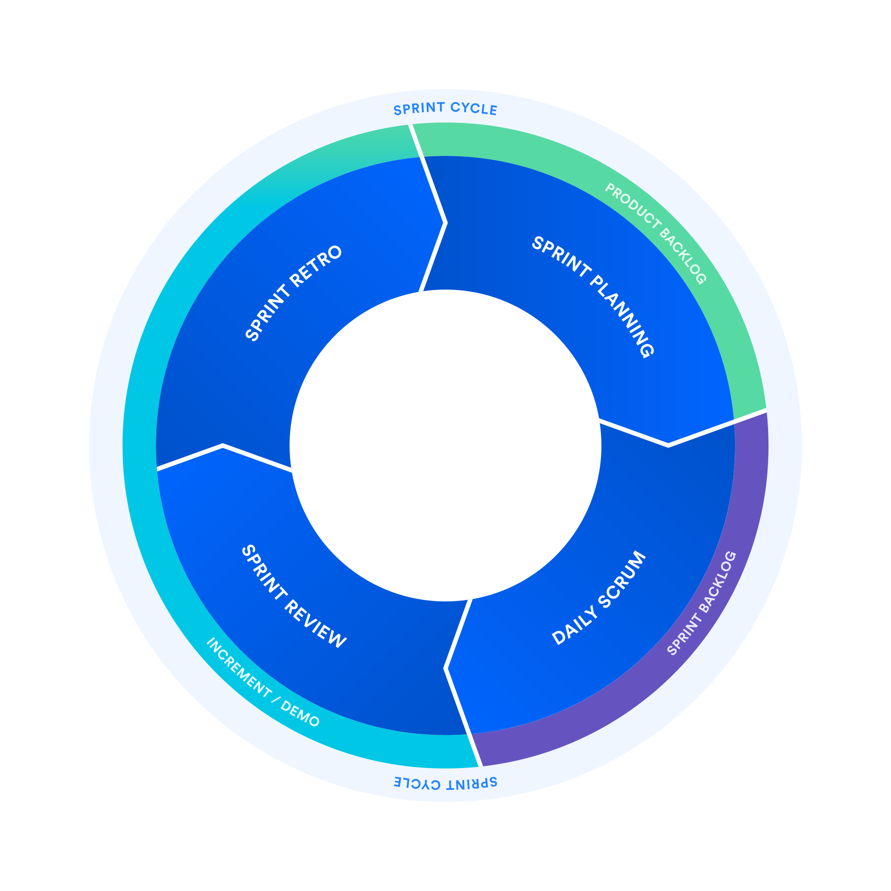

# [Scrum](https://www.youtube.com/watch?v=SWDhGSZNF9M)

Scrum is a framework or pattern of agile development. There are other similiar patterns like Kanban.

**The scrum framework is heuristic; it’s based on continuous learning and adjustment to fluctuating factors. It acknowledges that the team doesn’t know everything at the start of a project and will evolve through experience.**


### Scrum Artifacts

There are three artifacts in scrum:

1. product backlog, 
2. sprint backlog, 
3. an increment with your definition of “done”. (DoD)


backlog is just a todo list with a prioity. There are 2 types of backlogs. 

1. Product Backlog
2. Sprint Backlog

A **Product Backlog** stores the client requriements, also known as [Epics](#epic). They are not technical nor detailed, but overviews the system. They are too big to be able to be finished within weeks' scope. So that they will normally be broken down to smaller pieces also known as [User stories](#user-story) also stored in the Product Backlog.

For better organization, Epics afer defining, will consits multiple User stories as its subtasks. The number of user stories will be adjusted as the project eveloves, which process is also called [refinement](#backlog-refinement).


A **Sprint Backlog** stores a list of user stories can be done within 2-4 weeks, extracted from the product backlog with priorities.

> Product Backlog is similar to a to-do pool, each sprint, a new list of to-dos will be pulled from the product backlog to be placed into the sprintbacklog. And during each sprint, a backlog refinement will occur to improve the product backlog.

### Epic

Epics are the core client requirements, and that **long term**. After **Project Manager** discussing with the client, major epics will be added to the lists. 

The product backlog that stores Epics are subject to change as the project evloves, new conent may be added in order to meet the client's requirements.


> Early Planning: The PO defines Epics during initial project scoping to outline major features.

> Backlog Refinement: The PO continuously updates and prioritizes Epics based on feedback or changing requirements.

> Collaboration: The PO works with stakeholders and the Dev Team to split Epics into smaller stories.


### User Story

User story is a child of Epic, one user story represents a feature that could provide bussiness value. Multiple features or user stories can fullfil an epic. **And a user story should be small enough to be finished within the scope of 2-4 weeks.**

**User stories are created from the user's perspective**. It focuses on delivering value to the end user or customer.

A common template of defining a user story is

```
"As a [user], I want [goal] so that [reason]."
```

### Task

A user story represents a feature from the user's perspective, which is deigned to be done by multiple people working together for 2-4 weeks. Task is a more granular division of a user story that represents the technical steps should be down by **one** person in order to achive the user story.


### Relationship between Task / Epic / Story


The above is the hierachy from jira. Task in jira doesn't strictly follow the principle of Scrum. Sub-task of Jira is more similar to Task in Scrum.

### story points

A story point is a unit of measure used in Agile methodologies (like Scrum) to estimate the effort required to complete a user story or task. Unlike time-based estimates (e.g., hours or days), story points focus on the **relative** **complexity**, **effort**, and risk of a piece of work.


> Story points are **not** calculated using a strict formula but are instead assigned through team collaboration and consensus.

Different games may be played in order to estimate the story point of an issue.

1. **Choose a Reference Story**
   * The team selects a small, simple story as a baseline (e.g., 1 story point).
   * All other stories are estimated relative to this baseline.

2. **Use a Point Scale**
   * Most teams use a modified Fibonacci sequence for story points:
   * 1, 2, 3, 5, 8, 13, 21, ...
   * This scale reflects the increasing uncertainty and risk as stories get larger.

3. **Estimate During Planning Poker**
   * Team members discuss the story and its requirements.
   * Each team member privately selects a story point value (e.g., using Planning Poker cards).
   * Everyone reveals their estimate simultaneously.
   * If estimates differ, the team discusses the story further to reach a consensus.


> [What are story points in Jira and how to estimate them? Jira Guru](https://community.atlassian.com/forums/App-Central-articles/What-are-story-points-in-Jira-and-how-to-estimate-them-Jira-Guru/ba-p/2457031)


### Sprint

A sprint is a full life-cyle of SDLC, but only takes 2-4 weeks. 




### Sprink Planning

2 questions should be answered

1. 

### [Backlog Refinement](https://www.atlassian.com/agile/scrum/backlog-refinement#:~:text=Teams%20find%20that%20backlog%20refinement,to%20walk%20through%20the%20process.)


## Life Cycle

There are 3 roles

1. Scrum master
2. Project Manager / Owner
3. Developer

# Real-Life Example of a Scrum Lifecycle (2 Sprints)

## **Phase 0: Project Kickoff (Before Sprint 1)**  
**Scenario**: A fitness startup wants a mobile app with workout tracking and social sharing features.

### **Day 1: Client Meeting**  
- **Product Owner (PO)**:  
  - Gathers requirements (e.g., "Users should log workouts").  
  - Drafts a **Product Backlog** with features like:  
    - User registration  
    - Workout logging  
    - Social sharing
- **Scrum Master (SM)**:  
  - Schedules follow-up meetings.  
- **Dev Team**:  
  - Reviews technical feasibility if needed.  

---

## **Sprint 1 (2 Weeks): Core Features**  
### **Day 2: Sprint Planning**  
- **PO**: Prioritizes *User registration* and *Workout logging*.  
- **SM**: Facilitates planning meeting.  
- **Dev Team**: Breaks stories into tasks (e.g., "Design registration UI").  

### **Days 3–11: Daily Scrum**  
**Example Day 3**:  
```plaintext
Dev Team Member 1:  
- Yesterday: Built registration UI.  
- Today: Integrate with backend API.  
- Blockers: API endpoints delayed.  

SM: Assigns help for API blockers.  
PO: Refines backlog for future sprints.  
```

### **Day 12: Sprint Review**  
- **PO**: Demos *User registration* to the client.  
- **Client Feedback**: "Add photo upload for workouts."  
- **Dev Team**: Explains technical challenges.  

### **Day 12: Retrospective**  
- **SM**: Facilitates discussion.  
- **Dev Team**: Suggests "more code reviews."  

---

## **Sprint 2 (2 Weeks): Social Features**  
### **Day 13: Sprint Planning**  
- **PO**: Adds *Photo upload* and prioritizes *Social sharing*.  
- **Dev Team**: Breaks stories into tasks (e.g., "Integrate Facebook API").  

### **Days 14–22: Daily Scrum**  
**Example Day 14**:  
```plaintext
Dev Team Member 1:  
- Yesterday: Started social share UI.  
- Today: Add Facebook SDK.  

SM: Escalates delayed Facebook API key.  
PO: Coordinates with client to resolve blocker.  
```

### **Day 23: Sprint Review**  
- **PO**: Demos *Social sharing*. Client requests "privacy toggle."  

### **Day 23: Retrospective**  
- **Team**: Agrees to "allocate 20% time for testing."  

---

## **Roles’ Daily Responsibilities**  
| Role              | Daily Activities                                            |
| ----------------- | ----------------------------------------------------------- |
| **Product Owner** | Refine backlog, clarify requirements, liaise with client.   |
| **Scrum Master**  | Remove blockers, facilitate meetings, ensure Scrum process. |
| **Dev Team**      | Code, test, collaborate, update task status.                |

---

## **Outcome After 2 Sprints**  
- **Delivered**: User registration, workout logging, social sharing, photo upload.  
- **Backlog Update**: Privacy toggle added for Sprint 3.  
- **Team Improvement**: Better code reviews and testing focus.  

