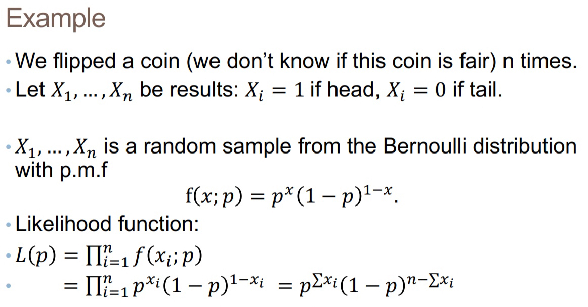

# STATS

This notes serves as helper to understand some concepts I probably already learnt in STAT in UIUC, but find it hard to recap what is going on. Hence, for the main concepts, try find the UIUC Notes for more information. 

## [Expected Value](https://www.youtube.com/results?search_query=expected+value)

## Cross Validation

When having limited dataset, cross-validation allows for more efficient use of the data. We split the whole dataset (leave part of it as test dataset) into `k` folds and do the followings. **This will make all data in the set to participate in the validation set and the training set**

1. Split the data: Divide your dataset into training and validation subsets. The training set is used for model training, while the validation set is used to evaluate the model's performance with different hyperparameter settings.

2. Define the hyperparameter space: Determine the range or values for the hyper-parameters you want to tune. For example, if you have a hyperparameter called "learning rate," you might choose a range of values such as [0.001, 0.01, 0.1].
Cross-validation loop: Perform a cross-validation loop that iterates over different hyperparameter settings and evaluates the model's performance.
    - a. For each hyperparameter setting, initialize the model with the chosen hyper-parameters.
    - b. Perform k-fold cross-validation: Split the training set into k folds. Train the model on k-1 folds and evaluate its performance on the remaining fold. Repeat this process k times, each time using a different fold as the validation set. Calculate the average performance across all folds.
    - c. Repeat steps (a) and (b) for each hyperparameter setting.

3. Select the best hyper-parameters: Compare the performance of different hyperparameter settings based on the cross-validation results. Choose the hyper-parameters that yield the best performance metric (e.g., highest accuracy, lowest error, etc.).

Thus, in order find the best choice hyper-parameters given `n` choices, and `k` folds, the iterations in total to use cv to find will be `n * k`

## [Supported Vector Machine](https://www.youtube.com/watch?v=efR1C6CvhmE)

A SVM is an algorithm that finds the optimal hyperplane (a straight line/plane) that **best separates data points** into different classes.

### Supported Vector Classifier
Before discussing SVM, let's first talk more about **Supported Vector Classifier**.

A Supported Vector Classifier does most of the job A SVM does as the above mentioned. 

In the above example, to classify the new **black** data, we can find which clause of data pink or green it is **closer** to. However, how to determine which clause the **black** data belongs to? The most obvious way of doing this is find a **mid point between two boundary** data as a **threshold**. And the distance of one edge point to the threshold is called `Margin` and when the threshold is not placed in the middle, the smaller distance is used as margin.

> This threshold is the hyperplane that a SVC tries to find, as well as what a SVM tries to find.

In the above method finding the mid point between two **edge** points is also known as **Max Margin Classifier**. However, this method is typically not ideal since it is extremely sensitive to outlier data. A reference can be found at [Support Vector Machines - main idea](https://youtu.be/efR1C6CvhmE?t=215). Indeed a **Soft Margin Classifier** that uses [Cross Validation](#cross-validation) to find the best two points as edge points is more preferred. 

A SVC can not only be used to find a point to separate data in 1 dimensions, but also a line and plane in 2 and 3 dimensions respectively as well. 

### [SVM-Dimension-Elevation](https://youtu.be/efR1C6CvhmE?t=742)

With SVC the majority of work has been done. However, what if the data doesn't cluster. For example, data represent drug dosage that only takes effect in certain range like `0000111100000`. SVC then can't not find a straight line to separate these data. 

Now, SVMs come to rescue. For 1 dimension data, it will create a y-axis that stores the transformed value (like *squared*). Then find a line that separates the data.

In the above example, y-axis is created and represents the value of `dosage^2`, and thus data can be separated. A new data we try to classified will first be transformed into the new dimension before be classified.

### [Multi-class SVM](https://www.youtube.com/watch?v=zK2-ngR9w2Q)

A SVM is often used to classify binary data that can be either be positive or negative. But SVM doesn't just stop there. When classifying data with multiple classes, **we tries to subdivide the problem into multiple binary classification.**

In the above example, we build 3 SVGs for 3 classes, and inside each SVG, we only care if the data is classified as the target class. The the procedure will be apply to the other 2 classes. Hence the problem becomes 3 binary SVG again. 

The only difference is that now we don't just classify in each binary SVG. We indeed calculate the probability of a class being classified as the target class. Then take the higher probability when all SVGs finishes calculating.

## [Probability vs Likelihood](https://www.youtube.com/watch?v=pYxNSUDSFH4)

* **Probability** is used to find the probability of getting a specific data value **GIVEN** the distribution.
$$
P(data \mid distribution)
$$

* **Likelihood** is used to find the "probability" of a specific distribution that can fit the data **GIVEN** the data.
$$
P(distribution \mid data)
$$

In the above example, when the distribution and data target are all the same, probability and likelihood would be same the may both return value of **0.12**. However, for probability, the distribution graph is fixed, and we're selecting different data points and find the corresponding value on the distribution line. 
For likelihood, the data point is fixed, and we're changing the distribution graph, and value of intersection with the same data point. (if we shifts the graph without changing its shape, then we're trying different `mean` values of the distribution.)

## Maximum Likelihood Estimation

Before we proceed what MLE is, we first need to understand the basic difference between [**Probability** and **Likelihood**](#probability-vs-likelihood).

We attempt to find the values of a parameter (like mean) of a distribution that would have most likely produce the data are given. 

**Hence, we'll calculate the likelihood function of all given data with a random variable that represent the parameter we're interested in.**

In the above example, we are given data $X_1,...X_n$ and try to find the value of $p$. Hence, we the likelihood function of $p$ $L(p)$ is a function with all known data $X_1, ...X_n$ and a random variable $p$. 

To find $p$ that maximize $L(p)$ we can simply take derivatives of $L(p)$ with respect to $p$ and find $p$ when the derivative is 0.

$$
\frac{d}{dp} L(p) = 0
$$

Now, we know the basic procedure of point estimation using MLE. However, taking derivative and solving for $p$ or more general to say $\theta$ is hard and can be simplified by using [Log-likelihood function](https://www.youtube.com/watch?v=ddqny3aZNPY)

$$
\frac{d}{dp} log(L(p)) = 0
$$

The reason for taking log:

1. Simplification of calculations:Taking the logarithm of the likelihood function allows us to convert multiplicative operations into additive operations. 
2. Transformation of products to sums: The logarithm of a product is equivalent to the sum of the logarithms of the individual terms.
3. Optimization: Taking the logarithm does not change the location of the maximum likelihood estimation (MLE). **Maximizing the logarithm of the likelihood function is equivalent to maximizing the likelihood function itself.**

## [Monte Carlo Estimation](https://www.youtube.com/watch?v=7ESK5SaP-bc)