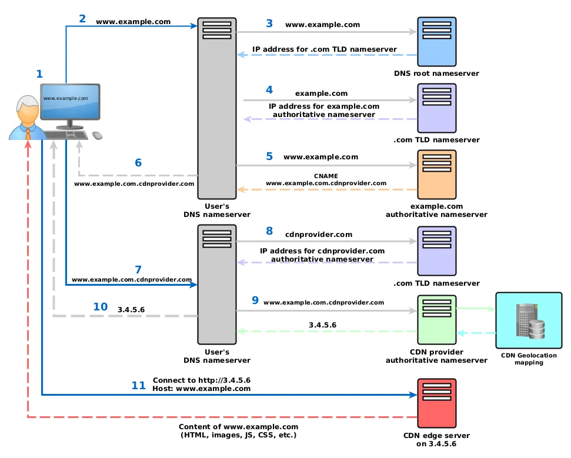

## [CDN](https://medium.com/globant/content-delivery-networks-explained-5a1feaa224c8#:~:text=The%20CDN%20uses%20its%20proprietary,website's%20content%20from%20the%20CDN.)

In a sentence, a Content Delivery Network is a network of servers strategically spread across the globe, designed to deliver content to users with high availability, low latency, and fast load times. 

### Benifits

1. Reduce latency
2. **Reduce traffic to save money**!
   * the CDN absorbs the traffic peaks, preventing them from reaching the origin server. Smaller infrastructure is needed at the origin to handle much more traffic than when not using a CDN, saving a ton of money on infrastructure bills.  

### How?

Depending on the CDN provider, this process is done in different ways, but there are two methods to accomplish this: 

1. Dynamic DNS resolution
2. Anycast **routing**

#### Dynamic DNS resolution

1. The client requests www.example.com, which has a CNAME record pointing to www.example.com.cdnprovider.com.
2. The client’s DNS resolver sends a query to the CDN’s authoritative DNS server for www.example.com.cdnprovider.com.

In step 9, the CDN’s DNS server identifies the user’s location using:

   1. **Resolver IP Geolocation**:
        
        The IP address of the client’s DNS resolver (e.g., the user’s ISP DNS server) is mapped to a geographic region.
        
        **Limitation**: If the resolver is far from the user (e.g., public DNS like Google or Cloudflare), this method is less accurate.
   
   2. **EDNS0 Client Subnet (ECS) Extension**:

        Modern DNS resolvers include the client’s original subnet/IP in the query via EDNS0.

        This provides a more precise location for the user, even if they’re using a third-party DNS resolver.

   3. GeoIP Databases:

        The CDN may cross-reference the resolver or client IP with a commercial GeoIP database (e.g., MaxMind) to estimate location.

The CDN’s DNS server uses the location data to select the optimal edge server based on: Geographic Proximity, Real-Time Performance Metrics (latency, server loads), and ect.

#### Anycast Routing

1. **DNS Resolution (Initial Step)**
   * User Request: The user types www.example.com into their browser.
   * DNS Lookup:
     * The DNS resolver (e.g., the user’s ISP or public DNS like Google) queries the authoritative DNS for `www.example.com`.
     * The DNS returns a `CNAME` record pointing to the CDN’s domain (e.g., `www.example.com.cdnprovider.net`). 
     * The CDN’s DNS server returns an **Anycast IP address** (e.g., 203.0.113.1) shared by all edge servers globally.
  
2. **BGP Advertising** (Network-Level Routing)
   * **CDN Edge Servers**: The CDN has edge servers in multiple locations (e.g., New York, London, Tokyo). Each server is configured with the same Anycast IP (203.0.113.1).
   * **BGP Announcements**:
     * Each edge server’s router advertises the same IP prefix (203.0.113.0/24) to its upstream ISP using BGP.
     * BGP routers on the internet propagate these routes, creating multiple paths to the same IP address.

3. **Packet Routing** (BGP Path Selection)
   * User’s ISP Routing:
     * The user’s ISP uses BGP routing tables to determine the "best" path to 203.0.113.1.
     * Path selection depends on:
       * Shortest AS Path: Fewest autonomous systems (ASes) to traverse.
       * Lowest Latency: Routes with the least network delay.
       * Peering Agreements: Direct connections between ISPs.
    * Routing to the nearest.... 

| **Feature**          | **Anycast**                | **DNS-Based Routing**             |
| -------------------- | -------------------------- | --------------------------------- |
| **IP Address**       | Single IP shared globally. | Different IPs per region.         |
| **Routing Decision** | BGP (network layer).       | DNS (application layer).          |
| **Granularity**      | Depends on BGP policies.   | Precise (client subnet or GeoIP). |
| **Use Cases**        | DNS, UDP, HTTP/3 (QUIC).   | HTTP/1.1, HTTP/2, static content. |

### How content is placed in the CDN edge servers

#### Push 

Push CDNs receive new content whenever changes occur on your server. You take full responsibility for providing content, uploading directly to the CDN and rewriting URLs to point to the CDN. You can configure when content expires and when it is updated. Content is uploaded only when it is new or changed, minimizing traffic, but maximizing storage.

> Sites with a small amount of traffic or sites with content that isn't often updated work well with push CDNs. Content is placed on the CDNs once, instead of being re-pulled at regular intervals.

#### Pull 
Pull CDNs grab new content from your server when the first user requests the content. You leave the content on your server and rewrite URLs to point to the CDN. This results in a slower request until the content is cached on the CDN.

A time-to-live (TTL) determines how long content is cached. Pull CDNs minimize storage space on the CDN, but can create redundant traffic if files expire and are pulled before they have actually changed.

> Sites with heavy traffic work well with pull CDNs, as traffic is spread out more evenly with only recently-requested content remaining on the CDN.

## References

1. https://www.youtube.com/watch?v=rwBv7FqZ77g
2. [Content Delivery Networks Explained](https://medium.com/globant/content-delivery-networks-explained-5a1feaa224c8#:~:text=The%20CDN%20uses%20its%20proprietary,website's%20content%20from%20the%20CDN.)