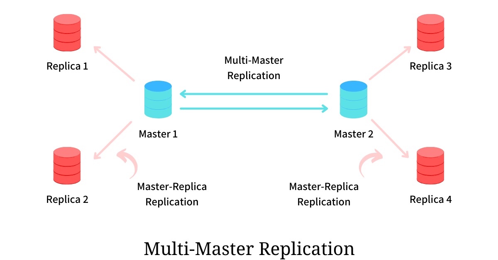

# Database

## Repication

### Master-slave replication

## Performance Improvments

1. Use good indices
2. Use denomralization by adding redundant columns to save for complex joins.
3. [Federation](https://github.com/donnemartin/system-design-primer?tab=readme-ov-file#federation)
    > Federation (or functional partitioning) splits up databases by function. 

4. Replications

## Replications

This improves availibility and offloads traffic, reduces latency.

### Master-Slave

All writes are through **one** Master node, and all slaves are read replicas.  If the master goes offline, the system can continue to operate in read-only mode until a slave is promoted to a master or a new master is provisioned.

Potential Problem with this pattern:

1. There is a potential for loss of data if the master fails before any newly written data can be replicated to other nodes.
2. During master down time, only read actions are allowed.
3. Master node is a Single Point of Failure

### Multi-Master

[Multi-Master Replication](https://arpitbhayani.me/blogs/multi-master-replication/)

> It's common to have all nodes as master nodes.

All master nodes accept write/read, and write will propagate to other master nodes async. This solves the SPOF issue of master/slave pattern

Potential Problem with this pattern:

1. write conflicts have to be resolved

## NoSQL vs SQL

NoSQL is 

## [Cassandra](https://medium.com/geekculture/system-design-solutions-when-to-use-cassandra-and-when-not-to-496ba51ef07a)

### What is the "Ring" in Cassandra?

The ring is a logical representation of how Cassandra distributes data across nodes. It uses consistent hashing to assign each node a range of "tokens" (numeric values). Here’s how it works:

**Partition Key**: When you insert data, Cassandra hashes the partition key (e.g., user_id) into a token using a hash function (e.g., Murmur3).

**Token Assignment**: Each node in the cluster is assigned a token range (e.g., Node A: 0-99, Node B: 100-199, etc.).

**Data Placement**: The hashed token determines which node "owns" the data. For example, if the hash of user_id=123 is 150, the data is stored on Node B.

Check [Gossip Protocol](#gossip-protocol)

### 2. What is a "Coordinator"?

Coordinator Role: When a client sends a read/write request to any node in the cluster, that node becomes the coordinator for that request.

**Responsibilities:**

1. Determine which nodes are replicas for the data (using the ring’s token ranges and replication strategy).

2. Forward the request to those replicas.

3. Ensure the operation meets the requested consistency level (e.g., ONE, QUORUM).

**Key Points:**

* Every node can act as a coordinator. There’s no fixed "master" node.

* This peer-to-peer design ensures no single point of failure and enables horizontal scalability.

### Gossip Protocol

Nodes use a gossip protocol to discover and share metadata about the cluster (e.g., node status, token ranges, cluster topology).

1. **Seed Nodes**: When a node starts, it contacts preconfigured seed nodes (bootstrap nodes listed in cassandra.yaml).

2. **Gossip Exchange**: Nodes periodically exchange state information (every second) with 1-3 random peers, propagating updates across the cluster.

3. **Membership**: Over time, all nodes learn about each other’s existence, health, and token assignments.

Example: 

1. Cluster Setup: Nodes A, B, C are seed nodes.

2. Node D Joins: Node D contacts seed Node A.

3. Gossip Spread: Node A shares Node D’s existence with Nodes B and C. Nodes B/C then gossip with others, propagating Node D’s metadata.
