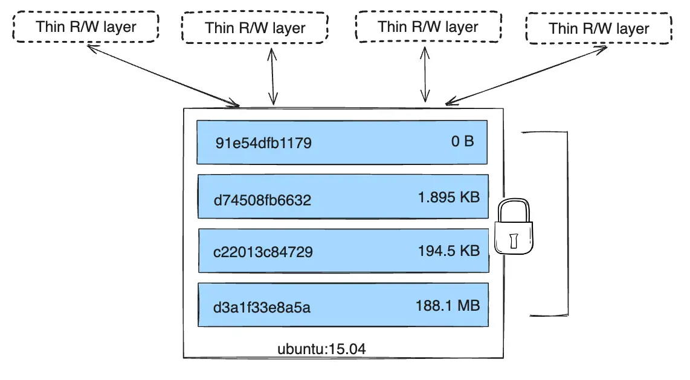

# [Docker](https://www.youtube.com/watch?v=fqMOX6JJhGo&t=3924s)


More on this [architecture of docker]((https://docs.docker.com/get-started/overview/#docker-architecture))


## [Context](https://www.youtube.com/watch?v=x0Kbj4lEOag)

With the Architecture of docker, we know docker server and client are separated. Therefore, we can easily swap the docker engine of the server. Therefore, context means configurations and docker engines.

For example, [colima](https://github.com/abiosoft/colima) provides context for Mac Arms.


From the above graphs, you can notice `colima run` changes the docker engines under the hood. Therefore, the container management and runtime are totally different. You'll notice that images downloaded for `desktop` doesn't appear in `colima` when running `docker images`.

In summary, Docker Context is :

* A robust way to encapsulate configuration
* An easy way to switch between Docker Engines
* The only way to access cloud integrations (NO research on this yet).

## [Storage](https://youtu.be/fqMOX6JJhGo?t=3835)

Docker has a **layer architecture**. For a docker file, which is used to build a docker image, has many declarations and those are separated into different layers. **And layers are appended, meaning only changes are stored.**. Therefore, caching can also be used, if former layers are already built when running an image.


Official information can be at [Images and layers](https://docs.docker.com/storage/storagedriver/#images-and-layers)

The key here is that, all the layers related to images are **read-only**.

Once a container starts running a new layer is add on top of the image layer called **container layer**, which is a R/W layer. All the modifications to the file system happen in the virtual file system of docker, and those modifications only lives with in the life period of the container. 

> After restarting the container or destroying the container, all the modifications happened in container layer are lost. This doesn't include stopping/start container.

This layer architecture with only container layer to be R/W allows Docker to have multiple containers built upon the same image without interfere each other.



At this point 1 question comes across. **If images layers are read-only and source code of the application actually are stored in the image, doesn't this mean we can't modify the source code? But in reality we actually can modify!**

> Cite from official: Docker uses storage drivers to manage the contents of the image layers and the writable container layer. Each storage driver handles the implementation differently, but all drivers use stackable image layers and the `copy-on-write (CoW)` strategy.

When modifying file inside the image, there's actually a copy of the file into the writable container layer, and changes are only applied to the copy. Therefore, the files of the image are still intact.

More detail refer to [COW](https://youtu.be/fqMOX6JJhGo?t=4163)

**In summary, modifications/new data are stored in the virtual filesystem of docker which certainly lives somewhere in the host fs, but will be cleaned when the container is destroyed.**

### Persistent Storage

Now, in order to make the modifications persistent, like database records, we use **volumes** or **bind-mounts**, which create a connection to the file system of the local host machine. Therefore, there's a partition on the local host that is dedicated to store the data. 

Now, 3 questions come across. 

1. Can a volume be used by multiple containers?

[YES](https://stackoverflow.com/questions/42854936/can-i-mount-same-volume-to-multiple-docker-containers)

2. Can a container have multiple volumes?

[YES](https://stackoverflow.com/questions/18861834/mounting-multiple-volumes-on-a-docker-container)

3. What happens if I wish to attach a volume to a running container?

NO, you can't. Volumes can only be specified when you run a container from an image the first time. 

But there are ways, you can work this around, but baking the current container into a new image and start a new container.

More on this, check out [How can I add a volume to an existing Docker container?](https://stackoverflow.com/questions/28302178/how-can-i-add-a-volume-to-an-existing-docker-container)

Now, what are the difference between **Volumes** and **bind-mounts***?

Bind-mount:
* Bind-mount is early developed.
* You can regard it as simply mapping an area of the file system of the local host to the container.
* The file system area is managed by the host OS. You have to make sure its compatibility, when running on different machines.
* Also, you need to specify the ABSOLUTE PATH in the local file system.

Volume:
* It's totally managed by docker. Therefore, it has an layer managed by Docker to make sure it always works on different host machines.
* You don't have to provide absolute PATH, just a name is sufficient.
* This is normally stored in `/var/lib/docker` on the host machine.

More on this can be found at [docker容器启动，向容器内文件写数据，数据存在哪里？](https://www.zhihu.com/question/334205224/answer/3041057718)

## Compose

Normally, an application involve with multiple containers. We **CAN** manually start each of time when delivering. However, there may need some configurations, like DNS mapping, and may be the order of starting is important. Stuff can get messy quickly. 

Docker compose allows us to deploy multiple containers the same time with rules defined in a `yml` file.

## Kubernetes

This is about container clustering to make sure more containers (replications of the same service) are automatically deployed as needed, which will be discussed in detail in the future when I get hands dirty on it.


## Commands

`docker exec` is used to execute a command **within** a **running** Docker container.

```bash
docker exec -it mycontainer bash
```

> `-i` flag (*interactive*) in the docker exec command, it **ensures that the input/output streams are connected between the terminal where you run the docker exec command and the container's environment**

Without it the input is not received by the container.

> `-t` flag stands for `terminal`. It opens a terminal within the container env.


